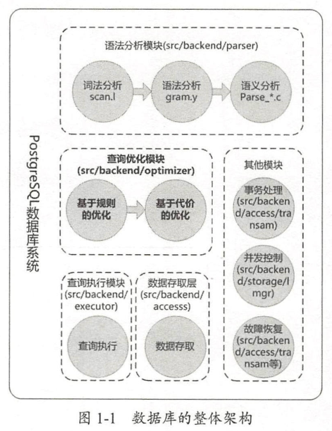
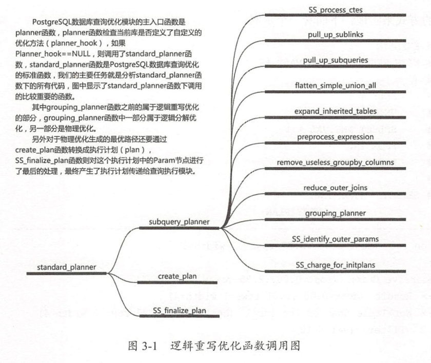
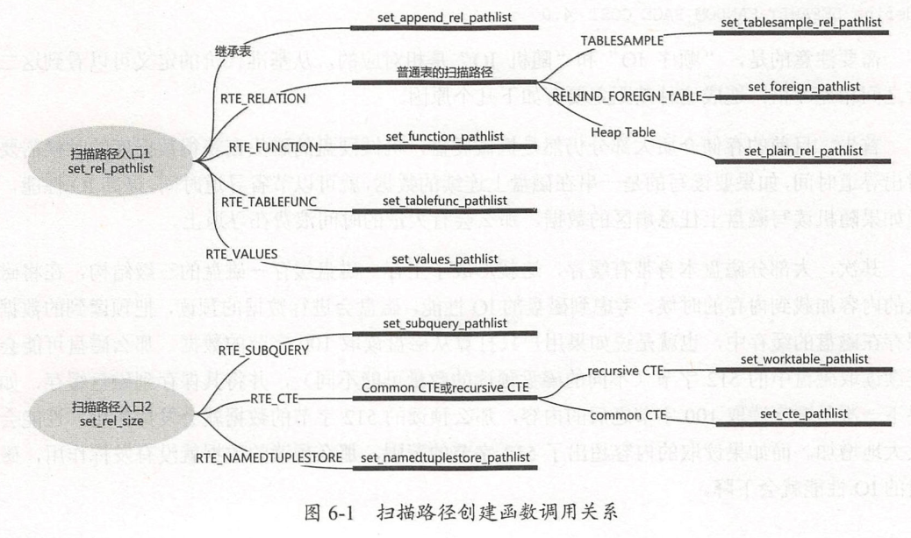

# PostSQL技术内幕:查询优化深度探索_学习笔记

## 1 概述

PG数据库是世界上最陷阱的开源关系数据库，是数据库从业人员研究数据库的宝贵财富，我们不打算再复述PG数据库的历史及概况，而是直入主题，看一下世界上最先进的开源数据库中的一个模块---查询优化器的实现方法。

### 1.1 查询优化的简介

查询优化是数据库管理系统中承上启下的一个模块，它接收来自语法分析模块传递过来的查询树(query = parse_analyze(parsetree))， 在这个查询树的基础上进行了逻辑的等价变换、物理执行路径的筛选，并且把选择出的最优的执行路径传递给数据库的执行器模块。简而言之，一个查询优化器它的输入是查询树，输出时查询计划。

```c
parsetree_list = pg_parse_query(query_string);
    raw_parsetree_list = raw_parser(query_string);  // 词法和语法分析入口
        scanner_init()                              // 词法分析
        base_yyparse()                              // 语法分析
List * pg_analyze_and_rewrite(RawStmt *parsetree)
	query = parse_analyze(parsetree);               // 语义分析
    querytree_list = pg_rewrite_query(query);       // 查询重写--逻辑优化 [input]
    return querytree_list；
plantree_list = pg_plan_queries(querytree_list);    // 查询优化--物理优化, 生成最优查询计划 [output]
PortalDefineQuery(portal, plantree_list);           // 转换成物理执行路径--portal
(void) PortalRun(portal, receiver);                 // 交给执行器执行, 并返回结果给receiver
```



数据库开发人员很难面面俱到地写出"极好的"语句,而查询优化器相对于数据库应用开发人员而言,具有一些独特的优势:

- 查询优化器和数据库用户之间的信息不对称,查询优化器在优化过程中会参考数据库统计模块自动产生的统计信息,这些统计信息从各个角度来描述数据的分布情况,查询优化器会综合考虑统计信息中的各种数据从而得到一个好的执行方案,而数据库用户一方面无法全面地了解数据的分布情况,另一方面即使数据库用户获得了所有的统计数据,人脑也很难构建一个精确的代价计算模型来对执行方案进行筛选.
- 查询优化器和数据库用户之间的时效性不同,数据库中的数据瞬息万变,一个在A时间点执行性能很高的执行计划,在B时间点由于数据内容发生了变化,它的性能可能就很低,查询优化器随时能根据数据的变化调整执行计划,而数据库用户则只能手动更改执行方案,和查询优化器相比,它的时效性比较低.
- 查询优化器和数据库用户之间的计算能力不同,目前计算机的计算能力已经大幅提高,在执行数值计算方面和人脑相比具有巨大的优势,查询优化器对一个语句进行优化时,可以从几百种执行方案中选出一个最优的方案,而人脑要全面地计算这几百种方案,需要的时间远远要长于计算机.

因此,查询优化器是提升查询效率非常重要的一个手段,虽然一些数据库也提供了人工干预生成查询计划的方法,但是通常而言查询优化器的优化过程对数据库开发人员是透明的,它自动地进行逻辑上的等价变换、自动地进行物理路径的筛选，极大地解放了数据库应用开发人员的“生产力”。

通常数据库的查询优化方法分为两个层次：

- 基于代价的查询优化（逻辑优化， Rule Based Optimization， 简称RBO）。
- 基于代价的查询优化（物理优化， Cost Based Optimization， 简称CBO）。

逻辑优化是建立在关系代数基础上的优化，关系代数中有一些等价的逻辑变换规则，通过对关系代数表达式进行逻辑上的等价变换，可能会获得执行性能比较好的等式，这样就能提高查询的性能；而物理优化则是建立在物理执行路径的过程中进行优化，关系代数中虽然指定了两个关系如何进行连接操作，但是这时的连接操作符属于逻辑运算符，它没有指定以何种方式实现这种逻辑连接操作，而查询执行器是不“认识”关系代数中的逻辑连接操作的，我们需要生成多个物理连接路径来实现关系代数中的逻辑连接操作，并且根据查询执行器的执行步骤，建立代价计算模型，通过计算所有的物理连接路径的代价，从中选择出“最优”的路径。

### 1.2 逻辑优化

逻辑优化时建立在关系代数基础之上的优化形式,下面通过介绍关系模型的理论知识来认识逻辑优化.

#### 1.2.1 关系模型

关系数据库采用了关系模型来描述数据库，每个数据库是一个“关系”的集合，这个“关系”就是我们通常所谓的表,其形态类似于一个二维数组,我们称其中的一行为一个"N-元组",通常简称为"元组",其中的一列代表的就是一个"属性",所有属性的值最终组成了"域".

在关系模型中,为了对关系、元组、属性等进行操作，定义了两种形式化的语言，分别是关系代数和关系演算。关系代数从逻辑的角度定义了对数据进行操作的方法，而关系演算则是描述性的，它准确刻画需要获得的结果而不关心获得结果的过程。

关系演算和关系代数不同，它从更高的层次来描述计算结果，完全不关心计算的过程，其中给予元组的关系演算可以称为元组关系演算，基于属性的关系演算称为域关系演算，元组关系演算包含的操作符如下：

- 存在量词和全称量词.
- 比较操作符（>, >=, <, <=, =, !=).
- 逻辑操作符.

关系演算的表达能力和关系代数是等价的,我们用元组关系演算的方式来实现选择、投影等几个关系代数表达式。

SQL作为数据库的标准查询语言，它吸收了一些关系代数的逻辑操作符，但是放弃了关系代数中“过程化”的特点，同时它更多地采用了关系演算的方法，一个SQL语句通常是对执行结果的描述，因此我们说SQL语言是一种介于关系代数和关系演算之间的描述性语言，如图1-6所示。


SQL语言是描述性语言这种特性导致了查询优化"大有可为",因为它只规定了"WHAT",而没有规定"HOW",不同的获取结果的方法代价相差可能极大,因此数据库的查询优化就变得极为重要了.

既然逻辑优化是建立在关系代数等价变换基础上的优化,下面我们来总结一下关系代数有哪些等价变换的规则.

上面的示例看似完美是因为它总能将过滤条件一推到底,然而在数据库的实现过程中却要面临很多障碍,比如数据库除了基本的关系代数操作之外还扩展出了外连接、聚集操作，在内连接中能够进行下推的约束条件，如果换成外连接就不一定下推，基于内连接能够做的等价推理换成外连接也不一定等价，这极大地增加了数据库查询优化的难度。

### 1.3 物理优化

基于代价的查询优化（Cost-based Optimizer， 简称CBO）也可以称为代价优化、物理优化，其主要流程是枚举各种待选的物理查询路径，并且根据上下文信息计算这些待选择路径的代价，进而选择出代价最小的路径。我们在关系代数表达式中已经指定了两个表要做连接，这种连接操作是逻辑操作符，它包括内连接、外连接、外连接等，而查询执行器并无法直接执行这些逻辑操作符，查询执行器只能认识物理连接路径，物理连接路径的作用就是指示查询执行器以何种方式实现逻辑操作符。

数据库无法从感性的角度来衡量哪条物理路径的代价低，因此它需要构建一个量化的模型，这个代价模型需要从两个方面来衡量路径的代价：

> 执行代价 = IO代价 + CPU代价

产生IO代价的原因是因为数据时保存在磁盘上,要对数据进行处理,需要将数据从磁盘加载到主存,另外在数据需要排序、建立hash表、物化的时候还可能将处理后的数据写入磁盘，这些都是IO代价，数据库要计算一个查询的IO代价存在一些困难：

- 磁盘IO到底是什么样的代价基准，由于磁盘种类不同，它的读写效率不同，如果有些数据挂载在机械磁盘上，而有些数据挂载在SSD磁盘上，那么不同磁盘上的数据的IO效率相差非常大，数据库如何区分这种区别呢？
- 数据库本身是有缓存系统的，假如某个表上有一些数据已经保存在缓存中了，这些数据在对表进行扫描的时候就不会产生IO，因此要想计算准确的IO代价，数据库还需要知道一个表中有多少页在缓存中，有多少页没有在缓存中，但是缓存中的页面可能随时地换入换出，数据库是否有能力实时地记录这种变化呢？
- 磁盘本身也有磁盘的缓存系统，在磁盘上随机读写和顺序读写的效率也不同，那么顺序读写和随机读写的效率差别如何量化呢？机械磁盘上顺序读写和随机读写的性能差别可能差距比较大，而SSD磁盘上的顺序读写和随机读写的性能差距则相对较小，数据库如何量化这种区别呢？

要想计算物理路径的代价，数据库还需要对数据的分布情况有一个了解，因为无论是IO代价还是CPU代价，都是建立在对数据处理的基础之上的，数据的分布情况也会从很大程度上对代价产生影响：

- 相同的数据在不同的分布下锁带来的开销不同，例如数据在有序的情况下和无需的情况下，如果要执行一个排序的操作，那么可能就一个需要排序，而另一个不需要排序，开销肯定是不同的，再例如同样一份数据，它在磁盘上的存储是稀疏的还是紧凑的对IO代价的影响也非常大。
- 相同的数据在面临不同的选择操作时，它的开销也不同，比如选择操作要处理数据中的高频值，相对而言它需要的计算就多一些，因此代价也会高一些。

总之，数据库很难给出一个“准确”的代价模型来描述所有的情况，计算代价的目的是在物理路径之间进行挑选，它只需要能够用于比较物理路径的优劣就够了，虽然大部分数据库都采用了IO代价和CPU代价来衡量物理路径的代价，但具体的实现细节则千差万别，一个数据库的代价模型需要不断地“修炼”才能接近完美。

#### 1.3.2 物理路径的生成过程

数据库中的物理路径大体上可以分为扫描路径和连接路径,扫描路径是针对单个关系的,他可以用来实现关系代数中的选择和投影,而连接路径对应的是两个表做连接操作,因此它可以用来实现关系代数中的笛卡尔积.

##### 1.3.2.1 物理路径的分类

如果要获得一个关系中的数据,最基础的方法就是将关系中的所有数据都遍历一遍,从中挑选出符合条件的数据,如图1-9所示,这种方式就是顺序扫描路径,顺序扫描路径的优点是具有广泛的实用性,各种"关系"都可以用这种方法,它的缺点是代价通常比较高,因为要把所有的数据都遍历一遍.


### 1.5 示例的约定

-- student(学号, 姓名, 性别)
create table student(sno int primary key, sname varchar(10), ssex int);
-- course(课程编号, 课程名, 教师编号)
create table course(cno int primary key, cname varchar(10), tno int);
-- score(学号, 课程编号, 分数)
create table score(sno int, cno int, degree int);
-- teacher(教师编号,教师姓名,教师性别)
create table teacher(tno int primary key, tname varchar(10), tsex int);

-- 在物理优化阶段则主要使用test_a, test_b, test_c, test_d....作为示例, 每个表的列名约定为
-- a, b, c, d....., 下面也给出它们的定义: 
create table test_a(a int, b int, c int, d int);
create table test_b(a int, b int, c int, d int);
create table test_c(a int, b int, c int, d int);
create table test_d(a int, b int, c int, d int);

insert into student values(1, '刘海峰', 1),(2,'颜敏', 0),(3, '刘海娟', 0),(4, '刘海岗', 1);
insert into course values(1, '语文', '刘老师'),(2, '数学', '王老师'),(3, '历史', '李老师'),(4, '化学', '张老师');
insert into score values(1, 1, 72),(1, 2, 73),(1, 3, 74),(1, 4, 75);
insert into score values(2, 1, 82),(2, 2, 83),(2, 3, 84),(2, 4, 85);
insert into score values(3, 1, 62),(3, 2, 63),(3, 3, 64),(3, 4, 65);
insert into score values(4, 1, 92),(4, 2, 93),(4, 3, 94),(4, 4, 95);
insert into teacher values(1, '刘老师', 1),(2, '王老师', 0),(3, '李老师', 1),(4, '张老师', 0);

insert into test_a values(1, 2, 3, 4);
insert into test_b values(1, 2, 3, 4);
insert into test_c values(1, 2, 3, 4);
insert into test_d values(1, 2, 3, 4);


TODO

### 1.6 小结

关系数据库的查询优化通常分为逻辑优化和物理优化.逻辑优化是基于关系代数的等价的逻辑变换,关系代数中有大量的逻辑等价规则,可以利用这些规则尝试将选择操作和投影操作尽量下推,缩小查询中的中间结果以提高执行效率;物理优化则是通过代价估算的方式挑选代价比较低的物理路径,根据物理路径的性质又可以分成扫描路径和连接路径,在生成物理路径的过程中通常可以选择动态规划方法等最优路径算法来获得对物理路径进行搜索.

虽然本章中已经介绍了部分查询优化涉及的基础理论,但是这远远不够,有兴趣的读者可以参阅<数据库系统实现>、《数据库系统概念>等理论专著的相关章节来了解查询优化的基础理论,另外也可以查阅相关的论文来了解学术界对查询优化的不断改进.

## 2 查询树

一个SQL查询语句在经过了词法分析、语法分析和语义分析之后会形成一颗查询树，这颗查询树实际上就对应了一个关系代数表达式，它是查询优化器的输入，贯穿了查询优化的整个过程。所谓“工欲善其事必先利其器”，在开始对查询优化器的代码进行分析之前，对查询树必须要有一定的了解。

### 2.1 Node的结构

PG数据库中的结构体采用了统一的形式，它们都是基于Node结构体进行的“扩展”，Node结构体中只包含一个NodeTag成员变量，NodeTag是enum（枚举）类型。

```c
typedef struct Node
{
    NodeTag type;
} Node;
```

其他的结构体则利用C语言的特性对Node结构体进行扩展,所有结构体的第一个成员变量也是NodeTag枚举类型,例如在List结构体里,第一个成员变量时NodeTag, 它可能的值是T_List、T_intList或者T_OidList，这样就能分别指代不同类型的List。

```c
typedef struct List
{
    NodeTag type;   /* T_List, T_IntList, or T_OidList */
    int length;
    ListCell *head;
    ListCell *tail;
} List;
```
而Query结构体也是也NodeTag枚举类型作为第一个变量,,它的取值为T_Query.

```c
typedef struct Query
{
    NodeTag     type;
    CmdType     commandType;        /* select|insert|update|delete|utility */
    QuerySource querySource;        /* where did I come from? */
    ......
} Query;
```

这样无论是List结构体的指针,还是Query结构体的指针,我们都能通过Node结构体的指针(Node*)来表示,而在使用对应的结构体时,则通过查看Node类型的指针中的NodeTag枚举类型就可以区分出该Node指针所代表的结构体的实际类型.

### 2.2 Var结构体

Var结构体表示查询中涉及的表的列属性,在SQL语句中,投影的列属性、约束条件中的列属性都是通过Var来表示的，在语法分析阶段将列属性用ColumnRef结构体来表示，在语义分析阶段会将语法树ColumnRef替换成Var用来表示一个列属性。下面来看一下Var结构体中各个变量的具体含义。

```c
typedef struct Var
{
	Expr		xpr;
	Index		varno;			/* index of this var's relation in the range
								 * table, or INNER_VAR/OUTER_VAR/INDEX_VAR */
	AttrNumber	varattno;		/* attribute number of this var, or zero for
								 * all */
	Oid			vartype;		/* pg_type OID for the type of this var */
	int32		vartypmod;		/* pg_attribute typmod value */
	Oid			varcollid;		/* OID of collation, or InvalidOid if none */
	Index		varlevelsup;	/* for subquery variables referencing outer
								 * relations; 0 in a normal var, >0 means N
								 * levels up */
	Index		varnoold;		/* original value of varno, for debugging */
	AttrNumber	varoattno;		/* original value of varattno */
	int			location;		/* token location, or -1 if unknown */
} Var;
```

- **varno:** 用来确定列属性所在的表的"编号",这个编号源自Query(查询树)中的rtable成员变量,查询语句中涉及的每个表都会在记录在rtable中,而其在rtable中的"编号"(也就是处于链表的第几个,从1个开始计数,这个编号用rtindex来表示)是唯一确定的值,在逻辑优化、物理优化的过程中可能varno都是rindex，而在生成执行计划的阶段，它可能不再代表rtable中的编号，这在第10章中会进行介绍。
- **varattno/vartype/vartypmod:** TODO


### 2.3 RangeTblEntry结构体

RangeTblEntry(范围表, 简称RTE)描述了查询中出现的表,它通常出现在查询语句的FROM子句中, 范围表中既有常规意义上的堆表,还有子查询、连接表等。

TODO

### 2.4 RangeTblRef结构体

RangeTblEntry只保留在查询树的Query->rtable链表中, 而链表是一个线性结构,它如何保存树状的关系代数表达式中的连接操作呢?答案是在Query->jointree中保存各个范围表之间的连接关系.

TODO

### 2.5 JoinExpr结构体
### 2.6 FromExpr结构体
### 2.7 Query结构体

Query结构体时查询优化模块的输入参数,其源于语法分析模块,一个SQL语句在执行过程中,经过词法分析、语法分析和语义分析之后，会生成一颗查询树，PG用Query结构体来表示查询树。

查询优化模块在获取到查询树之后，开始对查询树进行逻辑优化，也就是对查询树进行等价变换，将其重写为一颗新的查询树，这个新的查询树又作为物理优化的输入参数，进行物理优化。

### 2.8 查询树的展示

elog_node_display在gdb的使用, 请参考<小宇带你学PG内核>视频.

### 2.9 查询树的遍历
### 2.10 执行计划的展示

查询优化的主要目的就是将一个查询树(关系代数)转换为一个代价最低的非完全二叉树的执行算式,算式中的每一个节点对应一个物理路径,EXPLAIN语句打印的就是这个非完全二叉树.

### 2.11 小结

本章主要介绍了查询树的构造形态,读者可以了解到查询树中最重要的几个成员变量,例如Var、RangeTblEntry、FromExpr、JoinExpr等，这样在针对查询树应用优化规则的时候，用户才能清楚地了解查询树变换的真正意图。

另外， 查询优化的输入参数不只有查询树对应的结构体Query，另外还有PlannerInfo结构体（包括PlannerGlobal结构体），这个结构体是查询优化的上下文信息，它贯穿在整个查询优化的过程之中，因此现阶段很难清楚地说明它的每个成员变量的具体作用，因此我们把对PlannerInfo结构体的说明“散落”在本书的各个章节，在用到PlannerInfo的每个成员变量的时候再对其进行说明。

## 3 逻辑重写优化

依照PG数据库逻辑优化的源代码的分布情况，我们把逻辑优化分成了两部分：逻辑重写优化和逻辑分解优化，本章重点开始分析逻辑重写优化部分的源代码。划分的依据是：在逻辑重写优化阶段主要还是对查询树进行“重写”，也就是说在查询树上进行改造，改造之后还是一颗查询树，而在逻辑分解阶段，会将查询树打散，会重新建立等价于查询树的逻辑关系，逻辑重写优化的函数如图3-1所示。



### 3.3 UNION ALL优化

### 3.4 展开继承表

### 3.5 预处理表达式

### 3.10 小结

逻辑重写优化的大的基调是减少查询的层次、消除外连接操作、减少冗余操作。本章比较重要的是子查询（包括子连接）的提升、外连接的消除、为此规范，这些工作在现阶段还不能明显地看出有什么意义，不过随着查询优化分析的深入它们的作用就会显现出来。

逻辑优化的重写规则相对还是比较简单的，有兴趣的读者可以使用第2章中介绍的查询树打印函数在优化前后打印查询树，分析等价表换的内容，争取做到对查询树的内存形式烂熟于心。

在逻辑重写优化之后，查询树中已经没有了右外连接，这对后面的逻辑分解优化非常重要，因为它可以少处理一种情况，这样极大地增强了代码的可读性。


## 4 逻辑分解优化

逻辑分解优化是逻辑优化的一部分,从这里开始和物理优化产生了紧密的联系.例如在进行逻辑重写优化的过程中,查询树中的连接树(Query->jontree)是通过RangeTblEntry组织起来的,但在逻辑分解优化的过程中,所有的RangeTblEntry建立一个对应的RelOptInfo结构体,这是因为查询树(Query)中断RangeTblEntry结构体在物理优化时已经不使用了,必须使用适用于物理优化的RelOptInfo结构体来代替它. RangeTblEntry结构体对应的是查询语句中的范围表,它更多起到对一个表进行描述的作用,属于逻辑层面,它的内部没有提供和物理代价及物理路径相关的成员变量,而RelOptInfo结构体在设计的时候更多地考虑了生成物理连接路径及计算路径代价的需要,属于物理层面.

## 5 统计信息和选择率

PG数据库的物理优化需要计算各种物理路径的代价,而代价估算的过程严重地依赖于数据库的统计信息,统计信息是否能准确地描述表中的数据分布情况是决定代价的准确性的重要条件之一.

TODO

## 6 扫描路径

扫描路径是对基表进行遍历时的执行路径,针对不同的基表有不同的扫描路径,例如针对堆表有顺序扫描(SeqScan)、针对索引有索引扫描（IndexScan）和位图扫描（BitmapScan)、针对子查询有子查询扫描（SubqueryScan）、针对通用表达式有通用表达式扫描（CteScan）等，扫描路径通常是执行计划树的叶子节点。如图6-1所示是创建扫描路径的函数调用关系。



## 7 动态规划和遗传算法

## 8 连接路径

## 9 Non-SPJ优化

## 10 生成执行计划

最优的执行路径生成后,虽然Path Tree已经足够清楚指出查询计划要进行的物理操作,但是它的结构体中为了进行代价计算有太多的冗余信息,不方便查询执行器使用,并且有些参数还没有建立好,因此通过将其转换成执行计划来生成更合适查询执行器的Plan Tree,然后将Plan Tree转交给执行器就可以真正执行了. 路径的结构体时Path或者是"继承"自Path的新的路径结构体,例如JonPath,对应的执行计划节点的结构体是Plan或者是"继承"自Plan的新的执行计划节点,例如Join结构体. PG数据库的每个Path节点都一一对应一个Plan节点,最优的执行路径需要通过create_plan函数转换成对应的执行计划.

### 10.3 小结

物理路径最终需要转换成物理执行计划,本章重点介绍了顺序扫描路径、索引扫描路径、MergeJoin连接路径的转换过程,这些示例虽然具有一定的代表性,但是有兴趣的读者不放分析一下其他类型的路径向执行计划转换的流程.

