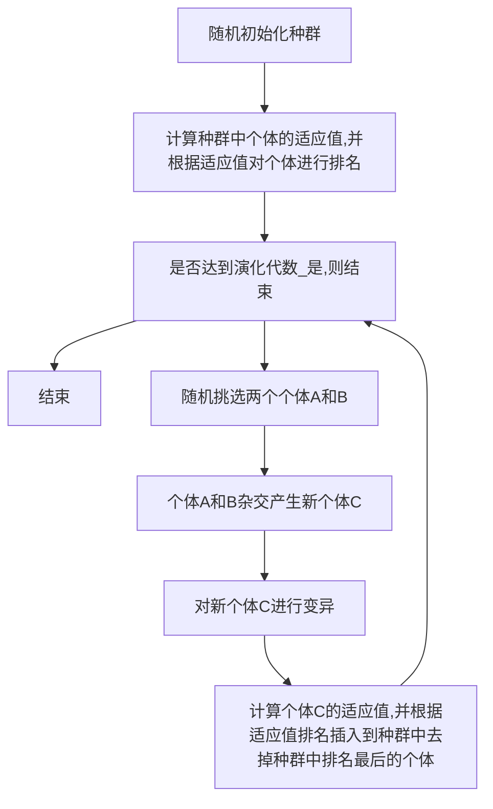

## 第1章 PostgreSQL系统概述

PostgreSQL是一种先进的对象-关系数据库管理系统(ORDBMS).

    1. 它支持关系数据库的各种功能;
    2. 它还具备类、继承等对象数据库的特征。

PostgreSQL主要运行在Unix和Linux系统上（从8.0版本开始推出了Windows平台上的版本）。

PostgreSQL的发展历程如图1-1所示：

### 1.2 PostgreSQL的特性

PostgreSQL是一种几乎可以运行在各种平台上的免费的开放源码的对象关系数据库管理系统.

    1. 拥有与企业级数据库相媲美的特性;
        1.1 完善的SQL标准支持；
        1.2 多版本并发控制（MVCC）；
        1.3 时间点恢复；
        1.4 表空间机制；
        1.5 异步复制；
        1.6 嵌套事务；
        1.7 在线/热备份;
        1.8 一个复杂的查询优化器;
        1.9 预写日志(WLA)容错技术.
    2. 支持国际字符集、多字节字符编码、Unicode；
    3. 对格式化、排序、大小写敏感提供本地化支持；
    4. 在管理大数据量方面有良好的可扩展性；
    5. 对并发用户管理具有自适应性；
    6. 现已出现具有管理超过4万亿字节（3.64TB）数据能力的实用版本产品。

### 1.3 PostgreSQL的应用

1. Sony在线娱乐网站
2. Hi5社交网站

### 1.4 PostgreSQL代码结构

PostgreSQL是遵照一个和BSD开源协议类似的协议PostgreSQL License发布.

开发人员或者商业组织只要遵循该协议，便可以自由地使用PostgreSQL，可以完全控制这些第三方代码，在必要的时候可以加以修改或者二次开发.

PostgreSQL源代码包含3400多个文件(截止8.4.1版本)，主要程序由C语言编写，包括十几个大型模块，定义了几百个主要的数据结构和上万个函数.

PostgreSQL源代码结构清晰，每一个子目录都对应一个模块，其中主要目录(模块)及用途如下：

* **Bootstrap** ： 用于支持Bootstrap运行模式，该模式主要用来创建初始的模板数据库.
    
    bootstrap： 引导程序的意思

* **Main** ： 主程序模块，它负责将控制权转到Postmaster进程或Postgres进程.
* **Postmaster** ： 监听用户请求的守护进程，并控制Postmaster进程的启动和终止.
* **Libpq** ： C/C++的库函数，处理与客户端间的通信，几乎所有的模块都依赖它.
* **Tcop** ： Postgre服务进程的主要处理部分，它调用Parser，Optimizer，Executor和Commands主的函数来执行客户端提交的查询.
* **Parser** ： 编译器，将SQL查询转化为内部查询树.
* **Optimizer** ： 优化器，根据查询树创建最优的查询路径和查询计划.
* **Executor** ： 执行器，执行来自Optimizer的查询计划.
* **Commands** ： 执行非计划查询的SQL命令，如创建表命令等.
* **Catalog** ： 系统表操作，包含用于操作系统表的专用函数.
* **Storage** ： 管理各种类型的存储系统(如磁盘， 闪存等).
* **Access** ： 提供各种存取方法，支持堆，索引等对数据的存取.
* **Nodes** ： 定义系统内部所用到的节点，链表等结构，以及处理这些结构的函数.
* **Utils** ： 各种支持函数，如错误报告，各种初始化操作等.
* **Regex** ： 正规表达式库及相关函数，用于支持正规表达式处理.
* **Rewrite** ： 查询重写，根据规则系统对查询进行重写.
* **Initdb** ： 初始化数据库集簇(/集群).
* **TSearch** ： 全文检索.
* **Psql** ： 数据库交互工具.
* **Port** ： 平台兼容性处理相关的函数.

### 1.5 安装PostgreSQL

在Windows下安装PostgreSQL比较简单， 按照安装程序的提示一步步进行即可.

在Linux下， 则需要从源代码进行安装.

## 第2章 PostgreSQL的体系结构

PostgreSQL是一种以关系数据库和SQL为基础，扩展了抽象数据类型，从而具备面向对象特性的数据库.

PostgreSQL数据库由5大部分组成：
* 连接管理系统(系统控制器)
* 编译执行系统
* 存储管理系统
* 事务系统
* 系统表

**连接管理系统(系统控制器)** 作用：

    1. 接受外部操作对系统的请求;
    2. 对操作请求进行预处理和分发
    3. 起系统逻辑控制作用.

**编译执行系统** 作用：

    1. 由查询编译器，查询执行器组成;
    2. 完成操作请求在数据库中的分析处理和转化工作;
    3. 最终实现物理存储介质中数据的操作.

**存储管理系统** 作用：

    1. 由索引管理器，内存管理器，外存管理器组成;
    2. 负责存储和管理物理数据;
    3. 提供对编译查询系统的支持.

**事务系统** 作用：

    1. 由事务管理器，日志管理器，并发控制，锁管理器组成;
    2. 日志管理器和事务管理器完成对操作请求处理的事务一致性支持;
    3. 锁管理器和并发控制提供对并发访问数据的一致性支持.

**系统表** 作用：

    1. 系统表是PostgreSQL数据库的元信息管理中心;
    2. 包括数据库对象信息和数据库管理控制信息;
    3. 系统表管理元数据信息;
    4. 将PostgreSQL数据库的各个模块有机的连接在一起，形成一个高效的数据管理系统.

### 2.1 系统表

    在关系数据库中，为了实现数据库系统的控制，必须提供数据字典的功能.

    数据字典不仅存储各种对象的描述信息，而且存储系统管理所需的各种对象的细节信息.

    从内容来看，数据字典包含数据库系统中所有对象及其属性的描述信息，对象之间关系的描述信息，对象属性的自然语言含义以及数据字典变化的历史(即数据库的状态信息).

    数据字典是关系数据库系统管理控制信息的核心.

    在PostgreSQL数据库系统中，系统表扮演着数据字典的角色.

**系统表**是PostgreSQL数据库存放结构元数据的地方，它在PostgreSQL中表现为存放有系统信息的普通表或者视图.

#### 2.1.1 主要系统表功能及依赖关系

1. pg_namespace ： 用于存储命名空间
2. pg_tablespace ： 存储表空间信息
3. pg_database ： 存放当前数据集中数据库的信息
4. pg_class ： 存储表及与表类似结构的数据库对象信息
5. pg_type ： 存储数据类型信息
6. pg_attribute ： 存储表的属性信息
7. pg_index ： 存储索引的具体信息

#### 2.1.2 系统视图

### 2.2 数据集簇

PostgreSQL安装完成后，在做任何其他事情之前，必须先使用initdb程序初始化磁盘上的数据存储区，即**数据集簇**，由PostgreSQL管理的用户数据库以及系统数据库总称为**数据集簇**.

在PostgreSQL的实现中，数据库就是磁盘上一些文件的集合.

    1. 只不过这些文件有特定的文件名，存储位置等，并且有些文件之间会相互关联.
    2. 默认情况下， PostgreSQL的所有数据都存储在其数据目录里，这个数据目录通常会用环境变量PGDATA来引用，后文中将会用PGDATA来指代数据目录.

**初始化数据集簇** 包括如下：
* 创建数据库系统所有数据的数据目录
* 创建共享的系统表
* 创建其他的配置文件和控制文件
* 创建3个数据库
    
    * 模板数据库template1和template0
    * 默认的用户数据库postgres
    
**备注**： 以后用户创建一个新数据库时， template1数据库里的所有内容(包括系统表文件)都会拷贝过来，因此，任何在template1里面安装的内容都自动拷贝到之后创建的数据库中. template0和postgres都是通过拷贝template1创建的.

#### 2.2.1 initdb的使用

#### 2.2.3 initdb的执行过程

initdb执行时将按照顺序执行下列工作：  
1. 根据用户输入的命令行参数获取输入的命令名.
2. 设置系统编码为LC_ALL， 查找执行命令的绝对路径并设置该路径.
3. 设置环境变量(pg_data等)， 获取系统配置文件的源文件路径(postgres.bki， postgresql.conf.sample等文件)， 并检查该路径下各文件的可用性.
4. 设置中断信号处理函数，对终端命令行SIGHUP，程序中断SIGINT，程序退出SIGUIT，软件中断SIGTERM和管道中断SIGPIPE等信号进行屏蔽，保证初始化工作顺利进行.
5. 创建数据目录，以及该目录下一下必要的子目录， 如base， global， base/1等.
6. 测试当前服务器系统性能，由测试结果创建配置文件postgresql.conf， pg_hba.conf， pg_ident.conf， 并对其中定义的参数做一些设置.
7. 在bootstrap模式下创建数据库template1，存储在数据目录的子目录base/1中.
8. 创建系统视图，系统表TOAST表等，复制template1来创建template0和postgres，这些操作都用普通的SQL命令来完成.
9. 打印操作成功等相关信息，退出.

**备注**： initdb时PostgreSQL中一个独立的程序， 它的主要工作就是对数据集簇进行初始化，创建模板数据库和系统表，并向系统表中插入初始元祖.在这以后，用户创建各种数据库，表，视图，索引等数据库对象和进行其他操作时，都是在模板数据库和系统表的基础上进行的.

#### 2.2.4 系统数据库

### 2.3 PostgreSQL进程结构

Postgre使用了一种专用服务器进程体系结构，其中，最重要的2个进程是守护进程postmaster和服务进程postgres.

守护进程：

* 负责整个系统的启动和关闭
* 监听并接受客户端的请求连接
* 为其分配服务进程Postgres
* 之外， 还将启动相关的后台辅助进程
* 守护进程Postmaster在完成基本运行环境初始化，创建接受用户请求的监听端口后，顺序启动如下系统辅助进程：
    
    1. SysLogger(系统日志进程)
    2. PgStat(统计数据收集进程)
    3. AutoVacuum(系统自动清理进程)
* 在守护进程Postmaster进入到循环监听中时启动如下进程：
    
    1. BgWriter(后台写进程)
    2. WalWriter(预写式日志写进程)
    3. PgArch(预写式日志归档进程)

服务进程：

* 接受并执行客户端发送的命令
* 在底层模块(如存储，事务管理，索引等)之上调用各个主要的功能模块(如编译器，优化器，执行器等)
* 完成客户端的各种数据库操作
* 并返回执行结果

PostgreSQL采用C/S模式，系统为每个客户端分配一个服务进程.

前端欲访问某一数据库时，就调用接口库(比如ODBC， libpq)把用户的请求通过网络发给守护进程Postmaster.

Postmaster将启动一个新的服务进程Postgres为用户服务.

此后前端进程和服务进程不再通过Postmaster而是直接进行通信.

也就是说，Postmaster总是监听用户连接请求并为用户分配服务进程Postgres，而Postgres则负责为客户端执行各种命令.

### 2.4 守护进程Postmaster

### 2.5 辅助进程

PostgreSQL的各个辅助进程完成特定的功能，支撑PostgreSQL系统运行和管理工作.

#### 2.5.1 SysLogger系统日志进程

#### 2.5.2 BgWriter后台写进程

BgWriter是PostgreSQL中在后台将脏页写出到磁盘的辅助进程.

#### 2.5.3 WalWriter预写式日志写进程

#### 2.5.4 PgArch预写式日志归档进程

PostgreSQL从8.x版本开始提出国PITR(Point-In-Time-Recovery)技术，支持将数据库恢复到其运行历史中任意一个有记录的时间点.

#### 2.5.5 AutoVacuum系统自动清理进程

在PostgreSQL数据库中， 对表元组的UPDATE或DELETE操作并未立即删除旧版本的数据，表中的旧元组只是被标识为删除状态，并未立即释放空间.

这种处理对于获取多版本并发控制是必要的，如果一个元组的版本仍有可能被其他事务看到，那么就不能删除元组的该版本.

当事务提交后，过期元组版本将对事务不再有效，因而其占据的空间必须回收以供其他新元组使用，以避免对磁盘空间增长无休止的需求，此时对数据库的清理工作通过运行VACUUM来实现.

#### 2.5.6 PgStat统计数据收集进程

### 2.6 服务进程Postgres

Postgres进程是实际的接受查询请求并调用相应模块处理查询的PostgreSQL服务进程.

它直接接受用户的命令进行编译执行，并将结果返回给用户.

如此循环，直到用户断开连接.

#### 2.6.1 初始化内存环境

#### 2.6.2 配置运行参数和处理客户端传递的GUC参数

#### 2.6.3 设置信号处理和信号屏蔽

#### 2.6.4 初始化Postgres的运行环境

#### 2.6.5 创建内存上下文并设置查询取消跳跃

#### 2.6.6 循环等待处理查询

#### 2.6.7 简单查询的执行流程

- 编译器: 
    输入: 字符串  
    功能: 进行词法和语法的分析
    输出: 抽象语法树

- 分析器:
    输入: 抽象语法树
    功能: 语义分析, 如果是查询命令, 在生成Query后进行规则重写(注意: 重写后可能会产生多个Query)
    输出: 查询树
- 优化器: 
    输入: 查询树
    功能: 对Query进行处理, 生成执行计划(Plan)
    输出: 执行计划(Plan)
- 执行器:
    输入: 执行计划(Plan)
    功能: 根据Plan中的节点中的命令类型(即物理执行路径Path), 调用响应的执行函数, 并返回结果
    输出: 执行(可能的话输出结果)

Postgres进程在系统中扮演着一个工作执行者的角色,在单用户或者多用户模式下,客户端请求通过认证后将直接与服务进程Postgres进程Postgres进程通信,而无须守护进程干预,只在客户端对应的进程出现问题时由守护进程执行容错恢复工作.Postgres和用户进行交互,执行客户端提交的查询请求和命令,并将执行结果通过网络返回给用户.Postgres后台进程的运行即实现了PostgreSQL的多任务并发执行.

### 2.7 小结

本章从宏观上对PostgreSQL的控制和处理流程进行了简要介绍，说明了各个模块之间是如何协同工作，以使得整个数据库系统能够稳定、正确地处理用户的各种操作和请求的。至于每个模块是如何各司其职，其内部具体是如何运作的，将会在后续的章节进行专门的介绍。

## 第3章 存储管理

数据库管理系统的任务本质上是向存储设备上写入数据或者从存储设备上读出数据，因此对于一个DBMS(Database Managment System)来说，存储的管理是一项非常基础和重要的技术.

在PostgreSQL中，有专门的的模块负责管理存储设备(包括内存和外存)，我们称之为存储管理器.

存储管理器提供了一组统一的管理外存与内存资源的功能模块，所有对外存和内存的操作都将交由存储管理器处理.

可以认为存储管理器是数据库管理系统与物理存取设备的接口.

### 3.1 存储管理器的体系结构

PostgreSQL的存储管理器主要包括两个功能：内存管理器和外存管理器.

除了管理内存和外存的交互外，存储管理器的另一个主要任务是对内存进行统筹安排和规划.

#### 内存管理

内存管理包括：
* 共享内存的管理
* 以及进程本地内存的字管理

在**共享内存中存储着所有进程的公共数据**， 例如： 锁变量，进程通信状态，缓冲区等.

而**本地内存为每个后台进程所专有，是它们的工作区域**，存储着属于该进程的Cache(高速缓存)， 事务管理信息，进程信息等.

为了防止多个进程并发访问共享内存中数据时产生冲突，PostgreSQL提供了**轻量级锁**，用于支持堆共享内存中同一数据的互斥访问.

PostgreSQL使用共享内存实现了**IPC(进程间通信)以及无效消息共享，用于支持进程间的相互通信**.

此外，存储管理器还提供了内存上下文(MemoryContext)用于**统一管理内存的分配和回收**，从而更加有效安全地对内存空间进行管理.

#### 外存管理

外存的管理包括：
* 表文件管理
* 空闲空间管理
* 虚拟文件描述(VFD)管理
* 及大数据存储管理等

在PostgreSQL中，每个表都用一个文件(表文件)存储，表文件以表的OID命名.

对于超出操作系统文件大小限制(比如FAT32限制为4G)的表文件，PostgreSQL会自动将其切分成多个文件来存储，并在原表文件名的尾部加上切分文件的顺序号来标识它们.

从PG8.4版本开始， 每个表除了表文件外还拥有两个附属文件： 1. 可见性映射文件(VM) 和 2. 空闲空间映射表文件(FSM).

* 前者： 用于加快清理操作(VACUUM)的执行速度
* 后者： 用于表文件空闲空间的管理

**VFD** ： 为了避免超过操作系统对每个进程打开文件数的限制，存储管理器使用了虚拟文件描述符机制，使得后台进程可以打开"无限多个"文件.

**大数据存储** ： 此外， 存储管理器还提供了**大对象机制**以及**TOAST机制**，用以支持大数据存储.

**可扩展性** ： PG还在存储管理器中封装了对具体存储器的操作接口， 以便扩展支持多种存储介质(比如对闪存，光盘的支持).

**分页** ： PG的存储管理器采用与OS类似的分页存储管理方式，即数据在内存中是以页面块的形式存在.

总体来说， 存储管理器的主要任务包括：
1. 缓冲池管理
2. Cache机制
3. 虚拟文件描述符管理(VFD)
4. 空闲空间管理
5. 进程间通信机制
6. 大数据存储管理

    > **缓冲池**在PG中起缓存的作用.数据库中的事务常常需要频繁地存取数据，为了减少对磁盘的读写，在事务执行时，数据首先将会放入缓冲池中，PG设立国进程间共享的缓冲池(共享缓冲池)以及进程私有的缓冲池(本地缓冲池).

    > **Cache机制**将进程最近使用的一些系统数据缓存在其私有内存中，其级别高于缓冲池.

    > **虚拟文件描述符管理(VFD)**： PG通过VFD来对物理文件进行管理，避免因为操作系统对进程打开文件数的限制出现错误.

    > **空闲空间管理**： 用于快速定位到表文件中的空闲空间以便于插入新数据，从而提高空间利用率.

    > **进程间通信机制(IPC)** ： PG是一个多进程的系统，IPC用来在多个后台进程之间进行通信和消息的传递，比如使用消息队列来同步进程产生的无效消息，同时IPC还提供了对共享内存的管理.

    > **大数据存储管理** ： 提供大对象和TOAST机制. 大对象机制是一种由用户控制的大数据存储方法，它允许用户调用函数，通过SQL语句直接向表中插入一个大尺寸文件(图片，视频，文档等). 而TOAST机制则是在用户插入的变长数据超过一定限度时自动触发，用户无法对TOAST加以控制.

当一个PG进程(Postmaster， Postgres等)从数据库读写一个元祖的时候， 对于以上各个功能模块的使用顺序可以使用下图表述：

 

### 3.2 外存管理

#### 3.2.1 表和元组的组织方式

#### 3.2.2 磁盘管理器

#### 3.2.3 VFD机制

#### 3.2.4 空闲空间映射表

#### 3.2.5 可见性映射表

#### 3.2.6 大数据存储

### 3.3 内存管理

### 3.4 表操作与元组操作

### 3.5 VACUUM机制

### 3.6 ResourceOwner资源跟踪

### 3.7 小结

1. 首先从整体上介绍了PG的存储管理架构
2. 然后分别从外存和内存2个方面进行了详细的描述
3. 并介绍了建立在存储管理上的表和元组操作
4. 最后介绍了PG的数据清理机制和资源跟踪器.

**备注** ： 存储管理模块是整个系统的基础部分，对其他模块提供了**访问数据的接口**，尤其是内存管理模块与其他模块的交互最多.

## 第5章 查询编译

查询处理器是数据库管理系统中的一个集合部件，它允许用户使用SQL语言在较高层次上表达查询，其主要职责是**将用户的各种命令转化成数据库上的操作序列并执行**.

查询处理分**查询编译**和**查询执行**两个阶段.

查询编译的主要任务是**根据用户的查询语句生成数据库中最优执行计划**，在此过程中要考虑视图，规则以及表的连接路等问题.

查询执行主要考虑**执行计划时所采用的算法等问题**.

### 5.1 概述

当PG的后台服务进程Postgres接收到查询语句后，首先将其传递到查询分析模块，进行词法语法和语义分析.若是简单的命令(例如建表，创建用户，备份等)则将其分配到功能性命令处理模块; 对于复杂的命令(select/insert/delete/update)则要为其构建查询树(Query结构体)，然后交给查询重写模块. 查询重写接收到查询树后，按照该查询所涉及的规则和视图对查询树进行重写，生成新的查询树. 生成规划算法或遗传算法，生成最优的表连接路径. 最后，由最优路径生成可执行的计划，并将其传递到查询执行模块执行.

查询优化的核心是生成路径和生成计划两个模块. 由于在整个查询执行过程中，表连接操作的开销最大，因此，查询优化要处理的问题焦点在于如何计算最优的表连接路径.

### 5.2 查询分析

查询分析是查询编译的第一个模块，它包括词法分析、语法分析和语义分析三个部分。它将用户输入的SQL命令转换为查询树（Query结构）。其中词法分析和语法分析分别借助词法分析 工具**Lex**和语法分析工具**Yacc**来完成各自的工作。

用户输入的SQL命令作为字符串传递给查询分析器，对其进行词法和语法分析生成分析树，然后进行语义分析得到查询树。

查询分析的处理过程如下：

1. exec_simple_query调用函数pg_parse_query进入词法和语法分析的主体处理过程，然后函数pg_parse_query调用词法和语法分析的入口函数raw_parse生成分析树（原始分析树链表raw_parse-tree_list)。

2. 函数pg_parse_query返回分析树给外部函数。

3. exec_simple_query接着调用函数pg_analyze_and_rewirte进行语义分析和查询重写。首先调用函数parse_analyze进行语义分析并生成查询树（用Query结构体表示），之后会将查询树传递给函数pg_rewrite_query进行查询重写。

#### 5.2.1 Lex和Yacc简介

在raw_parser中，将通过Lex和Yacc生成的代码来进行词法和语法分析并生成分析树。

Lex和Yacc是词法和语法分析工具，两者相配合可以生成用于词法和语法分析的C语言源代码。

在raw_parser中，就是通过调用采用Lex和Yacc预生成的函数base_yyparse来实现词法和语法分析工作。

Lex用来生成扫描器，其工作是识别一个一个的模式，比如数字、字符串、特殊符号等，然后将其传给Yacc。

Yacc则用于生成语法分析器，它识别模式的组合，即语法。

它们通过共同的符号表传递标识符，通过内置变量yylval传递表示的值。

#### 5.2.2 词法和语法分析

PG中的词法和分析和语法分析也是由Lex和Yacc配合完成的。

PG的源代码中包含scan.l和gram.y两个文件，并且已经为两个文件预生成了C文件，分别是scan.c和gram.c。

如果对scan.l和gram.y进行了修改，在编译PG的时候就会重新生成scan.c和gram.c。这两个C文件再配合上词法和语法分析模块需要的C文件就构成了整个模块。词法和语法分析模块的源代码 位于目录src/backend/parser下。

scan.l的主要目标是识别出PG中使用的所有关键字等。

#### 5.2.3 语义分析

语义分析阶段会检查命令中是否有不符合语义规定的成分。

### 5.3 查询重写

在完成语义分析步骤得到查询树之后，会立刻对该查询树进行查询重写处理。

查询重写的入口函数是pg_rewrite_query，它在pg_analyze之后被pg_analyze_and_rewrite调用，且pg_rewrite_query的参数就是pg_analyze的返回值——查询树。

查询重写模块使用规则系统判断来进行查询树的重写，如果查询树中某个目标被定义了转换规则，则该转换规则会被用来重写查询树。

查询重写的源代码在src\Backend\rewrite文件夹中。

#### 5.3.1 规则系统

查询重写的核心就是**规则系统**，而规则系统则由一系列的规则组成。

系统表pg_rewrite存储重写规则，pg_rewrite中的每一个元组代表一条规则。

#### 5.3.2 查询重写的处理操作

查询重写部分的处理操作主要包括定义规则、删除规则以及利用规则进行查询重写。

### 5.4 查询规划

在数据库管理系统中，用户的查询请求可以采用不同的方案来执行。尽管不同方案返回给用户的结果相同，但执行效率却存在差异，查询规划就用于选择一种代价最小的执行方案。

因此，查询规划在数据库的查询性能方面起着举足轻重的作用。

在数据库查询中，最耗时的是表连接，查询优化的核心思想是“尽量先做选择操作，后做连接操作”，因为先做选择操作可以减少后面进行表连接的数据量。

PG中提升子链接和提升子查询的目的在于将连接操作尽量推迟，并且在此过程中将子查询的WHERE子句与父查询合并。由于WHERE子句中各种行约束条件的执行代价不一样，尽量将各个行约束条件合并到同一个WHERE子句中，再重新确定其执行顺序，就可以降低选择操作的代价。

#### 5.4.1 总体处理流程

#### 5.4.2 预处理

在实际进行计划生成之前将对查询树做一些预处理，预处理的主要工作是提升子链接和子查询以及预处理表达式和HAVING子句等。

预处理部分主要是对查询树Query中的范围表rtable和连接树jointree等进行处理。

#### 5.4.3 生成路径 

对于SQL中的计划命令的处理，无非就是获取一个（或者一系列）元组，然后将这个元组返回给用户或者以其为基础进行插入、更新、删除操作。

因此对于一个执行计划来说，最重要的部分就是**告诉查询执行模块如何取到要操作的元组**。

执行计划要操作的元组可以来自一个基本表或者由一系列基本表连接而成的“连接表”，当然一个基本表也可以看成是由它自身构成的连接表。

这些基本表连接成连接表的关系可以从逻辑上表示成一个二叉树结构（连接树），由于表之间不同的连接方式和顺序，同一组基本表形成连接表的连接树会有多个，每一棵连接树在PG中都称为一条路径。

因此，路径在查询的规划和执行过程中表示了从一级基本表生成最终连接表的方式。

而查询规划的工作就是从一系列等效的路径中选取效率最高的路径，并形成执行计划。

生成路径的工作是由query_planner来完成的。

#### 5.4.4 生成可优化的MIN/MAX聚集计划

完成路径生成之后，查询规划器就可以开始进行计划的生成。

首先，规则器会处理一种比较特殊的查询：查询中含有MIN/MAX聚集函数，并且聚集函数使用的属性上建有索引或者属性恰好是ORDER BY子句中指定的属性。

在这种特殊情况下，可以直接从索引或者已排序好的元组集中取到含有最大值或最小值的元组，从而避免了扫描全表带来的开销，

规划器会先检查一个查询是否可以优化到不对全表扫描而直接读取元组，如果可以则生成可优化的MIN/MAX聚集计划，否则（需要对全表扫描）生成普通计划。

生成可优化的MIN/MAX聚集计划的主函数是optimize_minmax_aggregates,该函数从一个选定的路径生成一个计划，如果该路径对应的查询满足可优化的MIN/MAX聚集计划的条件，该函数会返回一个计划；否则该函数返回空值。

如果该函数能够生成一个非空的计划，则后续生成普通计划的步骤就不再进行，将这个计划进行完善后作为最终的计划。

//TODO

#### 5.4.5 生成普通计划

如果optimize_minmax_aggregates返回的是空值，则需要继续生成普通计划。

生成普通计划的入口函数是create_plan,该函数为最优路径创建计划，凭据其路径节点类型的不同，分别调用不同的函数生成相应的计划。

#### 5.4.6 生成完整计划

上节介绍了依据最优路径best_path生成计划树的过程。前面讲过，生成路径仅仅考虑基本查询语句信息，并没有保留诸如GROUP BY、ORDER BY等信息。groupping_planner函数调用create_plan生成基本计划树后，则会依据查询相关约束信息在前面生成的普通计划之上添加相应的计划节点生成完整计划。

#### 5.4.7 整理计划树

生成的完整计划经过计划树整理之后就可以交给查询执行器去执行了，负责整理工作的主函数是set_plan_refrerence。

整理计划树是查询规划器处理工作的最后一步，主要是为了方便执行器的执行，对计划树一些表达上的细节做最后的调整。

    例如，将上层的Var结构变为对子计划的输出结果的引用、获取操作符的OID等。同时这一步也会删除那些没有任何用处的子查询扫描计划节点。

在进行整理工作时会使用不同的函数来进行不同的整理动作，其主要函数及其功能如下：

主要函数 | 功能介绍
- | :-: | -:
fix_expr_references | 通过调用fix_expr_reference，完成表达式（目标属性表或条件表达式）的清理工作
set_subqueryscan_references | 在SubqueryScan上进行set_plan_references的操作，即试图去除掉SubqueryScan节点
fix_opfuncids | 通过调用fix_opfuncids_walker,在一个表达式的树中对操作符调用的表达式节点（OpExpr node)的值进行补全
trivial_subqueryscan | 检测一个SuqueryScan是否可以从计划树中删除
adjust_plan_varnos | 通过rtoffset来调整varnos和其他所涉及的表的索引在计划树中的偏移量
adjust_expr_varnos | 通过rtoffset来调整变量中的varnos在一个表达式中偏移量
fix_expr_references | 做表达式（如目标属性表或约束表达式）最后的清理工作
set_join_references | 通过设置varnos为内连接或外连接和设置attno的值为内连接或外连接的结果的元组的数目来修改join结点的目标属性和约束表达式
set_inner_join_references | 处理出现在内部索引连接的表达式的join节点
set_uppernode_references | 根据左子树子计划的返回元组来更新上层的目标变量列表和表达式
build_tlist_index | 为一个子节点的目标属性表建立一个索引的结构
search_indexed_tlist_for_var | 在一个索引的列表中寻找一个变量var，假如找到的话，返回它的一份拷贝，假如没有找到，则返回null
search_indexed_tlist_non_var | 在一个索引的列表中寻找一个非变量的节点，假如存在返回一个Var指向这个item，假如不存在，则返回null
join_references | 通过修改句子中的varno/varattno的值为外连接或内连接的目标属性表来建立一个join表达式或目标属性表的集合
replace_vars_with_subplan_refs | 这个程序修改表达式树，使得所有的变量节点都与子计划的目标节点相关联。它主要用来处理上层计划节点中的非连接表达式或目标属性表

#### 5.4.8 实例分析 

### 5.5 代价估计

在PG的查询规划过程中，查询请求的不同执行方案是通过建立不同的路径（Path）来表达的。在生成了许多符合条件的路径之后，要从中选择出代价最小的路径，把它转化为一个计划，传递给执行器执行。

因此，规划器的核心工作就是**建立多条路径，然后从中找出最优的那一条**。

同一个查询请求有不同路径主要是因为：表的不同访问方式、表之间不同的连接方式、表之间不同的连接顺序等因素造成的。而评价路径优劣的依据是用系统表pg_statistic中的系统统计估计出不同路径的代价（Cost）。

某个路径的代价要考虑CPU代价和磁盘存取代价两方面。

磁盘代价以从磁盘顺序存取一个页面的代价为单位，所有其他形式的代价计算都是相对磁盘存取代价来计算的。

### 5.6 PG中的遗传算法

遗传算法（GA）是一种启发式的优化法，它通过既定的随机搜索进行操作。

在PG中，遗传算法主要用在连接路径的生成操作中。

其流程图如下：

### 5.7 小结

数据库管理系统中，对性能影响最大的是**查询处理器**. 查询处理器由查询**编译器**和**执行器**两部分组成，而查询编译器又包括**查询分析器**，**查询预处理器**和**查询优化器**.

规划器/优化器的任务是创建一个优化了的执行计划. 它首先生成完成查询所有可能的路径. 这样创建的所有路径都产生相同的查询结果，而优化器的任务就是计算每个路径的开销并且找出开销最小的那条路径.

PG采用的优化算法是以穷尽搜索算法为基础的，并在此基础上进行了优化，同时还采用了遗传算法作为辅助，系统能够有效地采用不同的优化算法，从更大程度上达到查询优化的目的.

从实际应用来看，这种查询优化算法在PG上能够很好地工作，也能取得很高的优化效率.

## 第6章 查询执行

### 6.6 小结 

#### 练习题

##### 习题6.1 查询处理部分可划分为哪几部分，各部分的功能是什么？

查询执行有4表主要的子模块： Portal、ProcessUtility、Executor和特定功能子模块部分。

##### 习题6.2 Portal部分有哪几种执行策略，有何区别？

一. 4种执行策略

1. PORTAL_ONE_SELECT    
    > 如果 用户提交的SQL语句中**仅包含一个SELECT类型查询**，则查询执行器会使用执行器来处理该SQL语句。换句话说，这种策略用于处理一个可优化原子操作的情况。

2. PORTAL_ONE_RETURNING
    > 如果用户提交的SQL语句中**包含一个带有RETURNING子句**的INSERT/UPDATE/DELETE语句，查询执行器会选择这种策略。因为处理此类语句应先完成所有操作（对元组的修改操作），然后返回结果（例如操作是否成功、被修改的元组的数量等），以减少出错的风险。查询执行器在执行时，将首先处理所有满足条件元组，并将执行过程的结果缓存，然后将结果返回。

3. PORTAL_UTIL_SELECT
    > 如果用户提交的SQL语句是一个**功能类型语句**（数据定义语句），但是其返回结果类似SELECT语句（例如EXPLAIN和SHOW），查询执行器将选择这种策略。以此种策略执行时，同样首先执行语句获取完整结果，并将结果缓存起来，然后将结果返回给用户。

4. PORTAL_MULTI_QUERY
    > 用于**处理以上三种情况之外的情况**。从其名称中的“MULTI”就能够看出，这个策略更具有一般性，能够处理一个或多个原子执行操作，并根据操作的类型选择合适的处理部件。

##### 习题6.3 PG中的物理操作节点分为几类，功能有何区别？

一. PG中的物理操作节点分为9类， 分别为

1. Material
    > 对子查询结果进行缓存
2. Sort
    > 对底层节点返回的元组进行排序
3. Group
    > 对下层排序元组进行分组操作
4. Agg
    > 执行聚集函数
5. Unique
    > 执行去重操作
6. Hash
    > Hashjoin辅助节点
7. SetOp
    > 处理集合操作Exist、Intersect查询
8. Limit
    > 处理Limit子句 
9. WindowAgg
    > 处理窗口函数（新的聚集方式下的聚集函数）

##### 习题6.4 思考如果一个节点需要获取多个子节点的结果，PG中是如何实现的？
