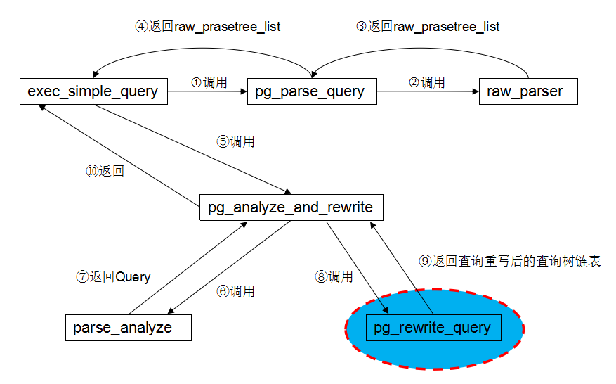
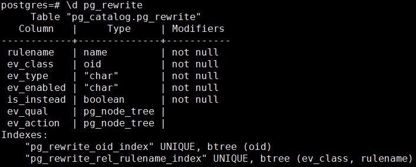
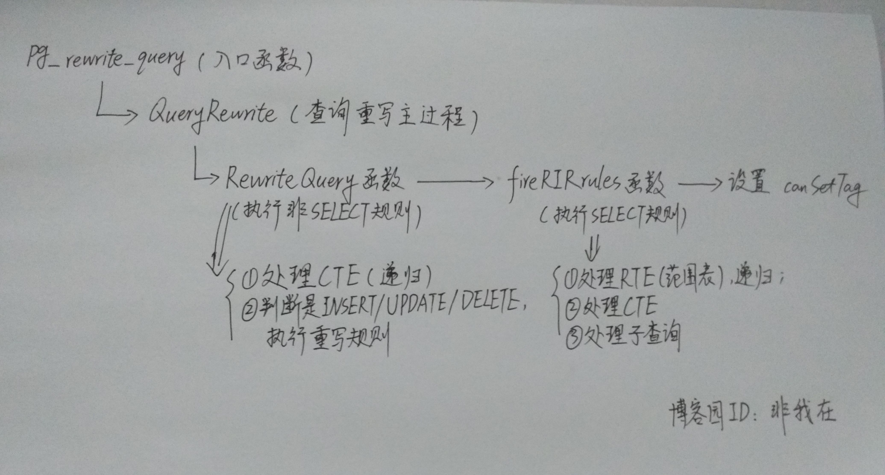

# 跟我一起读postgresql源码(三)——Rewrite(查询重写模块)

上一篇博文我们阅读了postgresql中查询分析模块的源码。查询分析模块对前台送来的命令进行词法分析、语法分析和语义分析后获得对应的查询树(Query)。在获得查询树之后，程序开始对查询树进行查询重写处理。

这一篇文章我们进入查询重写模块源码的阅读。还记得上一篇文章的那张函数调用关系图么？不记得没关系，我再放一遍。



上次的查询分析模块走了1~7这些步骤。而查询重写模块即如上图的标记所示，函数pg_rewrite_query是进行查询重写处理的入口函数。该函数定义在src/backend/tcop/postgres.c中。

函数pg_rewrite_query的参数就是查询分析模块的返回值(Query)。查询重写模块使用规则系统判断是否要对查询树进行重写。如果查询树中每个对象(或者说目标)被定义了转换规则，那么程序就会使用该规则重写查询树。这部分的源码大部分都在src/backend/rewrite文件夹下。

下面将首先介绍查询重写模块中使用的规则系统，在此基础上介绍查询重写源码的调用路径。

## 1.规则系统

毫不夸张地说，规则系统是查询重写模块的核心内容，该模块正是根据规则系统中描述的规则来决定如何对一个查询树进行重写。规则系统由一些列的规则组成。这些规则都存储在系统表pg_rewrite中。该表的结构如下图所示。每一条记录即为一条规则。



其中每个属性的意义如下：

```sh
属性名        类型            描述
oid         oid	            行标识符(隐藏属性; 必须明确选择)
rulename    name            规则名称
ev_class    oid	            使用这条规则的表名称
ev_type	    char            规则适用的事件类型：1 = SELECT, 2 = UPDATE, 3 = INSERT, 4 = DELETE
ev_enabled  char            控制规则在哪个session_replication_role模块触发。 O = 规则在 "origin" 和 "local" 模块触发, D = 规则被禁用, R = 规则在 "replica" 模块触发, A = 规则总是触发。
is_instead  bool            如果该规则是INSTEAD规则，那么为真
ev_qual     pg_node_tree    规则的资格条件的表达式树(以nodeToString()形式存在)
ev_action   pg_node_tree    规则动作的查询树(以nodeToString()形式存在)
```

由此我们可以知道：对于该表中的某条规则(即一条记录)，在该条记录的ev_class属性表示该规则适用的表(ev_class)上执行特定的命令(ev_type)且满足规则的条件表达式(ev_equal)，那么就用规则的动作(ev_action)来重写原始的查询树。

根据系统表pg_rewrite中属性值的不同，规则分为两种：

- 按照规则适用的命令不同，可以分为SELECT、UPDATE、INSERT和DELETE四种；
- 按照规则的动作方式不同，可以分为INSTEAD规则和ALSO规则。

### 1.1 SELECT/INSERT/UPDATE/DELETE规则

SELECT/INSERT/UPDATE/DELETE规则通过pg_rewrite表的ev_type属性来区分。它们的区别如下：

- SELECT规则中只能有一个动作，而且是不带条件的INSTEAD规则。

而INSERT/UPDATE/DELETE规则来说：

- 可以没有动作，也可以有多个动作;
- 可以是INSTEAD规则，也可是ALSO规则;
- 可以使用伪关系NEW和OLD;
- 可是使用规则条件;
- 不修改查询树，而是重建新的零到多个查询树(原始的查询树会被丢弃).

### 1.2 INSTEAD规则和ALSO规则

这两个规则通过pg_rewrite表的is_instead属性来区分。

INSTEAD规则就是直接用规则中定义的动作替代原始查询树中的对规则所在表的引用(例如对视图的处理)。

而对于ALSO规则，情况就复杂一些。

- 对于INSERT，原始查询在规则动作执行之前完成，这样可以保证规则动作能引用插入的行;
- 对于UPDATE/DALETE，原始查询在规则动作之后完成，这样能保证规则动作可以引用将要更新或者删除的元祖。

### 1.3 视图和规则系统

PostgreSQL里的视图是通过规则系统来实现的。下面的命令：

```sql
CREATE VIEW myview AS SELECT * FROM mytab;
```

实际上和下面两条命令：

```sql
CREATE TABLE myview (same column list as mytab);
CREATE RULE "_RETURN" AS ON SELECT TO myview DO INSTEAD
    SELECT * FROM mytab;
```

之间本质上没有区别，因为这就是CREATE VIEW命令在内部实际执行的内容。 这样做有一些负作用。其中之一就是在PostgreSQL 系统表里的视图的信息与一般表的信息完全一样。所以对于查询分析器来说， 表和视图之间完全没有区别。它们是同样的事物：关系。

具体的细节说明，这里不赘述。因为太占篇幅，写进来有头重脚轻之感。而且在postgresql的说明文档里有详细的解说。我把链接放在这里吧。http://www.postgres.cn/docs/9.5/rules-views.html

### 1.4 规则系统和触发器
读者可能会疑惑，这个规则系统和触发器的功能非常相似，尤其是在ALSO规则中尤其强烈。的确，他们都可以在某种命令和条件下被激活，执行原始查询以外的动作。但是他们在本质上是有差别的(敲黑板)：
触发器的执行对象是一个个元组，对涉及的每一个元组都要执行一次操作，而规则是对查询树的修改或者重写，涉及的层次要比触发器高。因此，如果在一个语句中涉及到多个元组，显然规则的效率要高得多。同时，触发器在概念上要比规则简单，触发器实现的功能可以用规则实现。

### 1.5 CREATE RULE命令
了解了以上这些情况，我们在来看看CREATE RULE命令。该命令用来定义一个重写规则。

命令格式如下：

```sql
CREATE [ OR REPLACE ] RULE name AS ON event
    TO table_name [ WHERE condition ]
    DO [ ALSO | INSTEAD ] { NOTHING | command | ( command ; command ... ) }


这里的event可以是下列之一：
    SELECT | INSERT | UPDATE | DELETE
```

CREATE RULE定义一个适用于特定表或者视图的新规则。 CREATE OR REPLACE RULE要么是创建一个新规则， 要么是替换一个表上的同名规则。

PostgreSQL规则系统允许在更新、插入、 删除时执行一个其它的预定义动作。简单的说， 规则就是在指定表上执行指定动作的时候，将导致一些额外的动作被执行。 一般来说，如果你只是简单地创建一个视图的话，系统会自动将视图的重写规则写到pg_rewrite表中，不需要用户自己创建，除非你想定制这个重写规则，可以使用CREATE RULE命令创建新的规则来覆盖它。

具体的详细命令使用方法，在postgresql的官方手册里说的很明白，我就不班门弄斧了，放一个链接好了http://www.postgres.cn/docs/9.5/sql-createrule.html。

## 2.查询重写

终于到源码分析这里了，先不多废话，这里先上个图。嘿嘿，自己画的，大家凑合着看。



我们可以看到，pg_rewrite_query函数通过调用QueryRewrite函数来完成查询树的重写。QueryRewrite函数是查询重写模块的主过程，完成了以下操作：

1) 用非SELECT规则将一个查询重写为0个或多个查询，此处调用RewriteQuery函数;

2) 对上一步得到的查询分别使用RIR规则进行重写，此处调用fireRIRrules函数;

3) 返回重写后的查询树.
好的，那我们再来看看RewriteQuery函数和fireRIRrules函数。

RewriteQuery函数的作用是执行非SELECT规则(也就是处理SELECT以外的语句)。

1) 该函数首先寻找含有INSERT/UPDATE/DELETE的WITH子句(说白了就是CTE)。如果存在，那么就调用自身递归地重写它们;

2) 对INSERT/UPDATE/DELETE语句，调整它们的TargetList，然后执行对应的重写规则;

3) 得到0个或多个查询并返回.
   
非SELECT规则处理完了，剩下的事交给fireRIRrules函数。fireRIRrules函数的作用是执行SELECT规则的重写。

1) 对查询树的每一个范围表(RTE)：如果RTE是子查询，调用自身递归地重写它们；如果是一个表，并且在查询树中被引用了，则调用ApplyRetrieveRule函数处理它;

2) 对于公共表表达式(CTE)，也递归地调用fireRIRrules函数重写;

3) 对于查询树的子查询，调用query_tree_walker遍历子查询，调用fireRIRonSubLink函数进行查询重写;

4) 返回重写后的查询树.
   
在调用完以上两个函数，得到一组查询树链表之后，程序最后再设置下canSetTag字段即大功告成。

查询重写部分也就到这里了，主体流程还是蛮清晰的。

## 3.结束语

这周末总算是把查询重写部分的源码粗粗的看了一下，深感不能拖延，因为你不知道未来会有什么破事在等你，因为承诺了一周一更。这篇就算这周的工作量了，如果这周不是特别闲的话可能下篇只能到下周出了。总之感谢各位的支持。

下一篇就写写查询规划部分的源码(Planner)吧。

作者：非我在
出处：http://www.cnblogs.com/flying-tiger/
本文版权归作者和博客园共有，欢迎转载，但未经作者同意必须保留此段声明，且在文章页面明显位置给出原文连接，否则保留追究法律责任的权利.
感谢您的阅读。如果觉得有用的就请各位大神高抬贵手“推荐一下”吧！你的精神支持是博主强大的写作动力。
如果觉得我的博客有意思，欢迎点击首页左上角的“+加关注”按钮关注我！