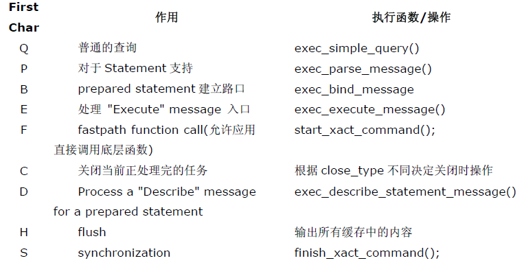
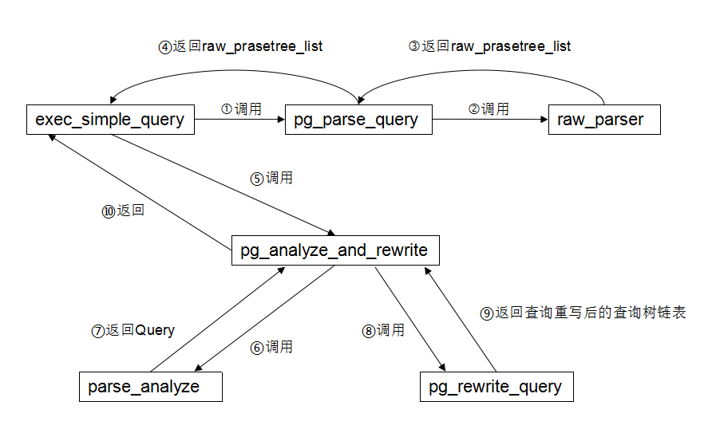
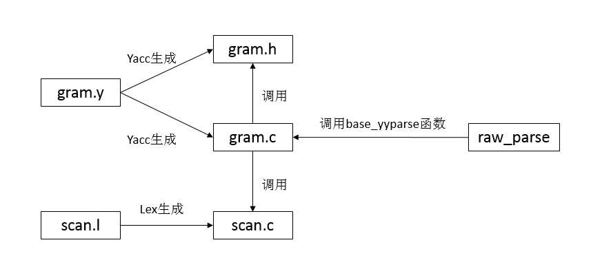

# 跟我一起读postgresql源码(二)——Parser(查询分析模块)

http://www.cnblogs.com/flying-tiger/p/6021107.html

上篇博客简要的介绍了下psql命令行客户端的前台代码。这一次，我们来看看后台的代码吧。
十分不好意思的是，上篇博客我们只说明了前台登陆的代码，没有介绍前台登陆过程中，后台是如何工作的。即：后台接到前台的连接请求后发生了什么？调用了哪些函数？启动了哪些进程？
那么，我们就先讲讲后台的工作流程吧。

## 1 PG后台工作流程

这里首先我们要知道postgresql是典型的“Server/Client”的模式。即服务器后台有一个主进程(postmaster)，该进程根据客户端的连接请求，fork一个服务端进程(postgres)为之服务。

具体来说，postmaster监听着一个特定的 TCP/IP 端口等待进来的连接。每当检测到一个连接请求时，postmaster进程派生出一个新的叫postgres的服务器进程。服务器任务(postgres进程)相互之间使用信号量和共享内存进行通讯， 以确保在并行的数据访问过程中的数据完整性。

前台程序发出一个启动命令后到Postmaster后，Postmaster根据其提供的信息建立一个子进程，也就是后台进程，专门为前台服务。Postmaster负责维护后台进程的生命周期，但与后台进程相独立。这样在后台进程崩溃后可以重启动后台进程而不会和这些后台进程一起崩溃。

落实到代码里呢？

我们首先看看\src\backend\main下的main.c文件。我们说过每个程序都有个“main”函数，之前也说明了psql里的main函数。后台的main函数就定义在main.c文件里。

在这个main函数里主要做了什么？我写在下面：

```c
line99： 函数MemoryContextInit()启动必须的子系统error和memory管理系统;
 
line110：函数set_pglocale_pgservice()获取并设置环境变量;
 
line146~148: 函数init_locale初始化环境变量;
 
line219~228：根据输入参数确定程序走向，这里进入了PostmasterMain(){跳转至postmaster.c文件中}
```

这里我们可以看到，main函数只是做了一些初始化的工作，它随后就把传进来的参数原封不动的传给了PostmasterMain(argc, argv)函数。那么继续进入PostmasterMain函数，他在src/backend/postmaster/postmaster.c中。

在函数postmaster中又做了哪些事？

```
根据命令行参数设定相应的环境值，初始化监听端口，检查其维护的数据库文件是否存在，设置signal handlers从操作系统上监听其感兴趣的消息；
调用StartupDataBase()启动后台子进程；
调用ServerLoop()监听新的建立连接消息。
```

ServerLoop()是一个死循环，当有一个新的建立连接消息到来的时候，查找自身维护的端口列表，看是否有空闭的端口，如果有调用static int BackendStartup(Port *port)来fork一个后台进程。然后，ServerLoop()判断下列几个后台支持进程的状态(linux上你可以用ps命令查看，Windows的话就任务管理器咯)：

```sh
system logger process
autovacuum process
background writer process
the archiver process
the stats collector process
```

当发现一个或多个进程发现崩溃后，重新启动它们，确保数据库整体的正常运行。Postmaster在循环中就这样一直不停的监听联系请求和维护后台支持进程。

以上的这些步骤都是在启动数据库服务器的时候完成的(postmaster命令、postgres命令或者pg_ctl命令)，即在你运行psql之前。当服务器做好上面的准备后，才可以接受前台的连接请求。

在监听并接受了一个前台的连接请求后，postmaster调用BackendStartup(Port *port)来fork一个后台进程。在该函数里：

- 调用函数BackendInitialize(port)完成Backend的初始化(主要包括读入postgre中的配置文件，根据配置文件进行端口的绑定和对客户进行验证);
- 调用函数调用BackendRun()，它会为backend设置好启动参数，并传递给PostgresMain(ac, av, port->database_name, port->user_name)函数(其中ac为int型,代表参数个数;char **av是一个二维字符串数组,用于存储参数;后面依次为要连接的数据库名和连接词数据库的用户名).

最后在src/backend/tcop/postgres.c的PostgresMain()函数里，设置好环境变量和内存上下文，在3933行的for循环处循环检查前台的输入并利用函数ReadCommand(StringInfo inBuf)读取前台命令。

根据读取的命令字符串的首字符的不同，可分为以下几种命令：



至此，后台服务进程正式开始工作。

## 2 PG的parser(查询分析模块)

当postgresql的后台服务进程postgres收到前台发来的查询语句后，首先将其传递到查询分析模块，进行词法分析，语法分析和语义分析。若是功能性命令(例如create table,create user和backup命令等)则将其分配到功能性命令处理模块；对于查询处理命令(SELECT/INSERT/DELETE/UPDATE)则为其构建查询语法树，交给查询重写模块。

总的来说流程如下：

SQL命令 --(词法和语法分析)--> 分析树 --(语义分析)--> 查询树

在代码里的调用路径如下(方框内为函数，数字显示了调用顺序)：



因此，查询分析的处理过程如下：

- exec_simple_query函数(在src/backend/tcop/postgres.c下)调用函数pg_parse_query进入词法分析和语法分析的主过程，函数pg_parse_query再调用词法分析和语法分析的入口函数raw_parser生成分析树；
- 函数pg_parse_query返回分析树(raw_parsetree_list)给exec_simple_query；
- exec_simple_query函数调用函数pg_analyze_and_rewrite进行语义分析(调用parse_analyze函数，返回查询树)和查询重写(调用pg_rewrite_query函数)；
- 返回查询树链表给exec_simple_query。

### 2.1 词法分析和语法分析

postgre命令的词法分析和语法分析是由Unix工具Yacc和Lex制作的。它们依赖的文件定义在src\backend\parser下的scan.l和gram.y。其中：

- 词法器在文件 scan.l里定义。负责识别标识符，SQL 关键字等，对于发现的每个关键字或者标识符都会生成一个记号并且传递给分析器;
- 分析器在文件 gram.y里定义。包含一套语法规则和触发规则时执行的动作.
  
在raw_parser函数(在src/backend/parser/parser.c下)中，主要通过调用Lex和Yacc配合生成的base_yyparse函数来实现词法分析和语法分析的工作。
其它重要的文件如下：

kwlookup.c：提供ScanKeywordLookup函数，该函数判断输入的字符串是否是关键字，若是则返回单词表中对应单词的指针；

scanup.c：提供几个词法分析时常用的函数。scanstr函数处理转义字符，downcase_truncate_identifier函数将大写英文字符转换为小写字符，truncate_identifier函数截断超过最大标识符长度的标识符，scanner_isspace函数判断输入字符是否为空白字符。

scan.l：定义词法结构，编译生成scan.c；

gram.y：定义语法结构，编译生成gram.c；

gram.h：定义关键字的数值编号。

值得一提的是，如果你想修改postgresql的语法，你要关注下两个文件“gram.y”和“kwlist.h”。简要地说就是将新添加的关键字添加到kwlist.h中，同时修改gram.y文件中的语法规则，然后重新编译即可。具体可以看下这篇博客如何修改Postgres的语法规则文件---gram.y

至于文件间的调用关系？我还是上个图吧：



至于词法分析和语法分析实现的细节，这应该是编译原理课程上学习的东西，这里先就不提了，以后有时间好好学习下Lex和Yacc的语法好了，到时候再写点东西与大家共享。

### 2.2 语义分析

语义分析阶段会检查命令中是否有不符合语义规则的成分。主要作用是为了检查命令是否可以正确的执行。

exec_simple_query函数在从词法和语法分析模块获取了parsetree_list之后，会对其中的每一颗子树调用pg_analyze_and_rewrite进行语义分析和查询重写。其中负责语义分析的模块是在src/backend/parser/analyze.c中的parse_analyze函数。该函数会根据得到的分析树生成一个对应的查询树。然后查询重写模块会对这颗查询树进行修正，这就是查询重写的任务了，而这并不是这篇博客的重点，放在下一篇博客里再说好了。

在parse_analyze函数里，会首先生成一个ParseState类型的变量记录语义分析的状态，然后调用transformTopLevelStmt函数处理语义分析。transformTopLevelStmt是处理语义分析的主过程，它本身只执行把'SELECT ... INTO'语句转换成'CREATE TABLE AS'的任务，剩下的语义分析和生成查询树的任务交给transformStmt函数去处理。

在transformStmt函数里，会先调用nodeTag函数生成获取传进来的语法树(praseTree)的NodeTag。有关NodeTag的定义在src/include/nodes/nodes.h中。postgresql使用NodeTag封装了大多数的数据结构，把它们封装成节点这一统一的形式，每种节点类型作为一个枚举类型。那么只要读取节点的NodeTag就可以知道节点的类型信息。

因此，随后在transformStmt函数中的switch语句里根据NodeTag区分不同的命令类型，从而进行不同的处理。在这里共有8种不同的命令类型：

```sql
SELECT INSERT DELETE UPDATE     //增 删 改 查
DeclareCursor   //定义游标
Explain         //显示查询的执行计划
CreateTableAs   //建表、视图等命令
UTILITY         //其它命令
```

对应这8种命令的NodeTag值和语义分析函数如下：

```c

NodeTag值                       语义分析函数
T_InsertStmt                transformInsertStmt
T_DeleteStmt                transformDeleteStmt
T_UpdateStmt                transformUpdateStmt
T_SelectStmt                ( transformValuesClause 
                            或者 transformSelectStmt 
                            或者 transformSetOperationStmt )
T_DeclareCursorStmt         transformDeclareCursorStmt
T_ExplainStmt               transformExplainStmt
T_CreateTableAsStmt         transformCreateTableAsStmt
default                     作为Unility类型处理，直接在分析树上封装一个Query节点返回
```

程序就根据这8种不同的命令类型，指派不同的语义分析函数去执行语义分析，生成一个查询树。

那在这里就以SELECT语句的transformSelectStmt函数为例看看语义分析函数的流程吧：

- 1)创建一个新的Query节点并设置其commandType字段值为CMD_SELECT;
- 2)调用transformWithClause函数处理WITH子句;
- 3)调用transformFromClause函数处理FROM子句;
- 4)调用transformTargetList函数处理目标属性;
- 5)调用transformWhereClause函数处理WHERE子句;
- 6)调用transformSortClause函数处理ORDER BY子句;
- 7)调用transformGroupClause函数处理GROUP BY子句;
- 8)调用transformDistinctClause或者transformDistinctOnClause函数处理DISTINCT子句;
- 9)调用transformLimitClause函数处理LIMIT和OFFSET;
- 10)调用transformWindowDefinitions函数处理窗口函数;
- 11)调用transformLockingClause函数处理FOR [KEY] UPDATE/SHARE子句;
- 12)设置Query节点的其他标志;
- 13)返回Query节点.

这样以后我们就得到了一个查询命令的查询树Query。

其实写到这里本来还想继续分析transformWithClause这些解析各种子句的函数，后来想想这样篇幅也太多了，而且未免也太细了，也留给各位朋友们一起讨论吧。

最后，我们再来看看生成的Query节点的结构(定义在src/include/nodes/parsenodes.h)吧。这里贴一下代码了。

```c
typedef struct Query
{
    NodeTag     type;
    CmdType     commandType;    /* select|insert|update|delete|utility */
    QuerySource querySource;    /* where did I come from? */
    uint32      queryId;        /* query identifier (can be set by plugins) */
    bool        canSetTag;      /* do I set the command result tag? */
    Node       *utilityStmt;    /* non-null if this is DECLARE CURSOR or a  non-optimizable statement */
    int         resultRelation; /* rtable index of target relation for INSERT/UPDATE/DELETE; 0 for SELECT */
    bool        hasAggs;        /* has aggregates in tlist or havingQual */
    bool        hasWindowFuncs; /* has window functions in tlist */
    bool        hasSubLinks;    /* has subquery SubLink */
    bool        hasDistinctOn;  /* distinctClause is from DISTINCT ON */
    bool        hasRecursive;   /* WITH RECURSIVE was specified */
    bool        hasModifyingCTE;    /* has INSERT/UPDATE/DELETE in WITH */
    bool        hasForUpdate;   /* FOR [KEY] UPDATE/SHARE was specified */
    bool        hasRowSecurity; /* row security applied? */
    List       *cteList;        /* WITH list (of CommonTableExpr's) */
    List       *rtable;         /* list of range table entries */
    FromExpr   *jointree;       /* table join tree (FROM and WHERE clauses) */
    List       *targetList;     /* target list (of TargetEntry) */
    OnConflictExpr *onConflict; /* ON CONFLICT DO [NOTHING | UPDATE] */
    List       *returningList;  /* return-values list (of TargetEntry) */
    List       *groupClause;    /* a list of SortGroupClause's */
    List       *groupingSets;   /* a list of GroupingSet's if present */
    Node       *havingQual;     /* qualifications applied to groups */
    List       *windowClause;   /* a list of WindowClause's */
    List       *distinctClause; /* a list of SortGroupClause's */
    List       *sortClause;     /* a list of SortGroupClause's */
    Node       *limitOffset;    /* # of result tuples to skip (int8 expr) */
    Node       *limitCount;     /* # of result tuples to return (int8 expr) */
    List       *rowMarks;       /* a list of RowMarkClause's */
    Node       *setOperations;  /* set-operation tree if this is top level of a UNION/INTERSECT/EXCEPT query */
    List       *constraintDeps; /* a list of pg_constraint OIDs that the query depends on to be semantically valid */
    List       *withCheckOptions;   /* a list of WithCheckOption's, which are
                                     * only added during rewrite and therefore
                                     * are not written out as part of Query. */
} Query;
```

值得关注的是commandType，rtable，resultRelation，jointree和targetList这几个变量，看懂这几个变量也就比较好懂这个数据结构了。大家看看英文也就懂了，我也不多说了。

## 总结

好吧，水了这么多，这篇算是告一段落了，自己对查询处理这一块也有个粗浅的认识了。这里要感谢《PostgreSQL数据库内核分析》这本书，虽然基于的是8.x的版本，但是对于我理解新版本也很有帮助。感谢图书的作者的无私奉献。
下一篇准备继续未完的事业，读一读postgresql的查询重写(rewrite)模块的代码，大家下期见吧。

最后一句，希望自己能坚持下去，加油。


作者：非我在
出处：http://www.cnblogs.com/flying-tiger/
本文版权归作者和博客园共有，欢迎转载，但未经作者同意必须保留此段声明，且在文章页面明显位置给出原文连接，否则保留追究法律责任的权利.
感谢您的阅读。如果觉得有用的就请各位大神高抬贵手“推荐一下”吧！你的精神支持是博主强大的写作动力。
如果觉得我的博客有意思，欢迎点击首页左上角的“+加关注”按钮关注我！

评论列表
   回复 引用#1楼 2016-11-09 21:22 我叫So
牛！！
支持(0) 反对(0)
   回复 引用#2楼 [楼主] 2016-11-09 21:27 非我在
@ 我叫So
大家一起学习哈~
支持(0) 反对(0)
   回复 引用#3楼 2016-12-12 21:39 穷白
写的很好，对照着源码理解整个的流程很清晰