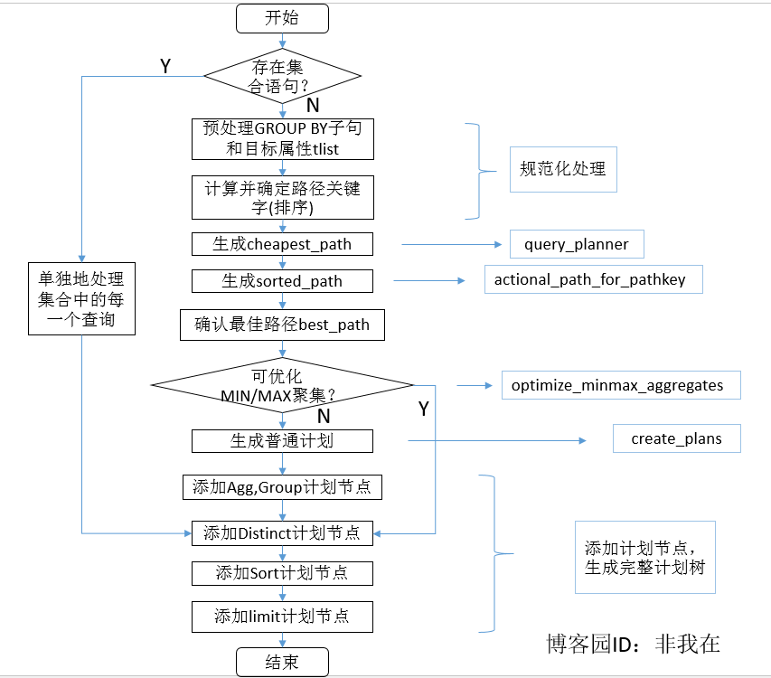
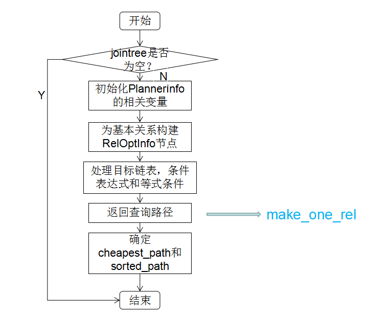
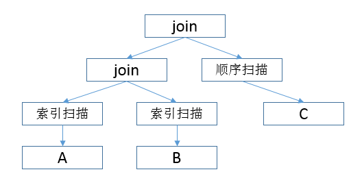
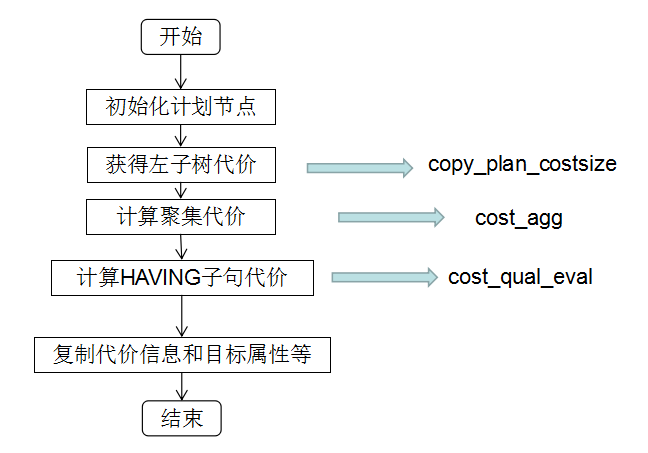

# 跟我一起读postgresql源码(五)——Planer(查询规划模块)(下)

https://www.cnblogs.com/flying-tiger/p/6087184.html

上一篇我们介绍了查询规划模块的总体流程和预处理部分的源码。查询规划模块再执行完预处理之后，可以进入正式的查询规划处理流程了。

查询规划的主要工作由grouping_planner函数完成。在具体实现的时候，针对postgresql中独有的继承表，程序使用inheritance_planner函数来解决，该函数主要是先将继承表的继承关系变换为非继承表来处理，然后仍然调用的是grouping_planner函数来完成查询规划的工作。

因此，我们说查询规划的主要工作在于grouping_planner函数。本篇的重点也是来解析该函数内部的调用关系和处理流程。

## 3.查询规划处理

这里大家真的要做好准备，因为grouping_planner函数本身就有将近1000行~

那什么，我们还是先上图吧。有图更清楚，文字太多大家也会晕的。以下是grouping_planner函数的流程图。



grouping_planner函数是生成查询计划树的主要函数。该函数首先要考虑查询计划中是否有集合操作(可通过查询树的setOperation变量来判断)。如果有则需要进行集合操作：遍历setOperation，为其中的每一个子查询生成计划。而对于非集合操作，计划的生成过程如下：

1. 如果查询含有GROUP BY子句，那么就调整其GROUP BY属性的顺序以匹配ORDER BY子句中的属性顺序(如果使用了grouping sets，则需要做进一步的变换，对于grouping sets，可以看这篇文章)，这样就可以使用一次排序操作同时实现排序和分组;

2. 调用preprocess_targetlist预处理INSERT、UPDATE、DELETE和FOR UPDATE情况下的目标属性;

3. 计算并确定代表排序需求的路径关键字，按优先级递减排序主要有groupClause、WindowClause，distinctClause和sortClause;

4. 调用query_planner函数为一个基本查询创建路径并获得cheapest_path(代价最低执行路径)，再调用get_cheapest_fractional_path_for_pathkeys函数获得sorted_path(对排序最优的路径);

5. 依据是否存在Hash等条件，确定最优路径best_path;

6. 生成可优化的MIN/MAX聚集计划;

7. 如果6)中没有生成聚集计划，则调用create_plan函数生成普通计划;

8. 根据是否有GROUP BY子句、聚集操作、ORDER BY子句、DISTINCT子句和LIMIT子句等添加相应的计划节点.

### 3.1 生成路径

SQL语句说白了就是从数据库中获取元组，之后再进行增删改查的操作。因此对于一个查询计划来说，重要的是告诉查询执行模块如何获取到要操作的元组。而这些元组要么来自于某张表，要么来自于一些基本表连接而成的"连接表"。对于这些连接表来说，会存在多种不同的连接方式，从而形成多种连接树(逻辑结构)。这样的每一棵树在postgresql中都成为一条路径。查询规划的目的莫过于从这些路径中选取一条最优的路径并生成对应的查询计划。

而生成路径的工作就是query_planner函数来完成的。不废话，上图。



在query_planner函数内部，首先我们要判断一下由PlannerInfo封装的查询树的jointree是否存在。为什么要做这样的判断呢？因为那些没有jointree的查询可能是"SELECT 2+2;"或者"INSERT ... VALUES()"这样的形式。对于他们的处理和对于有jointree的处理是不一样的。

对于没有jointree的查询树，为了和有jointree的查询树在返回的路径形式上保持一致，我们调用build_empty_join_rel函数来为它们构建一个空的join。这样以后我们就直接调用create_result_path函数和add_path函数为其创建了一条"冗余"(因为这条路径本来就不存在，数据并不在数据库里面)的路径。值得注意的是，我们仍然要为这样的路径做排序操作，因为我们可能会写出这样的查询语句:"SELECT 2+2 ORDER BY 1" 。虽然是毫无意义的排序，但是我们还是要处理的不是么。至此，返回查询路径，函数退出。

而对于有jointree的查询树，情况一定是更复杂了。首先要为PlannerInfo里面各种参数以及各种JOIN(left_join,right_join,full_join等等)语句做初始化。然后我们再为查询中的基本关系创建RelOptInfo节点(调用setup_simple_rel_arrays函数和add_base_rels_to_query函数)。然后，我们检查targetlist和jointree，对于所有引用的变量，将其增加到相对应的"基本关系"的targetlist条目中（调用build_base_rel_tlists函数)。然后再在jointree中搜寻PlaceHolderVars并为它们创建PlaceHolderInfos(调用find_placeholders_in_jointree函数)。再将join语句对应到相关的关系表中。以上的这些是为了处理目标链表，方便后面的创建路径。然后在处理好条件表达式和隐含条件，同时规范化好pathkeys的基础上，我们再调用make_one_rel函数来创建并返回路径，函数退出。(老实说，写完以上这两段，楼主的内心是崩溃的)

要理解该函数的操作，有一个数据结构是无论如何也无法回避的： RelOptInfo，定义如下:

```c
typedef struct RelOptInfo
{
    NodeTag        type;
    RelOptKind    reloptkind;
	/* all relations included in this RelOptInfo */
	Relids		relids;			/* set of base relids (rangetable indexes) */
	/* size estimates generated by planner */
	double		rows;			/* estimated number of result tuples */
	int			width;			/* estimated avg width of result tuples */
	/* per-relation planner control flags */
	bool		consider_startup;		/* keep cheap-startup-cost paths? */
	bool		consider_param_startup; /* ditto, for parameterized paths? */
	/* materialization information */
	List	   *reltargetlist;	/* Vars to be output by scan of relation */
	List	   *pathlist;		/* Path structures */
	List	   *ppilist;		/* ParamPathInfos used in pathlist */
	struct Path *cheapest_startup_path;
	struct Path *cheapest_total_path;
	struct Path *cheapest_unique_path;
	List	   *cheapest_parameterized_paths;
	/* parameterization information needed for both base rels and join rels */
	/* (see also lateral_vars and lateral_referencers) */
	Relids		direct_lateral_relids;	/* rels directly laterally referenced */
	Relids		lateral_relids; /* minimum parameterization of rel */
	/* information about a base rel (not set for join rels!) */
	Index		relid;
	Oid			reltablespace;	/* containing tablespace */
	RTEKind		rtekind;		/* RELATION, SUBQUERY, or FUNCTION */
	AttrNumber	min_attr;		/* smallest attrno of rel (often <0) */
	AttrNumber	max_attr;		/* largest attrno of rel */
	Relids	   *attr_needed;	/* array indexed [min_attr .. max_attr] */
	int32	   *attr_widths;	/* array indexed [min_attr .. max_attr] */
	List	   *lateral_vars;	/* LATERAL Vars and PHVs referenced by rel */
	Relids		lateral_referencers;	/* rels that reference me laterally */
	List	   *indexlist;		/* list of IndexOptInfo */
	BlockNumber pages;			/* size estimates derived from pg_class */
	double		tuples;
	double		allvisfrac;
	/* use "struct Plan" to avoid including plannodes.h here */
	struct Plan *subplan;		/* if subquery */
	PlannerInfo *subroot;		/* if subquery */
	List	   *subplan_params; /* if subquery */
	/* Information about foreign tables and foreign joins */
	Oid			serverid;		/* identifies server for the table or join */
	/* use "struct FdwRoutine" to avoid including fdwapi.h here */
	struct FdwRoutine *fdwroutine;
	void	   *fdw_private;
	/* used by various scans and joins: */
	List	   *baserestrictinfo;		/* RestrictInfo structures (if baserel) */							
	QualCost	baserestrictcost;		/* cost of evaluating the above */
	List	   *joininfo;		/* RestrictInfo structures for join clauses involving this rel */
	bool		has_eclass_joins;		/* T means joininfo is incomplete */
} RelOptInfo;
```

该结构涉及baserel(基本关系)和joinrel(连接关系)的概念。这里baserel指的是一个普通表、子查询或者范围表中出现的函数。而joinrel是指两个或者两个以上的baserel的简单合并。值得一提的是任何一组baserel只有一个joinrel，即只有一个RelOptInfo结构。对于joinrel本身来说，它并不关心baserel的连接顺序，baserel的连接顺序记录在RelOptInfo结构的pathlist字段里面。

而对于pathlist字段，它是一个List类型，其中每一个节点都是一个Path类型的指针。一个Path就记录了一条路径。每条路径描述了扫描表的不同方法(pathtype字段，比如有顺序扫描T_SeqScan，索引扫描T_IndexScan等等)和元组排序的不同结果(pathkeys)。需要注意的是：

- a) Path类型是一个"超类型"，也就是说，它不是一个具体的路径类型，他根据pathtype字段可以转换为具体的路径节点，例如T_IndexScan类型就对应着IndexPath数据结构。说白了，IndexPath这样的数据结构封装了Path类型，根据不同的pathype解析为不同的路径类型，这也算是一种抽象吧，后面如果新增新的路径类型，可以很方便的扩展。值得我们学习。

- b) pathkeys是一个Pathkeys类型的链表，它描述了一个路径下的排序信息。比如对于顺序扫描来说，就没有可用的排序信息，该值就为NIL，而对于索引扫描来说，我们显然是按照索引的键值来按序访问的，该值即记录了索引的排序键值(好的代码看起来就是让人舒服)。

这样看来，我们大概可以想到，路径的逻辑结构是类似树形的组织结构。上例子：

```sql
SELECT * FROM A ,B ,C
    WHERE A.a = B.a AND B.a = C.a AND A.b = 'XXX'
```

那么他的路径很可能长这个样子:



然而只是可能长这个样子，具体长什么样子，取决于很多因素，这就涉及到路径的生成算法了。

生成路径的工作由make_one_rel函数完成。make_one_rel函数非常简短。主要的就两步：

**Step1：** 调用set_base_rel_sizes函数估算每个访问路径锁涉及的记录行数和属性数，然后再调用set_base_rel_pathlists函数为每个基本关系生成一个RelOptInfo结构并生成路径，该路径放在RelOptInfo结构的pathlist字段里;

**Step2：** 调用make_rel_from_joinlist函数生成最终的路径。该函数生成一个RelOptInfo结构，它连接了上面提到的所有基本关系，并将最终路径组成的链表写入到pathlist字段里。说白了，这里就是把上面的基本关系的路径串起来，获得完整的路径。

函数的调用很清晰，但是处理机制还是比较复杂的。你看首先每个表的访问方式有顺序、索引和TID，表间的连接方式也有嵌套循环连接、归并连接和Hash连接等，多个表间的连接顺序也有左连接、右连接和bushy连接。这样一排列组合就有很多种路径可以选择。可以说当涉及的表数目较多时，这种排列组合的增长是爆炸式的！因此，如何选取一条执行效率最高，也即最优路径就是路径生成算法的核心问题了。对于这种可能解空间巨大的优化问题，我们想想也知道要用优化算法了。这里postgresql使用的是动态规划和遗传算法这两种策略。

####（1）动态规划算法

在postgresql里，默认的是使用动态规划算法来获得最优路径的。关于动态规划方法，网上的介绍很多，原理我就不介绍了。在postgresql里使用的步骤如下：

- 1)初始状态。在初始状态下，为每一个待连接的baserel生成基本关系访问路径，选出最优路径。这些关系成为第一层中间关系。把所有n个中间关系连接生成的的中间关系成为第n层关系;

- 2)归纳阶段。已知第1~n-1层关系，用下列方法生成第n层关系：

	- a.将第n-1层关系与每个第i层的关系连接，计算当前的最优连接方法(1 <= i <= n/2);

	- b.从以上结果中选择代价最小的连接顺序作为第n层的路径.

- 3)在生成的第n层关系里，选取最优的连接方法输出。

在计算时，由于连接的顺序和连接的方法都会直接或间接的影响查询执行时的磁盘I/O和CPU时间。因此在生成路径时需要同时考虑这两个因素，计算总代价。在postgresql中，代价的计算是自底向上的。因此在具体实现时保留当前的最优路径供上层节点使用。而最优路径无法精确判断，那么在每层节点中的RelOptInfo结构中都有cheapest_path、cheapest_total_path、cheapest_unique_path。分别代表启动代价最优路径、总代价最优路径和最优唯一路径。这些路径供上层比较选用。

####（2）遗传算法

遗传算法是一种启发式的搜索算法，在解空间很大的情况下，能够在一个合理的时间里获得一个"较优"的解。关于遗传算法的具体实现这里就不多说了，网上大把的例子和教程。这里提到遗传算法是因为它是作为对动态规划算法的补充。动态规划算法很好，能总是获得最优解。但是其算法时间复杂度比较高。尤其在基本关系数比较多的情况下，计算量会非常大，无法在合理的时间里获取查询规划。这里说极端点，假如我为了使查询时间节省了1秒而在获取最优查询规划时多花了十几秒这显然是得不偿失的。因此，这里有一个效率和准确度上的权衡。一般在基本关系超过阈值(默认值12)时，系统就开始使用遗传算法来生成路径。在配置文件里有两个参数来控制。一个是enable_geqo，用来设置是否允许使用遗传算法；另一个是geqo_threshold，用来控制阈值的大小。

以上是获取最优路径的算法。

### 3.2 生成可优化的MIN/MAX聚集计划

在上一小节我们完成了路径的生成，接下来就可以进行计划的生成了。在这里，程序会处理一种比较特殊的查询：查询里含有MAX/MIN聚集函数并且聚集函数使用了建有索引的属性或者该属性在ORDER BY中指定了。在这种情况下，程序可以直接在索引或者排序好的元组上直接获取MAX/MIN值对应的元组，否则可能就要扫描全表了。因此，这里程序就会判别一个查询是否满足以上条件，即可以直接读取元组。如果回答是肯定的，则生成可优化的MIN/MAX聚集计划，否则转到下一小节，生成普通的查询计划。

这里，执行这一操作的函数是optimaze_maxmin_aggregates函数。该函数对于给定的路径，判断如果可以生成可优化的MIN/MAX聚集计划，则返回一个查询计划并跳转至distinct子句节点的计划处理，否则返回空值。这个函数主要做了这些事:

1. 扫描查询树结构体(Query)中的hasAggs字段，如果存在聚集函数则进行下一步，否则跳至9);

2. 继续扫描查询树中的groupClause字段和hasWindowFuns字段分别判断查询中是否有GROUP BY和窗口函数，如果有则说明必须对表中的数据进行全表扫描，无法优化到直接获取单个元组，程序跳至9)，否则继续下一步;

3. 扫描查询中的范围表的个数，判断是否为单表查询，如果是则调用planner_rt_fetch函数读取该范围表进行下一步，否则跳至9);

4. 判断上一步的范围表是否为非继承的普通表，如果是则调用find_base_rel函数访问该关系，否则跳至9);

5. 调用find_minmax_aggs_walker函数在目标属性和HAVING子句中查找聚集函数，如果不都是MIN/MAX聚集函数则跳至9)；否则调用build_minmax_path函数查找是否可以使用索引对其优化并计算优化代价，此时如果不是所有的MIN/MAX聚集函数都可以被优化则也跳至9);

6. 通过调用函数cost_agg评估不优化MIN/MAX聚集函数时的代价，如果优化后的代价比优化前要好则调用make_agg_subplan函数为每个MIN/MAX聚集函数生成优化后的子计划，否则跳至9);

7. 分别调用函数replace_aggs_with_params_mutator函数将目标属性和HAVING子句中的MIN/MAX聚集函数替换成对应的子计划，调用函数mutate_eclass_expressions将等价类中的MIN/MAX聚集函数替换为对应的子计划;

8. 调用函数make_result生成最终的输出计划节点并调用cost_qual_eval函数对目标属性进行代价评估和更新计划节点中的代价评估值;

9. 程序结束并返回空值，退出。

### 3.3 生成普通计划

如果optimize_minmax_aggregates函数返回值为空值，那么就要继续生成普通执行计划了。grouping_planner函数调用create_plan函数来完成这一工作。同样，该函数使用3.1节生成的最优路径作为输入，并根据路径节点的不同，调用不同的函数完成计划的生成。要说明的是create_plan函数只是一个壳子，主处理交给了create_plan_recurse函数来递归地处理。而create_plan_recurse函数就是一个大的swith语句，负责判断节点类型然后分发给不同的函数去处理。
主要地，普通计划分为三种大的类型，分别介绍如下:

（1）扫描计划。也就是访问表的方式，种类如下：

```
T_SeqScan:
T_SampleScan:
T_IndexScan:
T_IndexOnlyScan:
T_BitmapHeapScan:
T_TidScan:
T_SubqueryScan:
T_FunctionScan:
T_ValuesScan:
T_CteScan:
T_WorkTableScan:
T_ForeignScan:
T_CustomScan:
```

这些交给create_scan_plan函数去生成扫描表的计划;

（2）连接计划。也就是表之间连接的方式，种类如下:

```
T_HashJoin
T_MergeJoin
T_NestLoop
```

这些交给create_join_plan函数去生成表间连接的计划;

（3）其它计划。比如Append计划、Result计划和Material计划等。这些分别使用create_xxx_plan函数去处理。

### 3.4 生成完整计划

总之，通过上面的内容我们总算根据best_path路径获得了计划树。但是，我们需要注意的是，生成的路径只考虑了基本查询语句的信息(即主干信息)，并没有保留GROUP BY、ORDER BY这些信息。因此。在获得基本的查询计划树之后，我们还需要添加相应的查询计划树节点使之完整。

我们回到最开头的那张图，我们看到主要要处理的是Agg、Group计划节点；Distinct计划节点；Sort计划节点和Limit计划节点。

对于Agg节点，调用make_agg函数来生成Agg类型的结构并连接到计划树；来个图吧：



其他的节点也类似的调用make_xxx函数来生成对应的节点结构来进行处理。
值得注意的是，在生成节点结构的时候也同时计算该节点的代价。

## 4.整理计划树

生成完整计划之后，还不能直接交给查询执行器去执行，还需要对计划树进行整理。这样做主要是为了方便执行模块的执行，对查询计划树上的一些细节进行整理加工。负责该项工作的主要函数是set_plan_references。

主要做了这几件事：

1. 把子查询里面所涉及到的相关关系表放进一个单独的list里，并清空那些在查询规划树里对查询执行模块无用的RTE域的值;

2. 调节扫描节点中的Var结构，使得其与范围表一致;

3. 调节上层计划节点中的Var结构，令其成为对子计划节点输出的引用;

4. 用PARAM_EXEC参数来替换PARAM_MULTIEXPR，这样就完成了所有MULTIEXPR子计划;

5. 计算操作符的OID;

6. 创建一个列表，用来存放查询计划所依赖的特殊对象(目前主要存储关系和用户定义函数);

7. 删除无用的子查询计划节点.

## 5.总结

是的，这篇废话很多的文章到这就结束了，很不甘心，查询规划部分有很多内容值得细讲，讲的时候有的讲的比较多，有的讲的很少。而且关键是自己的理解很不是特别清晰。查询规划过程中涉及到了很多的数据结构和方法。楼主我也没有一一的细讲。总之这篇赶得比较紧，有很多图表到后来都没有细细的画了，作为强迫症真有点不舒服。奈何！先这样吧，后续再对许多为完全理解的地方再一一解释吧，也是给自己一个交代。

也是第一次写这样长的文章，大家多担待了。

祝大家周末愉快~

作者：非我在
出处：http://www.cnblogs.com/flying-tiger/
本文版权归作者和博客园共有，欢迎转载，但未经作者同意必须保留此段声明，且在文章页面明显位置给出原文连接，否则保留追究法律责任的权利.
感谢您的阅读。如果觉得有用的就请各位大神高抬贵手“推荐一下”吧！你的精神支持是博主强大的写作动力。
如果觉得我的博客有意思，欢迎点击首页左上角的“+加关注”按钮关注我！

#1楼 2016-11-25 08:37 潇湘隐者
顶起，请问有那些postgresql方面的资料值得新手学习？ 谢谢！
支持(0) 反对(0)
   回复 引用#2楼 [楼主] 2016-11-25 08:50 非我在
@ 潇湘隐者
客气了哈 推荐你这个资料

https://github.com/ty4z2008/Qix/blob/master/pg.md

还有德哥的博客：

http://blog.163.com/digoal@126/

还有我看您是个DBA，能不能分享下其它数据库方面的资料和经验呢~