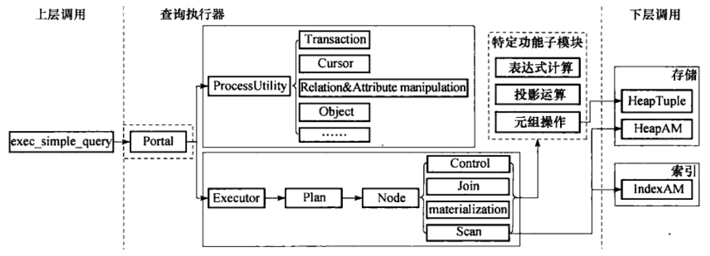
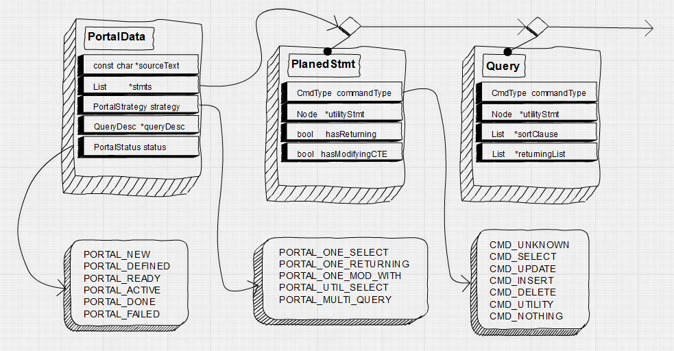
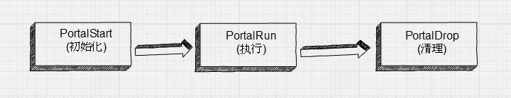
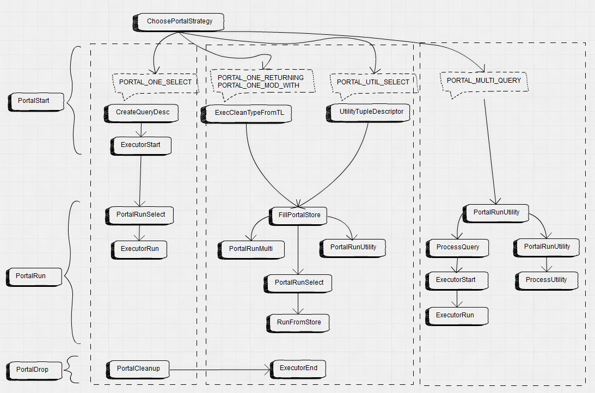

# 跟我一起读postgresql源码(六)——Executor(查询执行模块之——查询执行策略)

时光荏苒，岁月如梭。楼主已经很久没有更新了。之前说好的一周一更的没有做到。实在是事出有因，没能静下心来好好看代码。当然这不能作为我不更新的理由，时间挤挤还是有的，拖了这么久，该再写点东西了，不然人就怠懒了。不过这回，我准备写的精简些，一方面我想偷点懒省点时间，二来毕竟写太长大家也不一定爱看。

之前我说过的查询分析，查询重写和查询规划都是相当于是对查询的"编译"。那么编译完了就应该按照既定的策略去执行它。本篇就来介绍查询执行模块的代码(Executor)，欢迎拍砖。

这部分我主要从以下五个部分介绍查询执行模块(很可能要分成四到五篇文章来阐述，毕竟是比查询规划还要复杂的模块):

1.查询优化策略
2.非可优化语句的执行
3.可优化语句的执行
4.计划节点
5.其它子功能介绍

查询执行器的框架结构如下图所示。



在exec_simple_query函数中，调用查询编译模块之后，就进入了查询执行器模块。在该模块中，就是按照前一阶段查询规划模块锁生成的查询计划，有机第调用存储、索引，并发等模块来完成数据的读取或者修改的过程。

在本模块中，总共下属四个子模块，分别是：Portal、ProcessUtility、Executor和其他特定子功能模块。

我们知道，查询规划阶段将查询分为两种类型，在查询执行模块中，先由Portal模块识别查询类型(有计划树和无计划树)，根据查询类型分别指派Executor模块和ProcessUtility模块进行处理。

这两个子模块的处理逻辑相差很大，执行过程和先关数据结构差异也很大。

对于Executor模块，它根据输入的查询计划树按部就班地处理数据表中元组的增删改查(DML)操作，它的执行逻辑是统一的(所有的增删改查最后都归结为SELECT，只是分别在SELECT的基础上进行一些额外的操作)。其主要代码放在src/backend/executor下。

而对于ProcessUtility模块，由于处理的是除了增删改查之外的所有其他操作，而这些操作往往差异很大，例如数据定义操作(DDL),事务的处理以及游标用户角色定义这些，因此在ProcessUtility模块中，为每种操作单独地设计了子过程(函数)去处理。主要代码在src/backend/commands下。

而剩下的我说的特定功能子模块，是指一些功能相对独立和单一并且在整个查询过程中会反复被调用的函数(我更愿意称他们为工具函数)，例如各种辅助的子系统，表达式的计算，投影运算以及元组操作这些。

## 1.查询优化策略

在进入这一模块之前，我已经简要说明了Executor模块和ProcessUtility模块这两个主要的执行分支。这里要提到两个概念：

**可优化语句和非可优化语句**

可优化语句说白了就是DML语句，这些语句的特点就是都要查询到满足条件的元组。这类查询都在查询规划阶段生成了规划树，而规划树的生成过程中会根据查询优化理论进行重写和优化以提高查询速度，因此称作可优化语句。

那反过来讲，那些没有生成执行计划树的功能性操作就是非可优化语句了。这里只是提一下这个概念，在后面的介绍中会用。

### 1.1五种执行策略

上面提到，一条简单的SQL语句会被查询编译器转化为一个执行计划树或者一个非计划树操作。而一条复杂的SQL语句往往同时带有DDL和DML语句，即它会被转换为一个可执行计划树和非执行计划树操作的序列。而可执行计划树和非可执行计划树是由不同的子模块去处理的。这样就有了三种不同的情况，需要三种不同的策略去应对。

然而除此之外，我们还有一种额外的情况需要考虑到：有些SQL语句虽然可以被转换为一个原子操作，但是其执行过程中由于各种原因需要能够缓存语句执行的结果，等到整个语句执行完毕在返回执行结果。

具体的说：

- 1 对于可优化语句，当执行修改元组操作时，希望能够返回被修改的元组(例如带RETURNING子句的DELETE)，由于原子操作的处理过程不能被可能有问题的输出过程终止，因此不能边执行边输出，因此需要一个缓存结构来临时存放执行结果；

- 2 某些非优化语句是需要返回结果的(例如SHOW，EXPLAIN) ，因此也需要一个缓存结构暂存处理结果。

此外，对于带有INSERT/UPDATE/DELETE的WITH子句，会在CTE中修改数据，和一般的CTE不一样。我们也需要进行特事特办，特殊处理，这是第五种情况。

因此，综合上面所说的，我们需要有五种处理策略来解决，分别如下：

- 1）PORTAL_ONE_SELECT：处理单个的SELECT语句，调用Executor模块；

- 2）PORTAL_ONE_RETURNING：处理带RETURNING的UPDATE/DELETE/INSERT语句，调用Executor模块；

- 3）PORTAL_UTIL_SELECT：处理单个的数据定义语句，调用ProcessUtility模块；

- 4）PORTAL_ONE_MOD_WITH：处理带有INSERT/UPDATE/DELETE的WITH子句的SELECT，其处理逻辑类似PORTAL_ONE_RETURNING。调用Executor模块；

- 5）PORTAL_MULTI_QUERY：是前面几种策略的混合，可以处理多个原子操作。

### 1.2 策略的实现

执行策略选择器的工作是根据查询编译阶段生成的计划树链表来为当前的查询选择五种执行策略中的一种。在这个过程中，执行策略选择器会使用数据结构PortalData来存储查询计划树链表以及最后选中的执行策略等信息。

对于Portal这一数据结构(定义在src/include/utils/portal.h里)，我把重要的字段信息也贴在下面吧：

```c
typedef struct PortalData
{
    /* Bookkeeping data */
    const char *name;    		/* portal's name */
	......
	/* The query or queries the portal will execute */
	const char *sourceText;		/* text of query (as of 8.4, never NULL) */
	const char *commandTag;		/* command tag for original query */
	List	   *stmts;			/* PlannedStmts and/or utility statements */
	......
	ParamListInfo portalParams; /* params to pass to query */

	/* Features/options */
	PortalStrategy strategy;	/* see above */

	/* If not NULL, Executor is active; call ExecutorEnd eventually: */
	QueryDesc  *queryDesc;		/* info needed for executor invocation */

	/* If portal returns tuples, this is their tupdesc: */
	TupleDesc	tupDesc;		/* descriptor for result tuples */
	......
}	PortalData;
```

对于查询执行器来说，在执行一个SQL语句时都会以一个Portal作为输入数据，在Portal中存放了与执行该SQL相关的所有信息，例如查询树、计划树和执行状态等。
Portal结构和与之相关的主要字段的结构如下所示：



这里仅仅给出了两种可能的原子操作PlannedStmt和Query，这两者都能包含查询计划树，用于保存含有查询的操作。当然有些含有查询计划树的原子操作不一定是SELECT语句，例如游标的声明(utilityStmt字段不为空)，SELECT INTO语句(intoClause字段不为空)等等。

那么我们很容易想到，postgres是不是就是根据原子操作的命令类型和原子操作的个数来确定合适的执行策略当然呢？

**YES！但是不完全**

命令的类型就如下几种:

```c
//  src/include/nodes/nodes.h
typedef enum CmdType
{
    CMD_UNKNOWN,
	CMD_SELECT,					/* select stmt */
	CMD_UPDATE,					/* update stmt */
	CMD_INSERT,					/* insert stmt */
	CMD_DELETE,
	CMD_UTILITY,				/* cmds like create, destroy, copy, vacuum,
								 * etc. */
	CMD_NOTHING					/* dummy command for instead nothing rules
								 * with qual */
} CmdType;
```

那么策略到底如何呢？无非就是根据命令类型，原子操作个数以及查询树、计划树上的某些字段(比如hasModifyingCTE、utilityStmt等等)这些做判断了，具体的我就不写了，太占版面了，大家也不愿意看的。

执行这一任务的函数是ChoosePortalStrategy，在src/backend/tcop/pquery.c文件中。函数逻辑比较清晰，大家有兴趣可以瞅瞅。

### 1.3 Portal的执行过程

好了，终于到了这里，我们讲一讲一个Portal是如何执行的吧。

所有的SQL语句的执行都必须从一个Portal开始，所有的Portal流程都必须要进过下面这个流程：



该流程都在exec_simple_query函数内部进行。过程大致如下：

- 1）调用函数CreatePortal创建一个“clean”的Portal，它的内存上下文，资源跟踪器清理函数都已经设置好，但是sourceText,stmts字段还未设置；
- 2）调用函数PortalDefineQuery函数为刚刚创建的Portal设置sourceText，stmt等，并且设置Portal的状态为PORTAL_DEFINED;
- 3)调用函数PortalStart对定义好的Portal进行初始化：
    - a.调用函数ChoosePortalStrategy为portal选择策略；
    - b.如果选择的是PORTAL_ONE_SELECT，则调用CreateQueryDesc为Portal创建查询描述符；
    - c.如果选择的是PORTAL_ONE_RETURNING或者PORTAL_ONE_MOD_WITH，则调用ExecCleanTypeFromTL为portal创建返回元组的描述符；
    - d.对于PORTAL_UTIL_SELECT则调用UtilityTupleDescriptor为Portal创建查询描述符；
    - e.对于PORTAL_MULTI_QUERY这里则不做过多操作；
    - f.将Portal的状态设置为PORTAL_READY。
- 4）调用函数PortalRun执行portal,这就按照既定的策略调用相关执行部件执行Portal；
- 5）调用函数PortalDrop清理Portal，释放资源。

最后画一张图来解释整个流程吧：



下一篇，我们细细讲讲可优化语句和非可优化语句的执行~

作者：非我在
出处：http://www.cnblogs.com/flying-tiger/
本文版权归作者和博客园共有，欢迎转载，但未经作者同意必须保留此段声明，且在文章页面明显位置给出原文连接，否则保留追究法律责任的权利.
感谢您的阅读。如果觉得有用的就请各位大神高抬贵手“推荐一下”吧！你的精神支持是博主强大的写作动力。
如果觉得我的博客有意思，欢迎点击首页左上角的“+加关注”按钮关注我！

评论列表
   回复 引用#1楼 2017-07-11 12:33 千帆青年
已阅
支持(0) 反对(0)
   回复 引用#2楼 2017-07-17 11:03 狂神314
最近也开始挖PG源码了，有机会交流交流
支持(0) 反对(0)
   回复 引用#3楼 [楼主] 2017-07-19 11:48 非我在
@ 狂神314
好的 正愁没人交流 postgresql国内弄得人太少了
支持(0) 反对(0)
   回复 引用#4楼 2019-03-19 11:37 梦幻无极限
请教下，你后面画的Portal结构图和其流程图，是用啥软件画的，挺好看的
支持(0) 反对(0)
   回复 引用#5楼 [楼主] 2019-06-12 13:34 非我在
@ 梦幻无极限
SimpleDiagram: http://www.simplediagrams.com/