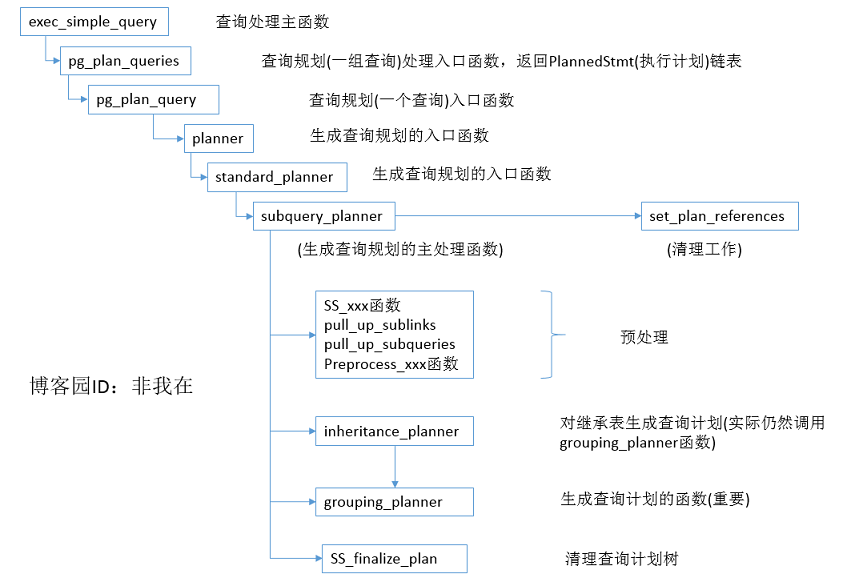

# 跟我一起读postgresql源码(四)——Planer(查询规划模块)(上)

https://www.cnblogs.com/flying-tiger/p/6063709.html

时间一晃周末就过完了，时间过得太快，不由得让人倍加珍惜。时间真是不够用哈~

好的不废话，这次我们开始看查询规划模块的源码吧。

查询规划部分的在整个查询处理模块应该是在一个非常重要的地位上，这一步直接决定了查询的方式与路径，很大程度上影响了数据库查询的查询性能。因此这一块代码量也很大，我也会花较多的笔墨来分析这个模块的代码。在篇幅上，可能查询规划这一模块我会用2到3篇文章来细细的说明下。今天这一篇先总体概述下查询规划模块的全貌，在介绍该模块的一个重要的子模块(总共三个主要模块)就结束吧，剩下的交给第二篇吧。

## 1.查询规划模块总体概况

废话不多说，我先上图。下图大概的刻画了查询规划模块里主要的函数调用关系，当然啦，最下层只画到主处理函数，主处理函数内部的调用关系在介绍每个主处理函数的时候再细细的说吧。



我简单介绍下吧。exec_simple_query函数是负责查询处理的主函数，在进行查询规划之前，它已经调用了查询分析和查询重写模块。还记得上一篇博文的查询重写模块么？该模块返回的是重写后的查询树链表。这里exec_simple_query函数将重写后的查询树链表交给查询规划模块进一步处理。查询规划模块的入口函数是pg_plan_queries函数。

pg_plan_queries函数调用pg_plan_query函数对每一个查询进行处理并返回PlannedStmt(执行计划)结构体链表。这里要注意，查询规划模块只会对非UTILITY命令进行处理。

而在pg_plan_query函数里，实际是调用planner函数负责查询计划的生成。

planner函数调用standard_planner函数进入标准的查询规划处理流程。该函数接受查询树以及相关参数，返回PlannedStmt结构体，详细的结构如下：

```c
typedef struct PlannedStmt
{
    NodeTag    	type;
	CmdType		commandType;	/* select|insert|update|delete */
	uint32		queryId;		/* query identifier (copied from Query) */
	bool		hasReturning;	/* is it insert|update|delete RETURNING? */
	bool		hasModifyingCTE;	/* has insert|update|delete in WITH? */
	bool		canSetTag;		/* do I set the command result tag? */
	bool		transientPlan;	/* redo plan when TransactionXmin changes? */
	struct Plan *planTree;		/* tree of Plan nodes */
	List	   *rtable;			/* list of RangeTblEntry nodes */
	/* rtable indexes of target relations for INSERT/UPDATE/DELETE */
	List	   *resultRelations;	/* integer list of RT indexes, or NIL */
	Node	   *utilityStmt;	/* non-null if this is DECLARE CURSOR */
	List	   *subplans;		/* Plan trees for SubPlan expressions */
	Bitmapset  *rewindPlanIDs;	/* indices of subplans that require REWIND */
	List	   *rowMarks;		/* a list of PlanRowMark's */
	List	   *relationOids;	/* OIDs of relations the plan depends on */
	List	   *invalItems;		/* other dependencies, as PlanInvalItems */
	int			nParamExec;		/* number of PARAM_EXEC Params used */
	bool		hasRowSecurity; /* row security applied? */
} PlannedStmt;
```

该结构体里包含了后续的查询执行模块所需要的全部信息，包括计划树(Plan)、子计划树(SubPlan)和其他重要的参数信息。

在standard_planner函数里，主要通过subquery_planner函数和set_plan_references函数分别完成查询计划的处理优化和清理工作。

set_plan_references函数这里不多做介绍，这不是查询计划的重点，我们把重点放在subquery_planner函数上。该函数接收Query(查询树)，返回一个Plan(计划树)。

如图所示，我们可以看出subquery_planner函数的处理主要分为三部分。

### 1.1 预处理

主要调用相关预处理函数，依据消除冗余条件、减少递归层次和简化路径等原则对查询树进行预处理。主要包括：

1.特殊情况的处理，如内联返回值函数、预处理行标记和扩展继承表等;
2.提升子链接和提升子查询;
3.预处理表达式;
4.预处理连接条件.

### 1.2查询规划处理

此处主要调用grouping_planner函数来处理(inheritance_planner函数在处理完继承关系后仍然调用的是grouping_planner函数来处理)。在执行过程中，该函数不再对查询树做变换处理，而是将查询中的信息进行规范化并传给query_planner函数。query_planner函数调用make_one_rel函数进入查询优化阶段，并将最优路径放入cheapest_path。然后grouping_planner函数再调用get_cheapest_fractional_path_for_pathkeys函数寻找符合需求的排序路径sorted_path，并最终确定最优路径best_path并生成基本计划树(调用create_plan函数)。

### 1.3 清理计划树

调用set_plan_references函数清理现场，做一些变量的调整工作，不对计划树做本质的改变。

那么，接下来的部分和后续文章(如果有的话)就从这三个部分展开了。

## 2.预处理

在进行正式的工作之前，常常需要做一些准备工作。在查询规划模块尤其是这样，因为它的预处理阶段做的事情还是蛮多的，因此值得单独拿出一节来讲，另外从篇幅上考虑，讲完预处理这篇就差不多了，因为之后的查询规划主过程的内容只会更多，应该要单独拿出(至少)一篇讲了。

查询规划模块的预处理工作主要是提升子链接和子查询，预处理表达式和having子句等。处理的对象主要是查询树中的范围表rtable和连接树jointree.

### 2.1提升子链接和子查询

首先我们先说明下子链接和子查询的区别：子查询是一条完整的查询语句，而子链接是一条表达式，但是表达式内部也可以包含查询语句。直白点说呢就是：子查询是放在FROM子句里的而子链接则出现在WHERE子句或者HAVING子句中。

在subquery_planner函数里，调用pull_up_sublinks函数处理WHERE子句和JOIN/ON子句中的ANY和EXISTS类型的子链接。

在用pull_up_sublinks函数内部，调用pull_up_sublinks_jointree_recurse函数递归地处理连接树jointree：

1.对于RangeTblRef类型，直接返回;

2.对于FromExpr类型，递归调用pull_up_sublinks_jointree_recurse函数处理每个节点并调用pull_up_sublinks_qual_recurse函数处理约束条件;

3.对于JoinExpr类型，递归调用pull_up_sublinks_jointree_recurse函数处理左右子树并调用pull_up_sublinks_qual_recurse函数处理约束条件.
之后，subquery_planner函数调用pull_up_subqueries函数来提升子查询。当子查询仅仅是一个简单的扫描或者连接时，就会把子查询或者子查询的一部分合并到父查询中以进行优化。一般会分一下三种情况处理：

1.在范围表中存在子查询。对于简单的子查询，直接调用pull_up_simple_subquery函数进行提升;而对于简单的UNION ALL子查询，调用pull_up_simple_union_all函数进行提升，其他的情况则不处理;

2.在FROM表达式中存在子查询。对于FROM列表中的每个节点都调用pull_up_subqueries递归处理;

3.连接表达式中的子查询。调用pull_up_subqueries函数递归地处理.

这些话说的很头疼，大家看了估计也头疼。我们举一个例子好了，假设我们有这样一个SQL语句：

```sql
SELECT D.dname
FROM dept D
WHERE D.deptno IN
    (SELECT E.deptno FROM emp E WHERE E.sal = 100);
```

从字面上看，如果该语句中的子查询被独立地规划，也就是说对于表dept中的每一个元组deptno值，都要搜索一遍emp表。显然这样的做法很蠢，代价也非常大。但是如果我们把子查询提升并合并到父查询中，那么我们看看效果。
先做提升子链接：

```sql
SELECT D.dname
FROM dept D ,   (SELECT E.deptno FROM emp E WHERE E.sal = 100) AS Sub
WHERE D.deptno = Sub.deptno;
```

然后再做提升子查询：

```sql
SELECT D.dname
FROM dept D ,emp E
WHERE D.deptno = E.deptno and E.sal = 100;
```

可以看到，这样操作以后的SQL语句只要先做一下过滤(E.sal = 100)，然后再把结果和dept表做一下连接即可，大大提高了查询效率。

### 2.2预处理表达式

表达式的预处理工作主要由函数preprocess_expression完成。该函数采用递归扫描的方式处理PlannerInfo结构体里面保存的目标属性、HAVING子句、OFFSET子句、LIMIT子句和连接树jointree。总体来说，做了以下几件事：

1.调用flatten_join_alias_vars函数，用基本关系变量取代连接别名变量;

2.调用函数eval_const_expression进行常量表达式的简化，也就是直接计算出常量表达式的值。例如："3+1 <> 4" 这种会直接被替换成“FALSE”;

3.调用canonicalize_qual函数对表达式进行规范化，主要是将表达式转换为最佳析取范式或者合取范式(这个博主也不太懂啊，尴尬);

4.调用函数make_subplan将子链接转换为子计划.

对于函数make_plan,还是要细细的说一下，其执行步骤如下：

1) 首先复制子链接SubLink中的查询树Query，如果查询树是一个EXISTS型的子计划，那么则调用simplify_EXISTS_query函数对QUery副本进行处理;

2) 调用subquery_planner函数为子链接生成计划，同时设置好参数tuple_fraction来告诉底层规划器需要去多少个元组。对于EXISTS型的子查询，设置该值为1.0，取回一个元组即可；对于ALL和ANY型的子查询，从概率上说大约取到50%的元组就可以得到结果，因此设置参数值为0.5；对于其他的查询，统一设置为0;

3) 调用build_subplan函数将上一步生成的计划转换为SubPlan或者InitPlan的形式，并将当前查询层次的参数列表传递给它的子计划;

4) 对于生成的是SubPlan而且是一个简单的EXISTS类型的查询，调用convert_EXISTS_to_ANY函数尝试将其转换为一个ANY类型的查询并创建查询计划.
   
### 2.3处理HAVING子句

对于HAVING子句来说，除了进行前面所提到的预处理外，还需要处理其中的每个条件。如果HAVING子句中没有聚集函数的话，那么它完全可以退化到WHERE子句中去，否则的话他将被写到查询树的HavingQual字段里面。
具体来说的话：

step1:初始化一个空的HAVING子句链表newHaving;

step2:扫描HAVING子句链表中的每一条HAVING子句：
        1.如果HAVING子句中存在聚集函数、易失函数或者子计划中的一种或多种，则添加至newHaving链表中;
        2.如果不包含GROUP子句，则添加至WHERE子句中;
        3.其他情况，将这条HAVING子句添加至WHERE子句同时也保存至newHaving中.

step3:用处理后的HAVING、子句链表newHaving替换原来的HAVING子句链表.
举个例子，例如有如下SQL语句：

SELECT a FROM b WHERE a.c = 10 HAVING  a.d > 5;
在HAVING子句里没有聚集，那么可以直接将"a.d > 5" 提升到WHERE子句中，即：

SELECT a FROM b WHERE a.c = 10 AND a.d > 5;

## 3.结语

所以这一篇就又这样水完了？不甘心啊。感觉写的蛮糟的。这次大概就把查询规划模块的总体和预处理阶段简单介绍了下，感觉思路有点乱，有空再捋捋。后面一篇再细细的说说查询规划的主处理过程吧~感觉是块硬骨头，不好啃。

好的，大家下期见~

作者：非我在
出处：http://www.cnblogs.com/flying-tiger/
本文版权归作者和博客园共有，欢迎转载，但未经作者同意必须保留此段声明，且在文章页面明显位置给出原文连接，否则保留追究法律责任的权利.
感谢您的阅读。如果觉得有用的就请各位大神高抬贵手“推荐一下”吧！你的精神支持是博主强大的写作动力。
如果觉得我的博客有意思，欢迎点击首页左上角的“+加关注”按钮关注我！

评论列表
   回复 引用#1楼 2016-11-22 11:12 我叫So
继续支持LZ！！！
支持(0) 反对(0)
   回复 引用#2楼 [楼主] 2016-11-22 14:46 非我在
@ 我叫So
感谢感谢 你们的支持就是我的动力~