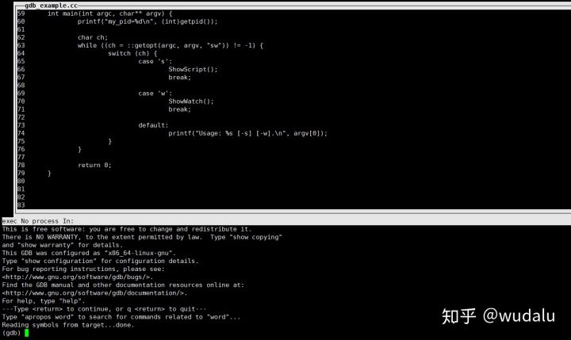
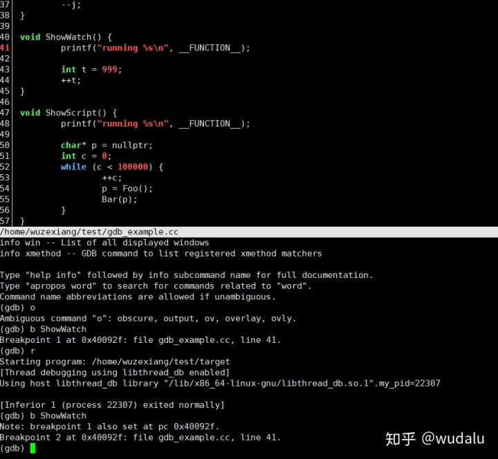

**gdb简明手册**

*https://zhuanlan.zhihu.com/p/36771960*

[wudalu](https://www.zhihu.com/people/wudalu)

问题解决专家，各种颓废，各种无聊，茶，各种歌，旅行，拍照，各种电影，各种平常

​关注他

10 人赞同了该文章

**简介**

linux/unix命令行调试工具，可分析coredump文件，可运行时attach，方便查看各类内存数据。

**使用**

**启动**

1.  gdb app

-   set args 设置app启动参数

-   gdb app core_file

-   运行时attach

-   gdb进入交互界面之后attach pid

-   gdb -p pid

**常用指令**

-   bt / where

    -   查看堆栈

    -   bt full 完整版，显示local变量

    -   bt n 显示前n个堆栈

-   frame

    -   查看栈帧

    -   简写：f

    -   f + number 表示去到对应的栈帧

-   up / down

    -   栈帧上下切换

    -   up 到当前栈帧的上一个栈帧(frame1-\>frame2)

    -   down 到当前栈帧的下一个栈帧 frame2-\>frame1)

-   info

    -   简写:i

    -   i args: 参数info

    -   i locals: local变量info

    -   i registers: 查看寄存器

    -   i frames

    -   i everything...

-   print

    -   简写:p

    -   p variable

    -   p expression  
        可执行一系列表达式，函数调用等等

-   x

    -   examine

    -   查看内存

    -   x/x 以十六进制输出

    -   x/d 以十进制输出

    -   x/c 以单字符输出

    -   x/i 反汇编 – 通常，我们会使用 x/10i \$ip-20
        来查看当前的汇编（\$ip是指令寄存器）

    -   x/s 以字符串输出

-   list

    -   列出源代码

    -   简写:l

    -   l func:显示func的代码

    -   l 行号：将显示当前文件以“行号”为中心的前后10行代码，如：list 12

    -   l : 接着上一次的list，继续列出源代码

    -   directory src_code_dir  
        设置源代码目录

-   thread

    -   线程调试

    -   简写: thr

    -   i thr

    -   thr thread_id  
        跳到对应的线程，后可做bt各种操作

-   set scheduler-locking off\|on  
    + off 不锁定其他线程，默认  
    + on 只让当前线程执行

-   disassemble

    -   简写：disas

    -   反汇编

    -   使用方式

        -   disassemble

        -   disassemble \$pc \$pc+100

        -   disassemble 开始地址 结束地址

**runtime debug**

-   所有常用指令

-   generate-core-file / gcore

    -   运行时生成core file，用于分析

    -   gcore 'pidof target'  
        无须gdb attach。

-   断点

    -   设置断点

        -   b file_name:line_number  
            file_name第line_number行设置断点

        -   b n  
            第n行设置断点

        -   b func  
            在func入口设置断点

        -   b f:n thread all  
            所有线程设置断点

    -   条件断点

        -   b f:n if condition  
            设置条件断点

    -   断点操作

        -   i b  
            显示所有断点

        -   d b  
            清除所有断点

        -   d(delete) 断点号n  
            删掉第n个断点

        -   c 行号n  
            清除第n行的断点

    -   执行控制

        -   next n

        -   step s

        -   continue c

        -   until u

    -   监视点

        -   watch 发生变化时暂停运行

        -   awatch 被访问，改变时暂停运行

        -   rwatch 被访问时暂停运行

    -   变量控制

        -   set variable key=value

        -   线上改变系统的运行，you can do it

**命令扩展**

-   \-x指定命令文件  
    gdb -q -p 30775 -x the_gdb \> gdb_output

-   comm  
    指定断点之后的动作

comm

i locals

i args

end

-   define  
    自定义命令，配合用来设置断点挺有用

(gdb) define il

Type commands for definition of "il".

End with a line saying just "end".

\>i locals

\>end

(gdb) b main

Breakpoint 1 at 0x4009b0: file gdb_example.cc, line 60.

(gdb) r

Starting program: /home/wuzexiang/test/target -s

[Thread debugging using libthread_db enabled]

Using host libthread_db library "/lib/x86_64-linux-gnu/libthread_db.so.1".

Breakpoint 1, main (argc=2, argv=0x7fffffffe628) at gdb_example.cc:60

60 printf("my_pid=%d\\n", (int)getpid());

(gdb) il

ch = 0 '\\000'

(gdb)

**gdb脚本**

-   \~/.gdbinit  
    source your script

-   gdb lua脚本  
    将L替换为你的luaState

set \$p = L-\>base_ci

while (\$p \<= L-\>ci )

if ( \$p-\>func-\>value.gc-\>cl.c.isC == 1 )

printf "0x%x C FUNCTION", \$p

output \$p-\>func-\>value.gc-\>cl.c.f

printf "\\n"

else

if (\$p-\>func.tt==6)

set \$proto = \$p-\>func-\>value.gc-\>cl.l.p

set \$filename = (char\*)(&(\$proto-\>source-\>tsv) + 1)

set \$lineno = \$proto-\>lineinfo[ \$p-\>savedpc - \$proto-\>code -1 ]

printf "0x%x LUA FUNCTION : %d %s\\n", \$p, \$lineno, \$filename

else

printf "0x%x LUA BASE\\n", \$p

end

end

set \$p = \$p+1

end

-   gdb python脚本  
    libpython.py放到/home/A

import sys

sys.path.insert(0,'/home/A/')

import libpython

-   一个好玩的小脚本

\# 无须添加代码，监控内存使用情况的脚本

\# set pagination off

b Foo

comm

silent

printf "Malloc. p=%x,size=%lu",p,size

bt

end

c

b Bar

comm

silent

printf "Free. p=%lu",p

bt

end

c

**better gdb**

-   \-tui 启动

gdb-tui 启动

-   cgdb

cgdb启动

-   try it

    -   emacs gdb

    -   gdb gui

**延伸使用**

-   demos

-   ulimit

-   perf

-   stack

-   strace / truss

**refs**

1.  [gdb调试利器](https://link.zhihu.com/?target=http%3A//linuxtools-rst.readthedocs.io/zh_CN/latest/tool/gdb.html)

2.  [GDB中应该知道的几个调试方法](https://link.zhihu.com/?target=https%3A//coolshell.cn/articles/3643.html)

3.  《debug hacks》

4.  idaq64.exe 查反汇编

5.  [gdb的python扩展](https://link.zhihu.com/?target=https%3A//sourceware.org/gdb/current/onlinedocs/gdb/Python-API.html)

6.  [终端调试哪家强？](https://zhuanlan.zhihu.com/p/32843449)

7.  《软件调试的艺术》

8.  [gdb Debugging Full Example (Tutorial):
    ncurses](https://link.zhihu.com/?target=http%3A//www.brendangregg.com/blog/2016-08-09/gdb-example-ncurses.html)

编辑于 2018-05-12
