Oracle RAC Q&A
==============

第一部分 集群管理软件
=====================

集群技术简介
------------

### EVM, CRS, CSS

Oracle10g版本, Oracle推出了自己的集群管理软件产品----CRS (Cluster Ready
Service).

对于集群管理软件---CRS, 主要分为3个组件: CSS (Cluster Synchronization Service),
CRS (Cluster Ready Service) 和 EVM (Event Manager).

CSS组件负责构建集群, 并维护集群的一致性.

CRS组件负责对集群的所有应用程序资源进行管理, 并实现应用程序的高可用性.

EVM组件负责产生并记录集群事件, 并在节点间传递发生的事件.

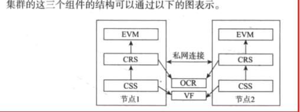

### ASM, OCR, VF

Oracle10g版本中, 为了更加方便的管理集群中的共享磁盘,
10g版本又推出了另一个重要的组件ASM(Automatics Storage
Management)来管理集群中的共享磁盘.

而CRS, ASM 和 RAC数据库之间的关系是: CRS作为集群层面的软件,
在集群的每个节点上运行,
负责完成构建集群,维护集群一致性,管理集群应用程序资源(主要是数据库)的任务.

ASM作为存储层面的软件,
负责为集群和应用程序(主要是数据库)提供共享磁盘,并对共享磁盘进行管理.
ASM管理磁盘是通过ASM实例来实现的, 而ASM组织磁盘是通过磁盘组来实现的. 不过,
比较遗憾的是CRS的重要共享文件OCR (Oracle Cluster Register)和VF (Voting
File)在10g还不能通过ASM进行管理.

### DRM, SCN BOC

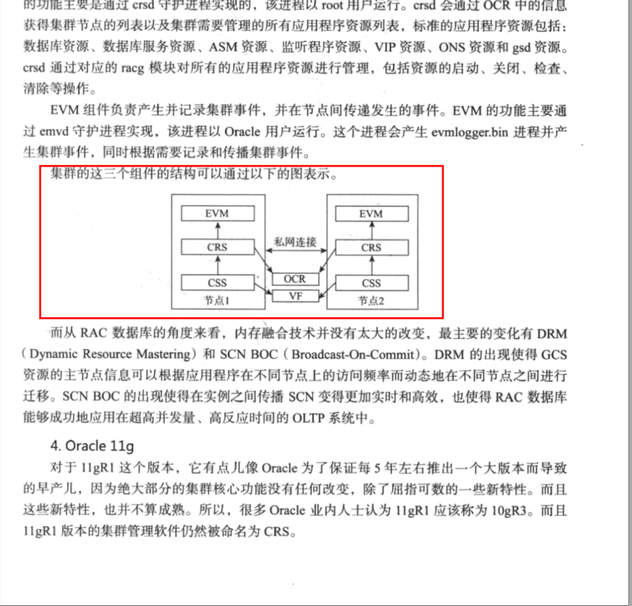

### Oracle GI (Grid Infrastructure)

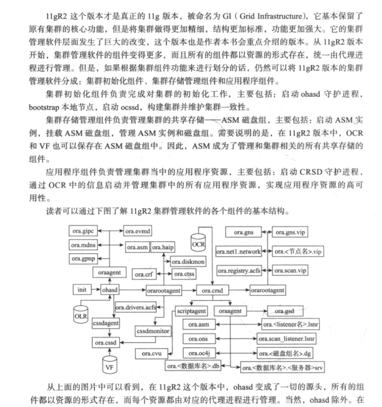

### Read mostly, HM(Hang Manager)

对于数据库层面, 11g版本也推出了一些优秀的新特性, 例如: Read mostly,
这个新特性的出现使内存融合技术在操作以读为主的数据库对象时变得更加高效.

HM(Hang
Manager)这个特性的出现使得RAC数据库能够自动地发现数据库中出现的等待链条,死锁或夯住的进程,
并且能够提前解决掉这些可能导致数据库性能问题的隐患,
同时也为诊断数据库性能问题提供更多的参考信息.

### LMHB进程

LMHB进程是11gR2版本中新出现的后台进程, 用于监控和内存融合相关的所有后台进程,
当这些进程当中的一个或多个出现性能问题时,
LMHB通过终止阻塞进程或者终止实例的方式来避免出现数据库挂起的问题.

### 多租户和in-memory选项

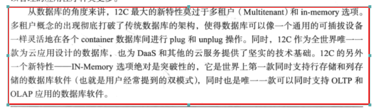

### HA Cluster

HA Cluster就是高可用集群(High Avilability Cluster).
高可用的含义就是最大限度的提供可用的服务.

### SGA

SGA(System Global Area)系统全局区, 这是一个非常庞大的内存区间,
也是为什么开启Oral侧之后占用了很大内存的原因.

SGA分为不同的池，我们可以通过视图v\$sgastat查看，如下所示。

SQL\> select pool ,sum(bytes) bytes from v\$sgastat group by pool;

POOL              BYTES  
------------ ----------  
              956298240  
java pool      16777216  
streams pool   16777216  
shared pool   199783376  
large pool     16777216

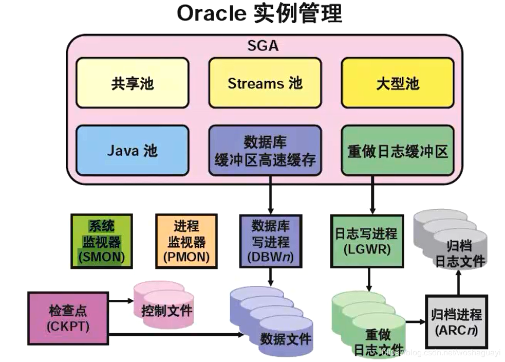

### DLM

DLM是Oracle分布式锁技术, 也叫内存融合技术.

DLM(pre 9i)/GRD可以看成是内存融合的基础.

### GCS, GES, GRD啥关系

先说定义,

GCS (Global Cache Service)

GES (Global Enqueue Service)

GRD (Global Resource Directory)

简单来说,

gcs负责管理维护buffer的并发控制

ges负责管理维护除buffer之外的所有资源的并发控制

grd, shard_pool的一部分,记录全局资源的使用情况

详细来说,

gcs用于缓冲区缓存管理的锁, 用来协调由多个实例访问的共享数据,
这些锁称之为”并行缓存管理(PCM)锁”;

ges 协调所有的全局队列(任何非缓冲区缓存资源)请求, 即非PCM锁,
这是RAC中进行锁管理的唯一联络点, 它还参与死锁检测和请求超时,
在正常操作期间,它管理缓存,而在集群再配置期间执行清理操作;

GRD就像是锁和资源的一个中央仓库, 它分散在所有节点中,
没有一个节点拥有关于所有资源的信息,
只有一个节点维护着有关一个资源的完整信息,这个节点为该资源的”主控节点”,
其他节点只需要维护该资源上保存在其本地的锁信息.

GRD（Global Resource
Service）其实就是一张哈希表，也就是一个全局资源目录。用来记录各个RAC节点资源的使用情况。  
GCS（Global Cache Service）对应的进程是LMSn ，负责数据块在实例间的传递。  
GES（Global Enqueue
Service）对应的进程是LMD和LMON，负责在多个实例之间协调对数据块的访问顺序，也就是管理队列资源，保证数据的一致性访问。LMD是实现队列资源的释放和分配的，LMON主要监控节点的健康。

### Oracle RAC后台进程LMD0, LMON, LMSN

LMD0, MLON, LMSN是Oracle RAC启动后的后台进程.

LMD0 (Global Enqueue Service Daemon 0 Process)

| LMD0 | Global Enqueue Service Daemon 0 Process | Manages incoming remote resource requests from other instances | LMD0 processes enqueue resources managed under Global Enqueue Service. In particular, LMD0 processes incoming enqueue request messages and controls access to global enqueues. It also performs distributed deadlock detections. | Database and ASM instances, Oracle RAC |
|------|-----------------------------------------|----------------------------------------------------------------|----------------------------------------------------------------------------------------------------------------------------------------------------------------------------------------------------------------------------------|----------------------------------------|

LMON (Global Enqueue Service Monitor Process)

| MON | Global Enqueue Service Monitor Process | Monitors an Oracle RAC cluster to manage global resources | LMON maintains instance membership within Oracle RAC. The process detects instance transitions and performs reconfiguration of GES and GCS resources. **See Also:** [Oracle Real Application Clusters Administration and Deployment Guide](https://docs.oracle.com/cd/E18283_01/rac.112/e16795/admcon.htm#RACAD7275) |
|-----|----------------------------------------|-----------------------------------------------------------|----------------------------------------------------------------------------------------------------------------------------------------------------------------------------------------------------------------------------------------------------------------------------------------------------------------------|

LMSn (Global Cache Service Process)

| LMS*n* | Global Cache Service Process | Manages resources and provides resource control among Oracle RAC instances | LMS, where *n* is 0-9 or a-z, maintains a lock database for Global Cache Service (GCS) and buffer cache resources. This process receives, processes, and sends GCS requests, block transfers, and other GCS-related messages. **See Also:** [Oracle Real Application Clusters Administration and Deployment Guide](https://docs.oracle.com/cd/E18283_01/rac.112/e16795/admcon.htm#RACAD7275) |
|--------|------------------------------|----------------------------------------------------------------------------|----------------------------------------------------------------------------------------------------------------------------------------------------------------------------------------------------------------------------------------------------------------------------------------------------------------------------------------------------------------------------------------------|

#### 所有后台进程参考

[Oracle 11g后台进程一览表](https://www.cnblogs.com/lhdz_bj/p/9407757.html)

### share-nothing和share-everything

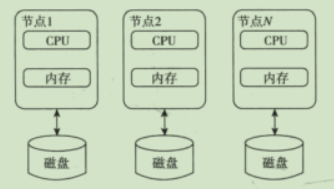

share-nothing

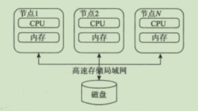

share-everything

### 内存融合技术涉及的各个进程和模块之间的关系

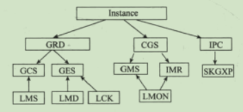

### 11gR2集群管理软件各个组件基本结构

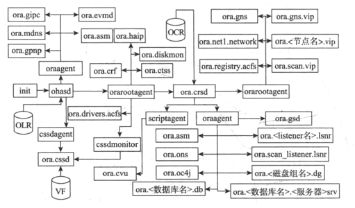

### Oracle RAC历史版本核心技术突破

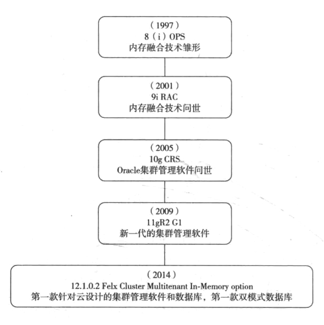

安装Oracle集群
--------------

### 安装过程分为哪几部

对于11gR2版本的集群管理软件, 整个安装过程大概分为三部分.

1.  安装前准备

2.  安装软件

3.  配置集群

### 中央目录(Central Inventory)

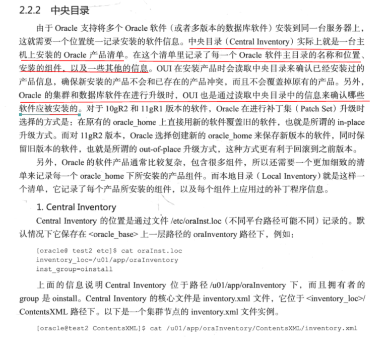

### root.sh 完成哪些阶段的工作

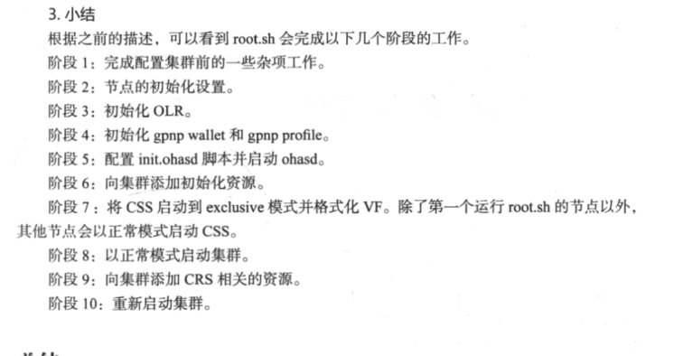

第5章 CSS部分
-------------

### CSS (Cluster Synchronization Service)

CSSs是Oracle集群管理软件的核心组件.

### 脑裂

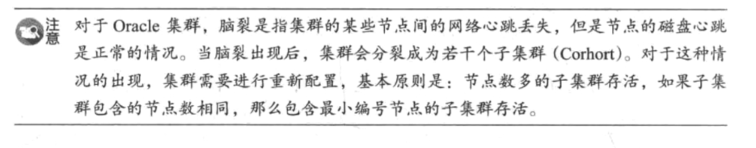

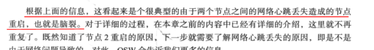

### 集群的心跳机制有哪些

网络心跳

磁盘心跳

本地心跳

### 心跳机制的作用

维护集群的一致性

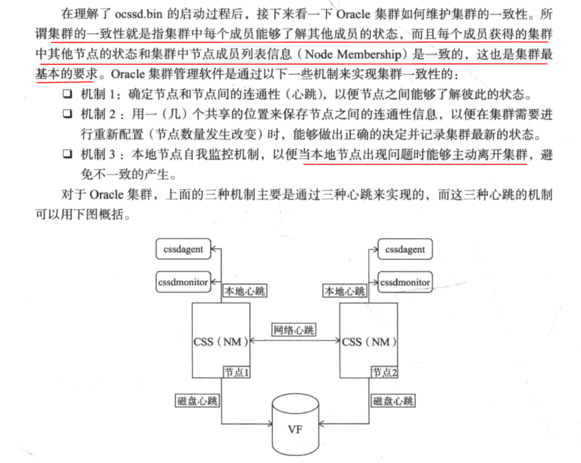

### 每个心跳机制的作用

网络心跳: 首先是通过网络心跳来确定集群节点之间的连通性,
以便节点之间能够了解彼此的状态.

磁盘心跳: 磁盘心跳的主要目的就是当集群发生脑裂时帮助定制脑裂的解决方案.

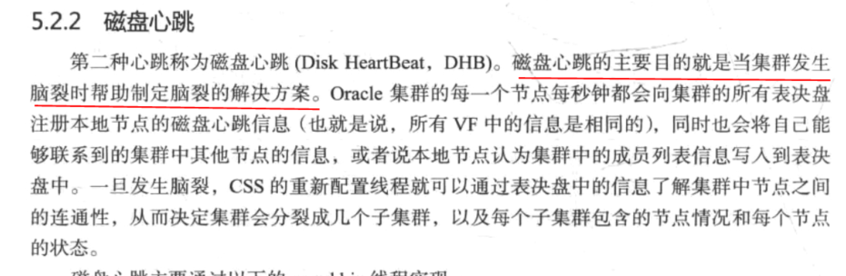

本地心跳: 这种心跳的作用是监控ocssd.bin进程以及本地节点的状态.

### 表决盘/表决文件 VF(Voting File)

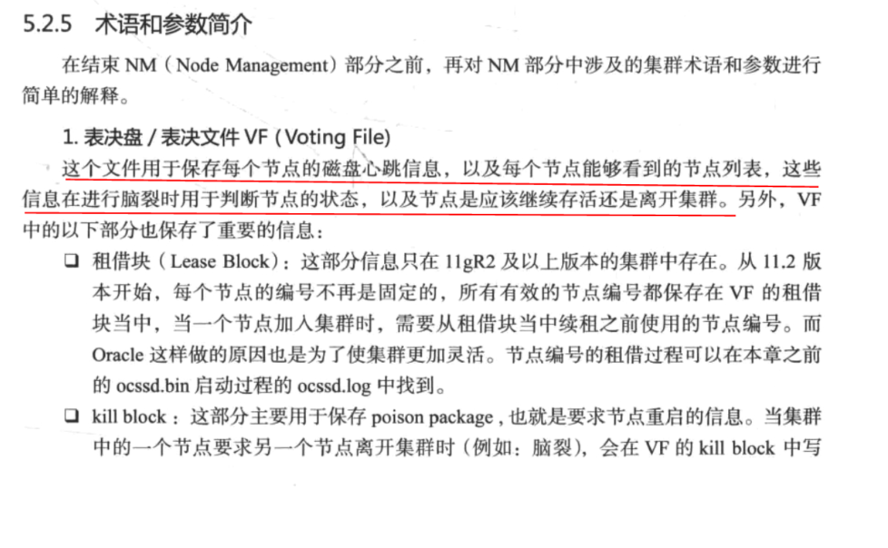

### OCR (Oracle集群注册表 Oracle Cluster Register)

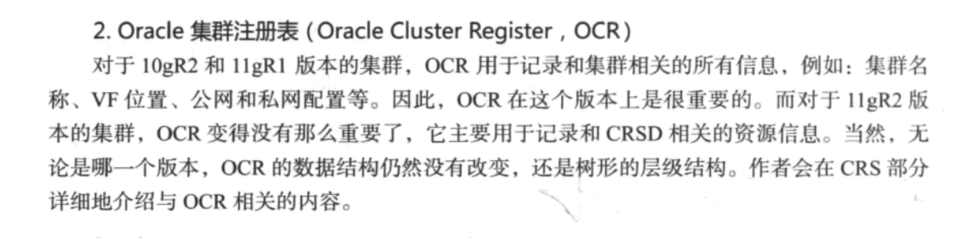

### miscount

这个值用来定义集群网络心跳的超时时间,默认值是30s. 也就是说,
当集群中的一个或多个节点连续丢失网络心跳超过miscount时间后,
集群需要进行重新配置,某一个或多个节点需要离开集群. 当然, 对应11gR2版本的集群,
这个值也是节点本地心跳的超时时间, 因为本地心跳和网络心跳是由相同的线程发送的.

### LIOT (long I/O timeout)

这个参数定义了节点在进行磁盘心跳时对*VF*的I/O超时时间, 默认值为200s, 也就是说,
如果cssd连续200s无法在一个VF上完成磁盘心跳的话, 这个VF会被离线掉.

### SIOT (short I/O timeout)

这个参数定义了节点在进行重写配置时对VF的I/O超时时间,默认值为misscount(30)-reboottime(3)
= 27s

### 重新配置主节点 (Reconfiguration master)

当集群中的节点数量(Node Membership)发送改变时,
会有一个节点被用于完成这次重新配置,该节点负责向集群中的其他节点发送重新配置消息,
接收其他节点的反馈信息, 并对集群的一些配置文件(如: OCR, VF)进行修改,
以反映集群新的节点数量.

通常情况下, 集群中编号最小的节点会被选择作为重新配置的主节点.

### Reboot time

这个集群参数用于指定Oracle集群要求OS完成重启的时间, 默认值为3s.

### diagwait

这个参数用于指定oprocd进程的margin时间.这个参数只适用于10gR2和11gR1版本的集群,
而且只能够被设置为13.

### Incarnation

这是一个单向增长的整数,集群每经历一次重新配置,这个数值就增加1.
Oracle通过这个数值来标志集群的最新状态.

### 什么是CSS组管理

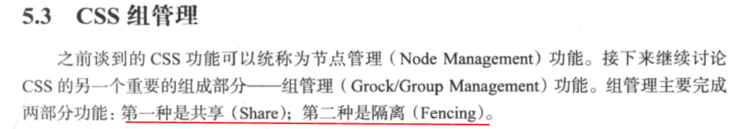

第6章 CRS部分
-------------

### CRS (Cluster Ready Service)

这里将CRS称之为CRSD, 原因:
为了将10gR2版本的集群管理软件名称CRS和本章的集群就绪服务部分加以区分, 避免混淆.

CRSD的主要功能是管理集群中的应用程序(或者说是应用程序对应的资源),
以便实现集群资源的高可用性. CRSD的另一部分功能就是管理OCR, 包括OCR的更新和备份.

### CRS中的基本概念

#### 资源

集群所管理的应用程序实体或守护进程.

资源分为本地资源和集群资源两种.

本地资源只能在集群的某一个节点上运行, 不能被切换到其他节点上运行.

集群资源正常情况下会在默认的节点上运行,但是可以根据不同的情况切换到其他节点上.

#### 资源概要文件

概要文件定义了资源的很多属性, 以便CRSD能够根据概要文件定义的属性来管理该资源,
例如: 检查间隔, 动作脚本等.

#### 动作

动作定义了CRSD对资源进行启动, 停止和检查操作时所需要运行的步骤,
他可以是一段shell脚本, 一段应用程序, 数据库命令等.

#### 状态

当某一个动作发生在一个资源上之后, 一定会返回一个状态作为动作的输出.

资源的状态可以是以下几种之一.

1.  ONLINE: 在线, 对应资源的online状态

2.  OFFLINE: 离线, 对应资源的offline状态, 当然, 即使资源被离线,
    GI仍然会探测这个资源的状态, 以便在资源恢复正常时能够自动将资源重新上线.

3.  UNKNOWN: 未知, 对应资源的unknown状态. 在这种状态下,
    CRSD会持续对该资源进行检查, 以便在资源恢复正常后能够发现它的新状态.

#### 依赖关系

TODO

资源之间并不是独立的, 有些资源之间是存在相互依赖关系的.

#### 权限

TODO

由于不同的资源需要执行的操作也是不同的,
这意味着执行操作的用户也会不同(主要是root和Oracle用户),
所以每个资源都会针对不同的用户指定不同的权限.

这也是为什么crsd.bin守护进程需要以root用户运行的原因之一.

#### RACG模块

TODO

#### OCR (Oracle Cluster Register)

OCR实际上是一个包含了以上所有信息的注册表,
CRSD通过访问OCR来获得集群资源的列表(当然, 还包括其他很重要的信息),
以及每个资源的各个属性.

可以说, OCR就相当于CRSD或者集群的数据字典,
集群中所有的属性和资源的属性都能在OCR中找到.

#### OCR主节点 (OCR Master Node)

TODO

##### OCR的详细介绍

TODO

第7章 Oracle集群管理软件的启动顺序
----------------------------------

第9章
-----

### ASM

Oracle ASM (Automatic Storage
Management)是Oracle提供的统一的存储服务,属于数据库的一个组件.

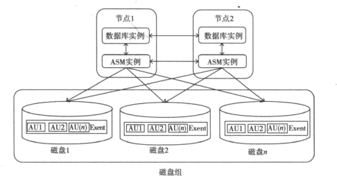

ASM的基本架构

### ASM实例

ASM实例是Oracle实现对ASM磁盘组和磁盘管理的方式.

它的结构和普通的数据库实例是一致的, 有内存结构和后台进程构成.

其中内存结构由SGA和PGA构成, 主要负责保存ASM磁盘相关的定义信息以及磁盘组的元数据,
而后台进程负责管理这些ASM的源数据, 并与数据库实例的进程进行通信,
为数据库提供存储服务.

### Quorum disk

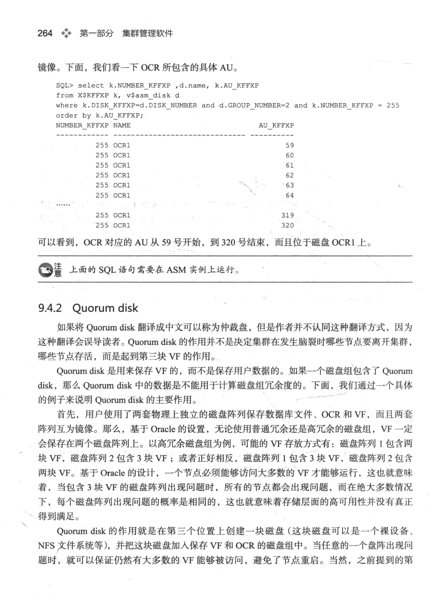

### OCR/VF和ASM磁盘组

从版本11.2开始, Oracle推荐把集群的重要组件OCR和VF保存到ASM磁盘组当中,
以便使OCR和VF能够使用ASM的特性(冗余和条带化).

对于OCR和VF, 它们会被保存到相同的磁盘组, 根据磁盘组的冗余程度,
OCR和VF会保存多个副本.

第二部分 RAC数据库软件
======================

第10章 解析内存融合技术
-----------------------

### 内存融合技术(Cache Fusion)

内存融合技术是RAC的核心技术.

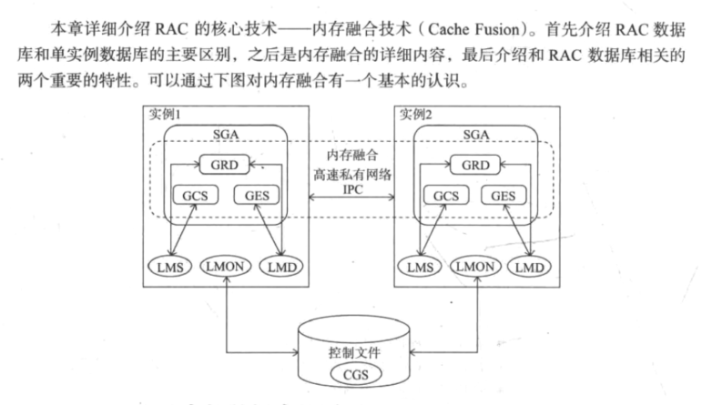

### RAC和单实例数据库的区别

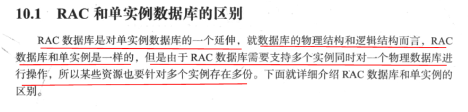

### RAC内存结构 \*

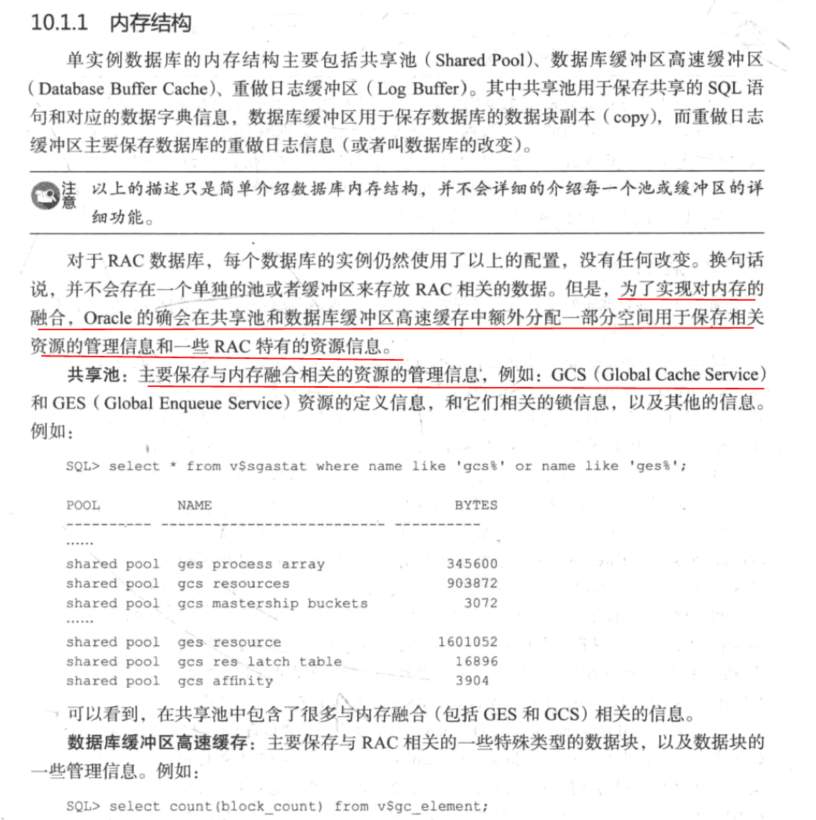

### RAC特有的后台进程

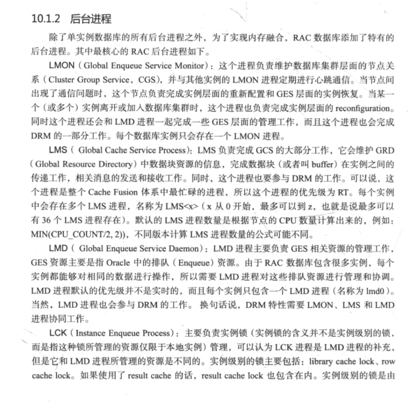

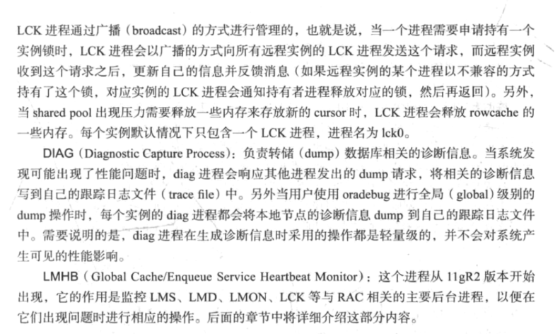

### 内存融合概念 \*\*

### 内存融合的过程 \*\*

### SCN(System Change Number)的传播和log file sync

### DRM (Dynamic Remastering)和READ mostly

第11章 RAC数据库的实例管理
--------------------------

### RAC数据库实例管理

由于RAC数据库的一个重要节点就是多个数据库实例同时访问相同的物理数据库, 所以,
就需要一套办法来实现实例之间的通信, 并维持数据库实例之间的一致性,
也就是RAC数据库当中的实例管理.

在RAC数据库当中, 这部分功能称为节点管理(Node Management, NM)或者CGS(Cluster
Group Service).

### 为什么要有实例管理

由于RAC数据库的一个重要特点就是多个数据库实例同时访问相同的物理数据库.
所以就需要一套办法来实现实例之间的通信,
并维持数据库实例之间的一致性,也就是RAC数据库当中的实例管理.

在RAC数据库中,这部分功能称之为节点管理(Node Management, NM)或者CGS(Cluster Group
Service).

### CGS \*\*

CGS(Cluster Group Service)功能实际上是Oracle
Rac的实例管理的实现方法,它负责实现以下功能:

1.  实例之间的心跳机制

2.  当实例离开或者加入集群时完成数据库集群的重新配置

3.  解决数据库层面出现的脑裂

所以, 它的功能很像之前集群部分当中的CSS组件,而且,
CGS的很多做法实际上和集群层面的CSS是很类似的.

### 脑裂

数据库层面的脑裂和集群层面的脑裂时比较类似的, 但是在处理方式上却有所不同.

数据库层面的脑裂:
是指当数据库集群节点之间由于网络问题导致了不能访问的情况.脑裂在绝大部分出现双节点的数据库集群丢失网络心跳的情况下,所以数据库层面的脑裂和集群层面的脑裂时比较类似的,
但是在处理方式上却有所不同.

#### 数据库层面的脑裂

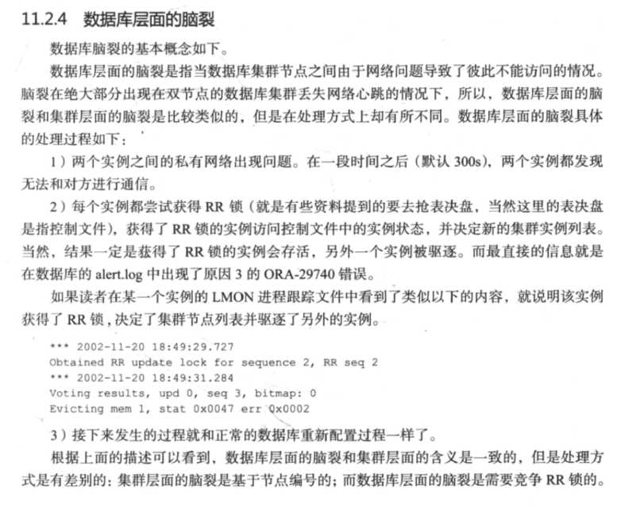

### 实例之间的心跳机制 \*\*

和CSS部分类似, RAC数据库中有3种心跳: 网络心跳, 磁盘心跳, 本地心跳.

### LMHB

LMHB进程是在11gR2版本才开始出现的, 该进程被称为Global Cache/Enqueue Service
Heartbeat Monitor.

顾名思义, 它被用来监控GCS和GES相关的后台进程的心跳信息.

该进程会定期检查LMON, LMS, LMD和LCK0的状态,
如果发现某一个进程在一段时间之内没有响应LMHB的心跳消息(也就是hang住了),
那么LMHB进程就会尝试找到阻塞该进程的阻塞进程(blocker).

如果阻塞进程不是数据库必需的后台进程,LMHB进程会通过终止阻塞进程的方式来解决内存融合核心进程hang住的问题;
否则, 如果没有找到阻塞进程, 或者阻塞进程也是重要的数据库后台进程的话,
那么LMHB可能会采用终止实例的方式来解决问题(这样做的目的是为防止由于某一个内存融合核心进程hang住导致整个数据库层面出现性能问题.

第12章 RAC性能调优
------------------

### RAC相关的统计信息分为哪几类

分为3类:

1.  与PCM资源相关的统计信息, 即GCS相关的统计信息,
    也就是数据库相关的计时器和计数器.

2.  与non-PCM资源相关的统计信息, 即GES相关的统计信息,
    也就是Enqueue相关的计时器和计数器.

3.  与消息相关的统计信息.

### RAC相关的等待事件

由于RAC相关的资源分为PCM资源和Enqueue(non-PCM)资源,所以与RAC相关的等待事件也可以分为Enqueue和gc两类.

### RAC死锁的发现方式

RAC数据库中的死锁是由LMD进程处理的。

基本步骤如下：

1.  每个实例的LMD进程定期申请DI资源，
    获得DI资源的LMD进程会搜索各个实例没有被满足的锁请求， 并绘制锁的等待链路.

2.  如果LMD进程发现有闭合环路(也就是死锁)的存在,那么将会导致这个环路的进程的当前DML语句回滚掉,以解决死锁,并释放DI资源.如果没有死锁,也会释放DI资源.

### RAC数据库的常见性能问题

1.  序列导致的性能问题

2.  索引块导致的性能问题

3.  过多物理读导致的性能问题

4.  缓存尺寸导致的性能问题

第13章 RAC中的连接管理和工作负载管理
------------------------------------

### RAC的负载均衡有几种

2种:

1.  客户端负载均衡

2.  服务器端负载均衡

和客户端负载均衡相比, 服务器端负载均衡算真正基于工作负载的负载均衡功能.

### 连接的故障切换有几种

2种:

1.  连接时的故障切换

2.  已存在连接的故障切换

附录
====

UXDB RAC 之前需要了解几个概念
-----------------------------

### GES (Global Enqueue Service)

### GCS (Global Cache Service)

### CM (Cluster Manager)

#### RAC的层次:

CM层: 即 Cluster Manager 包括:

1.  CSS (Cluster Synchronization Services) : 簇同步服务, 对应进程

2.  CRS (Cluster Ready Services) : 对应进程

3.  其他服务: EVM, ONS, OPROCD: 对应进程

NM层: 即Node Manager, 实现缓存同步, 包括以下进程:

1.  LMD

2.  LMS

3.  LMON

4.  LCK

5.  DIAG

CM资源: 实例, ASM实例, VIP等等, 在CM层基础上运行的所有程序, 都被称为CM资源.

参考文档:

<https://max.book118.com/html/2016/1124/65348594.shtm>

### GRD (Global Resource Directory)

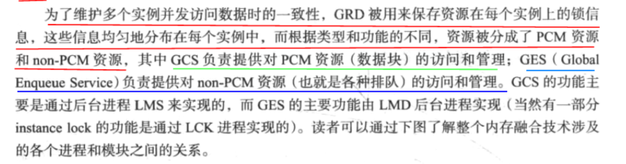

### PCM (Parallel Cache Management)

Oracle使用 PCM（ Parallel Cache Management） 维护缓冲区的一致性，通过PCM
Oracle允许一个节点访问位于另一个节点的缓冲区Cache中的数据；

### non-PCM

参考文章
--------

### Oracle RAC Cache Fusion 系列十三：PCM资源访问

<http://blog.woqutech.com/2019/08/21/oracle-rac-cache-fusion-%E7%B3%BB%E5%88%97%E5%8D%81%E4%B8%89%EF%BC%9Apcm%E8%B5%84%E6%BA%90%E8%AE%BF%E9%97%AE/>

### ORACLE RAC工作原理

<https://blog.csdn.net/beaning_zhang/article/details/47273197>
