PG内核分析 Q&A
==============

PG系统概述
----------

### 为什么说PG是一种先进的对象—关系数据库系统

因为PG它不仅支持关系数据库的各种功能, 而且还具备类, 继承等对象数据库的特征.

面向对象数据库技术可望成为继关系数据库技术之后的新一代数据管理技术。

它是一种以关系数据库和SQL为基础, 扩展了抽象数据类型,
从而具备面向对象特征的数据库.

PG不是完全的对象数据库, 而是综合了在关系数据库的基础上,
吸收了对象数据库的优点发展起来的. 对象数据库的缺点参见下面所述:

参考: 面向对象数据库和关系数据库的区别

<https://zhidao.baidu.com/question/327687544578054685.html>

面向对象数据库的产生主要是为了解决“阻抗失配”，它强调高级程序设计语言与数据库的无缝连接。什么叫无缝连接，假设你
不用数据库，用C语言编了一个程序，你可以不需要（或基本不需要）任何改动就将它作用于数据库，即你可以用C语言透明访问数据库，就好象数据库根本不存在一样，所以也有人把面向对象数据库理解为语言的持久化。怎么样，听起来挺玄的吧，可是我们自己开发的数据库系统——OSCAR早就做到了这一点。
由于实现了无缝连接，使得面向对象数据库能够支持非常复杂的数据模型，从而特别适用于工程设计领域。打个比方，想象CAD中的一个复杂部件，它可能由成千上万个不同的零件组成，要是用关系模型中的表来表达，得用多少张表啊？而描述这种复杂的部件，正好是高级程序设计语言的强项。  
  
此外，面向对象数据库还吸收了面向对象程序设计语言的思想，如支持类、方法、继承等概念。
面向对象数据库很好地解决了阻抗失配的问题，但它也有缺点。它的缺点正好是关系数据库的强项，由于模型较为复杂（而且缺乏数学基础），使得很多系统管理功能难以实现（如权限管理），也不具备SQL处理集合数据的强大能力。

 

总之，数据库系统发展的趋势是，面向对象数据库和关系数据库将不断融合。而对象关系数据库由于继承了上述两者的优点，已经成为目前数据库发展的主流。

### PG的特性都有哪些

拥有与企业级数据库(如: Oracle, DB2)相媲美的特性, 如完善的SQL标准支持(如:
PG支持SQL92等标准, 详见官方文档), 多版本并发控制(即MVCC,
比Oracle数据库的回滚段机制还要先进), 时间点恢复, 表空间机制(注:
不是所有大型数据库都能够支持此高级功能), 异步复制, 嵌套事务, 在线/热备份,
一个复杂的查询优化器, 预写日志容错技术.

它支持国际字符集, 多字节字符编码, Unicode, 并且对格式化, 排序,
大小写敏感提供本地化支持.

PG在管理海量数据方面有良好的可扩展性, 对并发用户管理具有自适应性.
目前已经出现具有管理超过4万亿字节(约3725GB, 或3.6PB, 注意: 这只是单机PG的能力,
通过citus或 PG RAC等分布式技术可以更大)数据能力的实用版本产品.

### PG的代码结构是怎么样的

PG源代码包括3400多个文件(截止8.4.1版本).

主要目录(模块)及用途如下:

Bootstrap: 用于运行Bootstrap运行模式,该模式主要用来创建初始的模板数据库.

Main: 主程序模块,它负责将控制权转到Postmaster进程或Postgres进程.

Postmaster: 监听用户请求的守护进程,并控制Postgres进程的启动和终止.

Libpq: C/C++的库函数,处理与客户端间的通信,几乎所有的模块都依赖它.

Tcop: 即Traffic cop(交通警察),
Postgres服务进程的主要处理部分,它调用Parser,Optimizer,Executor和Commands中的函数来执行客户端提交的查询.

Parser: 编译器, 将SQL查询转化为内部查询树.

Optimizer: 优化器, 根据查询树创建最优的查询路径和查询计划.

Executor: 执行器, 执行来自Optimizer的查询计划.

Commands: 执行非计划查询的SQL命令,如创建表命令等.

Catalog: 系统表操作, 包含用于操作系统表的专用函数.

Storage: 管理各种类型的存储系统(如磁盘,闪存等).

Access: 提供各种存取方法,支持堆,索引等数据的存取.

Nodes: 定义系统内部所用到的节点,链表等结构,以及处理这些结构的函数.

Utils: 各种支持函数, 如错误报告,各种初始化操作等.

Regex: 正则表达式库及相关函数,用于支持正则表达式处理.

Rewrite: 查询重写, 根据规则系统对查询进行重写.

Initdb: 初始化数据库集簇.

TSearch: 全文检索.

Psql: 数据库交互工具.

Port: 平台兼容性处理相关的函数.

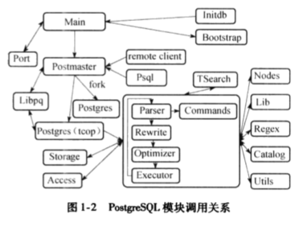

### PG的数据库命令都有哪些

PG的体系结构
------------

### PG的体系结构是怎样的

由5大系统构成:

1.  连接管理系统(连接管理器)

2.  编译执行系统

3.  存储管理系统

4.  事务系统

5.  系统表

连接管理系统: 接受外部操作对系统的请求, 对操作请求进行预处理和分发,
起系统逻辑控制作用;

编译执行系统: 由查询编译器,查询执行器组成,
完成操作请求在数据库中的分析处理和转化工作, 最终实现物理存储介质中数据的操作;

存储管理系统: 由索引管理器,内存管理器, 外存管理器组成, 负责存储和管理物理数据库,
提供对编译查询系统的支持;

事务系统: 由事务管理器, 日志管理器, 并发控制, 锁管理器组成,
日志管理器和事务管理器完成对操作请求处理的事务一致性支持,
锁管理器和并发控制提供对并发访问数据的一致性支持;

系统表: 是PG数据库的元信息管理中心, 包括数据库对象信息和数据库管理控制信息,
系统表管理元数据信息, 将PG数据库的各个模块有机连接在一起,
形成一个高效的数据管理系统.

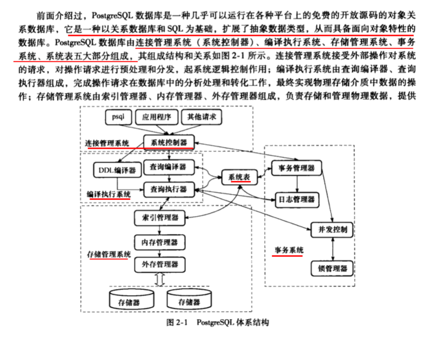

### PG中的数据字典角色由谁扮演

在PG数据库系统中, 系统表扮演着数据库字典的角色.

在关系数据库中, 为了实现数据库的控制, 必须提供数据库字典的功能.
数据字典不仅存储各种对象的描述信息, 而且存储系统管理所需的各种对象的细节信息.

从内容来看, 数据字典包含数据库系统中所有对象及其属性的描述信息,
对象之间关系的描述信息,
对象属性的自然语言含义以及数据字典变化的历史(即数据库的状态信息).

数据字典是关系数据库系统管理控制信息的核心, 在PG中,
系统表扮演中数据库字典的角色.

### 简介PG数据字典的扮演者---系统表

在关系数据库中,为了实现数据库系统的控制,必须提供数据字典的功能.数据字典不仅存储各种对象的描述信息,而且存储系统管理所需的各种对象的细节信息.从内容来看,数据字典包含数据库系统中所有对象及其属性的描述信息,对象之间关系的描述信息,对象属性的自然语言含义以及数据字典变化的历史(即数据库的状态信息).

数据字典是关系数据库系统管理控制信息的核心,在PG数据库系统中,系统表扮演着数据字典的角色.

PG的某一个数据库中都有自己的一套系统表,其中大多数系统表都是在数据库创建时从模板数据库中拷贝过来的,因此这些系统表里的数据都是与所属数据库相关的.只有少数系统表是所有数据库共享的(比如pg_database),
这些系统表里的数据时关于所有数据库的.

### PG的进程结构是怎样的

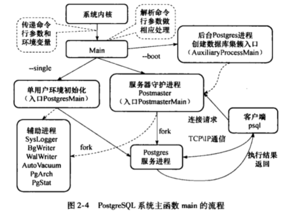

### Postgremaster及其子进程是如何通信的

Postgremaster进程在起始时会建立共享内存和信号库,
Postgremaster及其子进程的通信就是通过共享内存和信号来实现的.

这种多进程设计使得整个系统的稳定性更好,
即使某个后台进程奔溃也不影响系统中其他进程的工作,
Postgremaster只需要重置共享内存即可从单个后台进程的奔溃中恢复.

### PG7.1版本为什么要引进”内存上下文机制”

PG7.1之前的版本在处理大量以指针传值的查询时一直存在着内存泄漏问题,
直到查询结束后才能将内存收回.

为了解决这个问题, 从版本7.1开始, 系统实现了新的内存管理机制,
这样使得运行时大多数内存分配操作在各个语义的内存上下文(MemoryContext)中进行.

内存上下文释放时将会释放在其中分配的所有内存,
这样即使某些内存没有被任何指针指向或忘记了释放,
我们也可以通过释放内存上下文来避免这些内存泄漏.

这一机制也使得内存管理更加方便, 开发人员不必再费尽心思的处理内存释放的工作.

#### 内存上下文具体是如何使用的

1.  程序首先调用MemoryContextInit创建TopMemoryContext和ErrorContext.

2.  然后调用AllocSetContextCreate以TopMemoryContext为根节点创建PostmasterContext

3.  最后, 将全局指针CurrentMemoryContext指向PostmasterContext.

这些内存上下文的具体含义如下:

1.  TopMemoryContext: 在其中分配的内存直到系统退出时才会释放. 例如:
    其中存放了所有打开的文件描述符, 内存上下文的控制节点等.
    它是所有内存上下文的树根.

2.  ErrorContext: 这是错误恢复处理的永久性内存环境, 恢复完毕则重设.

3.  PostmasterContext: 这是Postmaster正常工作的内存环境,
    由它通过fork函数产生的子进程将会删除这个环境.

### PG 配置参数(GUC)

在初始化内存环境之后, 需要配置Postmaster运行时所需的各种参数. GUC(Grand Unified
Configuration)模块实现了多种数据类型(目前有boolean, int, float,
string四种)的变量配置.这些参数可能由不同的进程在不同的时机进行配置,系统会根据既定的优先权来确定什么情况下的配置可以生效.

### PG的辅助进程都有哪些

共6个:

1.  SysLogger 系统日志进程

2.  BgWriteer 后台写进程

3.  WalWriter 预写式日志写进程

4.  PgArch 预写式归档进程

5.  AutoVacuum系统自动清理进程

6.  PgStat 统计数据收集进程

### 各个辅助进程的入库文件都是哪些

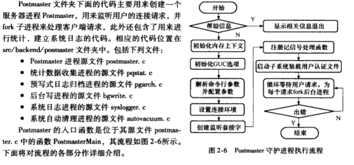

### PG各个辅助进程简要介绍

#### SysLogger系统日志进程

日志信息是数据库管理员获取数据库系统运行状态的有效手段.在数据库出现故障时,日志信息是非常.把数据库日志信息集中输出到一个位置将极大方便管理员维护数据库系统.然而,日志输出将产生大量数据(特别是在比较高的调试级别上),单文件保存时不利于日志文件的操作.因此,
在SysLogger的配置选项中可以调协日志文件的大小,
SysLogger会在日志文件达到指定的大小时关闭当前日志文件,产生新的日志文件.

#### BgWriter后台写进程 \*\*\*

BgWriter是PG后台将脏页写出到磁盘的辅助进程.

引入该进程主要为达到如下两个目的:

1.  首先,
    数据库在进行查询处理时若发现要读取的数据不在缓冲区中时要先从磁盘中读入要读取的数据所在的页面,此时如果缓冲区已满,则需要先选择部分缓冲区中页面替换出去.如果被替换的页面没有被修改过,那么可以直接丢弃;但如果要被替换的页已被修改,则必需先将这页写出到磁盘中后才能替换,这样数据库的查询处理被阻塞.通过使用BgWrite定期写出缓冲区中部分脏页到磁盘中,
    为缓冲区腾出空间,就可以降低查询处理被阻塞的可能性.

2.  其次, PG在定期作检查点时需要把所有脏页写出到磁盘,
    通过BgWriter预先写出一些脏页,可以减少调协检查点(CheckPoint,
    数据库恢复技术的一种)时要进行的IO操作,使系统的IO负载趋向平稳.通过BgWriter对共享缓冲区写操作的统一管理,避免了其他服务进程在需要读入新的页面到共享缓冲区时,不得不将之前修改过的页面写出到磁盘的操作.不过,当BgWriter同时也负责处理所有检查点,它也会定期地发出一个检查点请求,当然也可以由其他进程通过信号要求BgWriter执行一个检查点.

#### WalWriter预写式日志写进程 \*\*\*\*\*

预写式日志WAL(Write Ahead Log,
也称为XLog)的中心思想是对数据库文件的修改必须是只能发生在这些修改已经记录到日志之后,
也就是先写日志后写数据.

如果遵循这个过程,那么就不需要在每次事务提交的时候都把数据块刷回到磁盘,因为在出现崩溃的情况下可以用日志来恢复数据库.

使用WAL主要的好处就是显著地减少了写磁盘的次数,因为在日志提交的时候只需要把日志文件刷新到磁盘,而不是事务修改的所有数据文件.

在多用户环境里,许多事务的提交可以用日志文件的fsync来完成.

而且日志文件是顺序写的, 因此同步日志的开销远比同步数据块的开销要小.

WalWrite的PG8.3以后才新加入的新特性,它避免了其他服务进程在事务提交时需要同步的写入预写式日志到磁盘,
以使得事务提交记录不是在提交时同步写入磁盘,
而是在一个已知的预先设置的时间异步的写入.

同BgWriter一样, 其他服务进程在WalWriter出错时也允许直接进行预写式日志写操作.

#### PgArch预写式日志归档进程

PG从8.x版本开始提出了PITR(Point-In-Time-Recovery)技术,
支持将数据库恢复到其运行历史中任意一个有记录的时间点.

除2.5.3节中所述的WalWriter外,
PITR的另一个重要的基础就是对WAL文件(即XLog)的归档功能.

PgArch辅助进程的目标就是对WAL日志在磁盘上的存储形式(Xlog文件)进行归档备份.

#### AutoVacuum系统自动清理进程

在PG数据库中,对表元组的UPDATE或DELETE操作并未立即删除旧版本的数据,表中的旧元组只是被标记为删除状态,并未立即释放空间.这种处理对于获取多版本并发控制是必要的,如果一个元组的版本仍有可能被其他事务看到,那么就不能删除元组的该版本.

当事务提交后,过期的元组版本对事务不再有效,因而其占据的空间必须回收以供其他元组使用,以避免对磁盘空间增长的无休止的需求,此时对数据库的清理工作通过运行VACUMM来实现.

从PG8.1开始,
PG数据库引入一个额外的可选辅助进程AutoVacuum(系统自动清理进程),自动执行VACUUM和ANALYZE命令,回收被标识为删除状态记录的空间,更新表的统计信息.

#### PgStat统计数据收集进程

PgStat辅助进程是PG数据库系统的统计信息收集器,它专门负责收集数据库系统运行中的统计信息,
如在一个表和索引上进行了多少次插入与更新操作,
磁盘块的数量和元组的数量,每个表上最近一次执行清理和分析操作的时间,
以及统计每个用户自定义函数调用执行的时间等.

##### PgStat统计数据的主要目的是什么

PgStat辅助进程收集的统计信息主要用于查询优化时的代价估算.

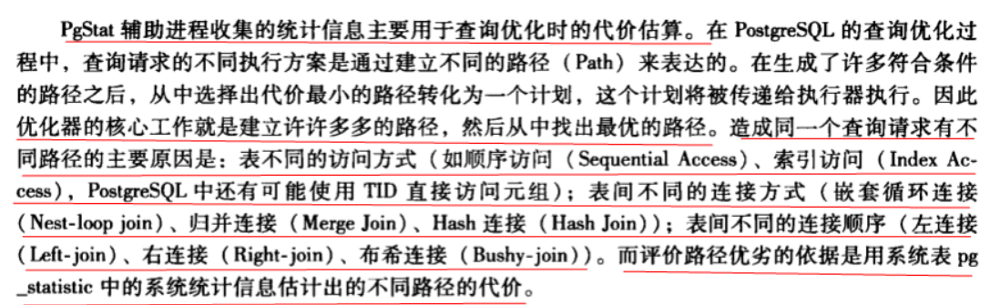

### 2.4 守护进程Postmaster

#### PG信息及其处理函数列表

| 信号    | 信号处理函数            |
|---------|-------------------------|
| SIGHUP  | SigHupHandler           |
| SIGINT  | StatementCancelHandler  |
| SIGTERM | die                     |
| SIGQUIT | quickdie                |
| SIGALRM | handle_sig_alarm        |
| SIGPIPE | SIG_IGN                 |
| SIGUSR1 | CatchupInterruptHandler |
| SIGUSR2 | NotifyInterruptHandler  |
| SIGFPE  | FloatExceptionHandler   |
| SIGCHLD | 默认                    |

##### SIGHUP简介

典型的例子是一个父进程fork子进程之后，父进程立即退出，这样子进程所在的进程组将变为孤儿进程组。这样的孤儿进程组中的每个停止（Stopped）状态的每个进程都将收到挂断信号（SIGHUP），然后又立即收到继续信号（SIGCONT）。所以fork子进程之后，退出父进程，如果子进程还需要继续运行，则需要处理挂断信号，否则进程对挂断信号的默认处理将是退出。

<https://www.cnblogs.com/lvyahui/p/7389554.html>

##### 进程退出：SIGINT、SIGTERM和SIGKILL区别

一、SIGINT、SIGTERM和SIGKILL区别

1.  SIGINT与SIGTERM区别  
    1）SIGINT关联ctrl+c  
    2）SIGINT只能结束前台进程  
    3）通过ctrl+c对当前进程发送结束信号，信号被进程树接收到（即：不仅当前进程，子进程也会收到结束信号）

2.  SIGTERM与SIGKILL  
    1）SIGTERM可以被阻塞、处理和忽略；因此有的进程不能按预期的结束  
    2）kill不使用参数：发送SIGTERM信号，只有当前进程收到信号，若当前进程被kill，则子进程的父进程就会更改为init，即pid为1  
    3）kill命令的默认不带参数发生的信号就是SIGTERM，让程序友好的退出
    ，当程序未退出时，可以使用kill -9强制退出

##### SIGINT、SIGQUIT、 SIGTERM、SIGSTOP区别

2) SIGINT

程序终止(interrupt)信号,
在用户键入INTR字符(通常是Ctrl-C)时发出，用于通知前台进程组终止进程。

3) SIGQUIT

和SIGINT类似, 但由QUIT字符(通常是Ctrl-\\)来控制.
进程在因收到SIGQUIT退出时会产生core文件, 在这个意义上类似于一个程序错误信号。

15) SIGTERM

程序结束(terminate)信号,
与SIGKILL不同的是该信号可以被阻塞和处理。通常用来要求程序自己正常退出，shell命令kill缺省产生这个信号。如果进程终止不了，我们才会尝试SIGKILL。

19) SIGSTOP

停止(stopped)进程的执行. 注意它和terminate以及interrupt的区别:该进程还未结束,
只是暂停执行. 本信号不能被阻塞, 处理或忽略.

##### SIGALRM

在POSIX兼容的平台上, SIGALRM是在定时器终止时发送给进程的信息.

##### SIGPIPE

往一个已经接收到FIN的套接中写是允许的，接收到的FIN仅仅代表对方不再发送数据。并不能代表我不能发送数据给对方。

往一个FIN结束的进程中写(write)，对方会发送一个RST字段过来，TCP重置。如果再调用write就会产生SIGPIPE信号

通常，我们只需要忽略这个信号即可：signal(SIGPIPE,ISG_IGN);

<https://www.cnblogs.com/wsw-seu/p/8413290.html>

##### Linux的SIGUSR1和SIGUSR2信号

SIGUSR1 用户自定义信号 默认处理：进程终止

SIGUSR2 用户自定义信号 默认处理：进程终止

当一个进程调用fork时，因为子进程在开始时复制父进程的存储映像，信号捕捉函数的地址在子进程中是有意义的，所以子进程继承父进程的信号处理方式。

但是当子进程调用exec后，因为exec运行新的程序后会覆盖从父进程继承来的存储映像，那么信号捕捉函数在新程序中已无意义，所以exec会将原先设置为要捕捉的信号都更改为默认动作。

<https://www.cnblogs.com/kex1n/p/8296332.html>

##### SIGFPE

在POSIX兼容的平台上，SIGFPE是当一个进程执行了一个错误的算术操作时发送给它的信号。SIGFPE的符号常量在头文件signal.h中定义。因为在不同平台上，信号数字可能变化，因此常使用信号名称。

SIG是信号名的通用前缀。FPE是floating-point
exception（浮点异常）的首字母缩略字。产生SIGFPE信号时并非一定要涉及浮点算术，之所以不修改名字是因为这么做会破坏向下兼容性。
[1]

导致SIGFPE被发送给进程的原因有很多。一个常见的例子是由于一个意外输入导致的溢出，或者在程序构造中的错误。

SIGFPE可以被处理。也就是说，程序员可以指定他们在接收到信号时想要的动作，例如调用一个子程序，忽略事件等。

##### SIGCHLD

SIGCHLD，在一个进程终止或者停止时，将SIGCHLD信号发送给其父进程，按系统默认将忽略此信号，如果父进程希望被告知其子系统的这种状态，则应捕捉此信号。

SIGCHLD属于unix以及类unix系统的一种信号

产生原因 siginfo_t代码值

1，子进程已终止 CLD_EXITED

2，子进程异常终止（无core） CLD_KILLED

3，子进程异常终止（有core） CLD_DUMPED

4，被跟踪子进程以陷入 CLD_TRAPPED

5，子进程已停止 CLD_STOPED

5，停止的子进程已经继续 CLD_CONTINUED

PG的存储管理
------------

### 为什么说存储管理数据库非常基础和重要的技术

数据库管理系统的任务本质上是向存储设备上写入或者从存储设备上读出数据,
因此对于一个DBMS来说, 存储的管理是一项非常基础和重要的技术.

在PG中, 有专门的模块负责管理存储设备(包括内存和外存), 我们称之为存储管理器.

存储管理器提供了一组统一的管理外存和内存资源的功能模块,
所有对外存和内存的操作都将交由存储管理器处理,
可以认为存储管理器是数据库管理系统与物理存取设备的接口.

与PG的其他模块相比, 存储管理器处在系统结构的底层,
它包含了操作物理存取设备的接口.

### 3.1 存储管理的体系结构

#### 存储管理器的体系结构是怎样的

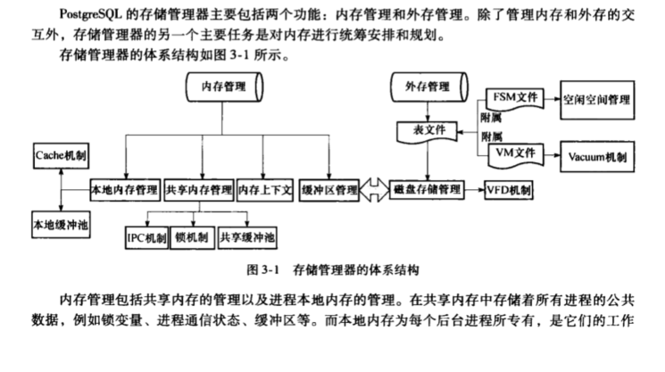

#### 为了防止多个进程并发访问共享内存中数据时产生冲突, PG是如何处理的

为了防止多个进程并发访问共享内存中数据时产生冲突,
PG提供了轻量级锁,用于支持对共享内存中同一数据的互斥访问.

#### 使用共享内存有什么用

PG使用共享内存实现了IPC(进程间通信)以及无效消息共享,用以支持进程间的相互相互通信.

#### 提供内存上下文有什么用

存储管理器提供内存上下文(MemoryContext)用于统一管理内存的分配和回收,
从而更加有效安全地对内存空间进行管理.

#### 外存的管理包括哪些

外在的管理包括表文件管理,空闲空间管理,虚拟文件描述符管理以及大数据存储管理等.

在PG中,
每个表都用一个文件(表文件)存储,表文件以表的OID命名.对于超出操作系统文件大小限制(比如FAT32限制为4G)的表文件,
PG会自动将其切分成多个文件来存储,并在原表文件名的尾部加上切分的顺序号来标识它们.

#### VM和FSM

从PG8.4开始, 每个表除了表文件外还拥有两个附属文件:
可见性映射表文件(VM)和空闲空间映射表文件(FSM).

前者用于加快清理操作(VACUMM)的执行速度, 后者则用于表文件空闲空间的管理.

#### 虚拟文件描述符机制

为了避免超过操作系统对每个进程打开文件数的限制,存储管理器使用了虚拟文件描述符机制,使得后台进程可以打开”无限多个”文件.

#### PG如何支持大数据存储的

PG提供了大对象机制和TOAST机制, 用以支持大数据存储.

前者主要用于大尺寸的文件, 后者主要用于变长字符串.

#### PG支持多种存储介质(如: 闪存,光盘)的扩展吗

支持.

PG在存储管理选择器中封装了对具体存储器的操作接口,
以便扩展支持多种存储介质(比如对闪存,光盘的支持).

#### PG中数据在内存中是以何种形式存在的

PG的存储管理器采用与操作系统类似的分页存储管理方式,即数据的在内存中是以页面块的形式存在.

#### 每个表文件由什么组成的

每个表文件由多个BLCKSZ(一个可配置的常量)字节大小的文件块组成,每个文件块又可以包含多个元组.

#### 表文件以什么单位读入内存中的

表文件是以文件块为单位读入内存中的,每一个文件块在内存中形成一个页面块.

由于页面块是文件块在内存中的存在形式,因此在后文中如不进行特殊说明也会使用页面来指代文件块.

#### 表文件的写入(即落般或刷盘)是以什么单位写入的

表文件的写入也是以页面块为单位.

#### PG采用的是行存还是列存

PG采用的是传统的行式存储, 即以元组为单位进行数据的存储.

当然, 数据库还有”列存”这样的存储方式, 使用在特定的场合.

#### 元组可以跨页面块(或文件块)存储吗

不能.

PG不支持元组的跨块存储,每个元组最大为MaxHeapTupleSize.

#### 元组不可以跨块存储的原因

元组不可以跨块存储, 这样保证了文件块中存储的是多个完整的元组.

#### PG在内存中如何存储磁盘中的文件块的

与操作系统一样,PG在内存中开辟了缓冲区域用于存储这些文件块,我们将其在内存中开辟的缓冲区域称为缓冲池,
缓冲池被划分成若干个固定大小(和文件块的尺寸相同,也是BLCKSZ)的缓冲区,
磁盘上的文件块读入内存后被存放在缓冲区中,称之为页面块或缓冲块.

#### BLCKSZ默认大小是多少

BLCKSZ的默认值是8192(即:8K), 因此一个标准(内存)缓冲块的大小默认为8KB.

#### 存储管理器的主要任务包括哪些 \*\*

有6个:

1.  缓冲池管理

2.  Cache机制

3.  虚拟文件描述符管理

4.  空闲空间管理

5.  进程间通信机制(IPC)

6.  大数据存储管理

##### 缓冲池管理干什么用的

缓冲池在PG中起缓存的作用.数据库中的事务常常需要频繁地存取数据,为了减少对磁盘的读写,在事务执行时,数据首先将会放入缓冲池中,PG设立了进行间共享的缓冲池(共享缓冲池)以及进程私有的催办(本地缓冲池).

##### Cache机制有什么用

将进程最近使用的一些系统数据缓存在其私有内存中,其级别高于缓冲池.

##### OS已经有文件描述符,为什么PG还要虚拟的

PG通过虚拟文件描述符(Vitual File Descriptor, VFD)来对物理文件进行管理,
这样可以避免因为操作系统对进程打开文件的限制出现错误.

##### 空闲空间管理是什么东东, 有什么用

即: FSM, 用于快速定位到表文件中的空闲以便于插入数据,从而提高空间利用率.

##### PG为什么要实现IPC

PG是一个多进程系统,
IPC用来在多个进程后台进程之间进行通信和消息的传递,比如使用消息队列来同步进程产生的无效消息,同时IPC还提供了对共享内存的管理.

##### PG在大数据存储管理方面提供了哪些机制, 各自有什么区别

PG在大数据存储管理方面提供了大对象和TOAST机制.
大对象机制是一种由用户控制的大数据存储方法,它允许用户调用函数,通过SQL语句直接向表中插入一个大尺寸文件(如:
图片,视频,文档等).

而TOAST机制则是在用户插入的变长数据超过一定限度时自动触发,用户无法对TOAST加以控制.

前者主要用于大尺寸的文件, 后者主要用于变长字符串.

#### 读写元组的过程是怎样的 \*\*\*

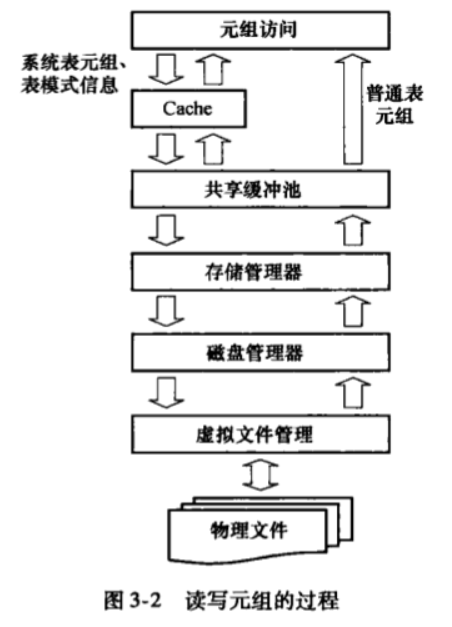

### 3.2 外存管理

#### 外存管理是干什么的

外存管理负责处理数据库与外存介质的交互过程的, 在PG中,
目前只实现了磁盘的管理操作.

其他介质的PG提供了统一的外存操作接口, 需要自己来实现.

##### 3.2.1 表和元组的组织方式

###### 同一个表的元组在表文件中是如何存储的

在PG中, 同一个表中的元组按照创建的顺序依次插入到表文件中的.

备注: 在进行清理操作清除被删除的元组后,
元组也可以以无序的方式插入到具有空闲空间的文件块中.

###### 什么是堆文件

元组之间不进行关联, 这样的表文件称为堆文件.

###### PG中有哪些堆文件

4种:

1.  普通堆

2.  临时堆

3.  序列

4.  TOAST表

元组之间不进行关联, 这样的表文件就叫普通堆文件.

临时堆的结构与普通堆相同,但临时堆仅在会话过程中临时创建,会话结束会自动删除.

序列则是一种元组值自动增长的特殊堆.

TOAST表其实也是一种普通堆,但是它被专门用于存储变长数据.

尽管这几种堆文件功能各异,但在底层的文件结构却是相似的:
每个堆文件都是由多个文件块组成,在物理磁盘中的存储形式如图:

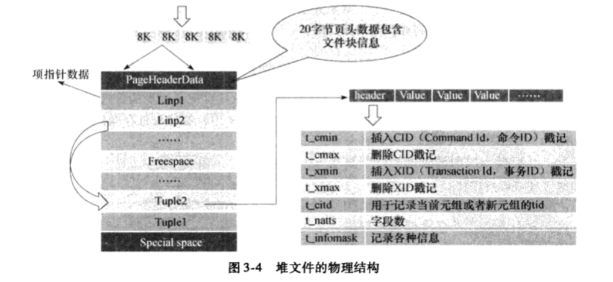

###### 了解一下PG中的”HOT技术”

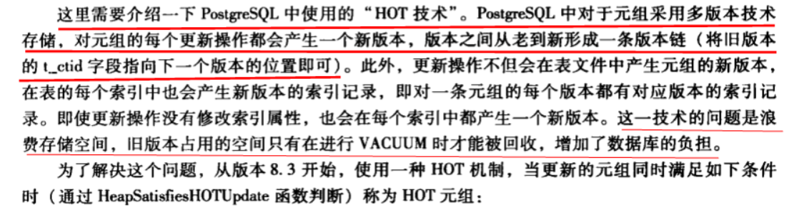

##### 3.2.2 磁盘管理器

磁盘管理器是SMGR的一种具体实现, 它对外提供了管理磁盘介质的接口,
其主要实现在文件md.c中.磁盘管理器并非对磁盘上的文件直接进行操作,
而是通过VFD机制来进行文件操作.

在PG中, 凡是要对存储在磁盘中的表进行磁盘操作(如打开/关闭,读/写等),
都是必须与磁盘管理器打交道, 由它来统一处理.

##### 3.2.3 VFD机制

##### [./media/image10.png](./media/image10.png)

3.2.4 空闲空间映射表

随着表中不断插入和删除元组, 文件块中必然会产生空闲空间(freee space).
在插入元组时优先选择将其存放在空闲空间内是利用存储的好方法.
但是这需要在该表众多拥有空闲空间的文件块之间进行选择,
而遍历所有文件块进行选择的开销将是非常庞大的.在PG8.4之前使用了一种全局FSM文件来记录所有表文件的空闲空间状况,
其缺点是在全局FSM文件中只能记录每个表文件一定数量的文件块空闲空间状况.这使得对于空闲空间的管理比较复杂和低效.为了解决这一问题,
PG8.4中采用了一种新的策略,即对于每个表文件(包括系统表在内),
同时创建一个名为”关系表OID_fsm”的文件,
用于记录该表的空闲空间大小,称之为空闲空间映射表文件(FSM).

例如, 一个OID为12000的表, 其空闲空间映射表文件将被命名为12000_fsm.

##### 3.2.5 可见性映射表

PG中为了实现多版本并发控制, 录事务删除或更新元组时, 并非从物理上删除,
而是通过将其标记为无效的方式进行标记删除,
最终对这些无效元组的清理操作需要调用VACUMM来完成.

##### 3.2.6 大数据存储

在PG中提供了两种大数据存储方式:第一种是TOAST机制, 使用数据压缩和线外存储来实现;
第二种是大对象机制, 使用一个专门的系统来存储大对象数据.

### 3.3 内存管理

#### 所有数据库管理系统, 存储管理中涉及的本质问题是什么

不管是什么样的数据库管理系统, 其存储管理中涉及的问题本质是一样的:
如何减少I/O次数.

在磁盘上读或写一个块大约要花10\~30毫秒,在这段时间内一台普通的机器或许能执行数万条指令.在通常情况下,读写磁盘所用的时间决定了数据库操作所花费的总时间.

因此, 要尽可能地站最近使用的文件块停留在内存中,这样就能有效地减小磁盘I/O的代价.

合理有效的内存管理对于整个DBMS的性能起着非常重要的作用.

#### PG的内存管理包括哪2个方面

PG中的内存管理包括对共享内存和本地内存的管理.

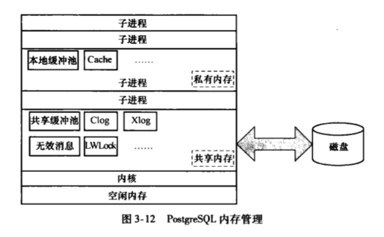

##### 3.3.1 内存上下文

在PG的旧版本中, 常常需要处理大量以指针传值的查询,
因而存在着内存泄漏的问题,直到查询结束才能将内存收回.
尤其是在处理引用TOAST机制的查询时, 需要使用大量的内存, 使得这个问题尤为明显.

为此, 从版本7.1开始, PG中实现了新的内存管理机制---内存上下文(MemoryContext).

系统中的内存分配操作在各自语义的内存上下文中进行,所有在内存上下文分配的内存空间都通过内存上下文进行记录.

因此可以很轻松地通过释放内存上下文来释放其中的所有内容,而不用费心地释放其中的每一块内存,
使得内存分配和释放更加快捷和可靠,

内存上下文机制借鉴了操作系统的一些概念. 我们知道,
操作竹编为每个进程分配了进程执行环境, 进程环境之间不互相影响,
由操作系统来对环境进行切换,进程可以在其进程环境中调用一些库函数(如malloc, free,
realloc等)来执行内存操作.

类似的, 一个内存上下文实际上就相当于一个进程环境,
PG以类似的方式提供了在内存上下文进行内存操作的函数: palloc, pfree, repalloc等.

###### 内存上下文包括了哪几个重要内容

5部分:

1.  MemoryContext

2.  内存上下文初始化与创建

3.  内存上下文中内存的分配

4.  内存上下文中内存重分配

5.  释放内存上下文

##### 3.3.2 高速缓存

当数据库访问表时, 需要表的模式信息, 比如表的列属性,OID,统计信息等.
PG将表的模式信息存放在系统表中,因此要访问表,就需要首先在系统表中取得表的模式信息.对于一个PG系统来说,
对于系统表的普通表模式的访问是非常频繁的. 为了提高这些访问的效率,
PG设立了高速缓存(Cache)来提高访问效率.

###### 为什么要设立高速缓存

当数据库访问表时,需要表的模式信息,比如表的列属性,OID,统计信息等.PG将表的模式信息放在系统表中,因此访问表,就需要首先在系统表中取得表的模式信息.

对于一个PG系统来说,对于系统表和普通表模式的访问是非常频繁的.

为了提高这些访问的效率,PG设立了高速缓存(Cache)来提高访问效率.

###### 高速缓存包括几个部分

高速缓存Cache中包括一个系统表元组Cache(SysCache)和一个表模式信息Cache(RelCache).

SysCache中存放的是最近使用过的系统表的元组,而RelCache中包含所有最近访问过的表的模式信息(包含系统表的信息).

RelCache中存放的不是元组, 而是RelationData数据结构(数据结构3.13),
每一个RelationData结构表示一个表的模式信息,这些信息都由系统表元组中的信息构造而来.

###### 两种Cache(SysCache和RelCache)是所有进程共享的吗

不是.

值得注意的是,
两种Cache都不是所有进程共享的,每一个PG进程都维护着自己的SysCache和RelCache.

即: 在PG中, 每一个进程都有属于自己的Cache.

换句话说,
同一个系统表在不同的进程中都有对应的Cache来缓存它的元组(对于RelCache来说缓存的是一个RelationData结构).

###### 说说SysCache

系统表元组Cache(SysCache).

SysCache中存放的是最近使用过的系统表的元组.

###### 说明RelCache

表模式信息Cache(RelCache).

RelCache中包含所有最近访问过的表的模式信息(包含系统表的信息).

RelCache存放的不是元组, 而是RelationData数据结构(数据结构3.13),
每一个RelationData结构表示一个表的模式信息,
这些信息都由系统表元组中的信息构造而来.

注: 两种Cache都不是所有进程共享的,
每一个PG的进程都维护着自己的SysCache和RelCache.

###### 两者的区别

1.  对RelCache的管理比SysCache要简单许多,原因在于大多数时候RelCache中存储的RelationData的结构是不变的,因此PG仅用一个Hash表来维持这样一个结构.

2.  对RelCache的查找,插入,删除,修改等操作也非常简单

###### 两者的类似

1) 和SysCache的初始化类似, RelCache的初始化同样也在InitPostgres函数中进行,
同样分为两个阶段: RelationCacheInitialize 和 RelationCacheInitializePhase2.

##### 3.3.3 缓冲池管理

如果需要访问的系统表在Cache中无法找到或者需要访问普通表的元组,
就需要对缓冲池进行访问. 任何对于表,元组,索引表等的操作都在缓冲池中进行,
缓冲池的数据调度都以磁盘块为单位,
需要访问的数据以磁盘块为单位调用函数smgrread写入缓冲池,
而smgrwrite将缓冲池数据写回到磁盘.

调入缓冲池中的磁盘块称为缓冲区, 缓冲块或者页面, 多个缓冲区组成了缓冲池.

缓冲池管理模块的主要结构如下图.

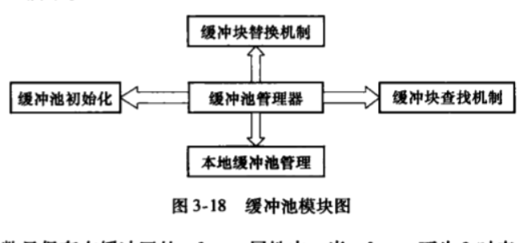

###### 有了高速缓冲(Cache),为什么还要缓冲池

如果需要访问的系统表元组在Cache中无法找到或者需要访问普通表的元组,
就需要对缓冲池进行访问.

任何对于表,元组,索引表等的操作都在缓冲池中进行,缓冲池的数据调度都以磁盘块为单位,需要访问的数据以磁盘块为单位调用函数smgrread写入缓冲池,而smgrread将缓冲池数据写回到磁盘.调入缓冲池池中的磁盘块称为缓冲区,缓冲块或者页面,多个缓冲区组成了缓冲池.

###### 共享缓冲区为什么采取了静态方式 \*\*\*\*\*

为了便于实现, PG对共享缓冲区的管理采取了静态方式:
它在系统配置时规定好了共享缓冲区的总数(1000个, 由全局变量NBuffers定义),
以后在每次系统启动时,
由Postmaster或某一独立的Postgres从共享内存中分配一片空间作共享缓冲区,
全部(共享)缓冲区构成共享缓冲池.

###### 缓冲池管理主要有几块内容

主要有4块:

1.  初始化共享缓冲池

2.  共享缓冲区查询

3.  共享缓冲区替换策略

4.  本地缓冲池管理

##### 3.3.4 IPC

###### 什么是IPC

IPC(进程间通信, Inter-Process
Communication)是指至少两个或者两个以上的进程交换数据或信号的技术或者方法.

由于进程是操作系统分配资源的最小单位, 每个进程都有自己独立的一套系统资源,
不同进程之间的资源是相互隔离的.

为了使不同进程之间能够互相访问资源并且进行协同工作, 操作系统提供了IPC机制.

广义上的IPC不仅可以使用同一计算上的多个进程进行通信,
而且可以使不同计算机上的多个进程进行通信,
但PG中的IPC只考虑同一计算机上的进程间通信.

###### 操作系统为什么要提供IPC

为了使不同进程之间能够互相访问资源并且协同工作, 操作系统提供了IPC机制.

###### PG中的IPC有什么不同

广义上的IPC不仅可以使用同一计算上的多个进程进行通信,
而且可以使不同计算机上的多个进程进行通信,
但PG中的IPC只考虑同一计算机上的进程间通信.

###### IPC的实现方法有哪些

IPC有多种实现方法, 包括文件, Socket, 共享内存等.

PG中的IPC主要采用共享内存的方式来实现,
即在系统中开辟一片所有进程都可以读写的内存空间,
并约定好进程读写这片内存的时机和方式,
这样进程之间就可以通过这片共享内存来交换数据.

###### PG中的IPC额外还提供了哪些功能

在共享内存的基础上, PG的IPC机制还提供了以下功能:

1.  进程和Postermaster的通信机制

2.  统一管理进程的相关变量和函数

3.  提供了SI Message机制, 即无效消息传递机制.

4.  有关清除的函数.

###### IPC模块主要分几部分内容

共3部分:

1.  共享内存管理

2.  SI Message

3.  其他

### 3.4 表操作与元组操作

#### 3.4.1 表操作

#### 3.4.2 元组操作

### 3.5 VACUUM机制

#### 为什么需要Vacuum机制

当修改元组属性,执行重建索引等操作时, 特别是当进行多次更新,删除操作时,
磁盘上会出现很多无效的元组, 占据了很多磁盘空间并且导致系统性能下降,
这时就需要VACUUM操作清除掉这些”垃圾”.

#### 辅助进程AutoVacuum干什么用的

很明显, 那些经常更新或者删除元组的表需要比那些较少更新的表清理的更频繁一些.
PG开启了一个辅助进程AutoVacuum来执行自动清理工作.

#### 3.5.1 VACUUM操作

#### 3.5.2 Lazy VACUUM

#### 3.5.3 Full VACUUM

### 3.6 ResourceOwner资源跟踪

#### 为什么要有ResourcesOwner资源跟踪

在PG中, 每个事务(包括其子事务)在执行时, 需要跟踪其占用的内存资源.

例如, 需要跟踪一个缓冲区的pin锁或者一个表的锁资源,
以保证在事务结束或失败的时候能够被及时释放.

PG中使用ResourceOwner对象来对资源集中进行跟踪.

我们也称之为ResourceOwners资源跟踪器.

#### ResourceOwner主要记录哪些资源类型

ResourceOwner记录了大多数事务过程中使用到的资源, 主要包括:

1.  父节点,子节点的ResourceOwner指针, 用于构成资源跟踪器之间的树状结构.

2.  占用的资源共享缓冲数组和持有的缓冲区pin锁个数.

3.  Cache的引用次数以及占用的Cache中存储的数据链表,包括CatCache,
    RelCache以及缓存查询计划的PlanCache.

4.  TupleDesc引用次数以及占用的TupleDesc数组.

5.  Snapshot(见7.10.3节)引用次数以及占用的Snapshot数组.

索引
----

### 什么是索引

索引是指按表中某些关键属性或表达式建立元组的逻辑顺序,
它是由一系列元组的标识号组成的一个列表.

### 索引的好处

使用索引可以快速访问表中的特定元组, 被索引的表称为基表.

### 索引改变元组了吗

索引并不改变表中元组的物理顺序, 索引技术会将对于元组的逻辑排序保存在索引文件中.

### 索引是如何更新的

基表文件中的元组被修改或删除时, 索引文件会自动更新以保证能够准确的找到新的数据.

任何一个成熟的数据库都离不开索引的支持, PG当然也不例外.

### PG中的索引类型有哪些

在PG8.4.1中目前支持的索引有: B-Tree索引, Hash索引, GiST索引和GIN索引.

### 延伸-说一下数据库有哪些索引类型，有什么优缺点？

<https://blog.csdn.net/qq_39944869/article/details/100532144>

### 4.1 概述

#### 举例说明索引的好处

假设有下面这样一个表:

create table student_in_all_countries (

id integer,

name varchar

);

需要大量使用类似下面这样的语句进行查询:

select name from student where id=007;

通常, 数据库系统需要一行一行地扫描整个student表以寻找所有匹配的元组.
如果表student的规模很大(如上student_in_all_countries, 全世界所有国家的学生数量,
恐怕有几亿个), 但是满足where条件的只有少数几个(可能是0个或1个),
那么这种顺序扫描的性能就比较差了(注意: 元组在数据库物理存储并不是顺序的,
而是按照创建顺利来的, 所以上面id=007, 有可能需要很大量的顺序扫描).

如果让数据库系统在id属性上维护一个索引用于快速定位匹配的元组,那么数据库系统只需要在搜索树中查找少数的几层就可以找到匹配的元组,
这将大大提高数据查询的性能.

类似的, 在数据库中进行更新,删除操作时也需要先找到要操作的元组,
利用索引同样可以提升这些操作的性能.

#### PG提供了哪些索引方式和索引类型

PG8.4.1中一共提供了5种索引方式: 唯一索引, 主键索引,
多属性索引,部分索引,表达式索引以及4中索引类型: B-Tree, Hash, GiST, GIN.

每种索引类型都分别适合某些特定的查询类型, 因为他们用了不同的索引结构.

create index命令可以用来创建索引, 默认情况下该命令将创建一个B-Tree索引.

#### 什么是”从属索引”

PG里的所有索引都是”从属索引”, 也就是说, 索引在物理上与它描述的表文件分离.

#### 索引在数据字典哪里记录着

作为一种数据库对象, 每个索引都在pg_class表里面有记录,
一个索引的内部结构与该索引的访问方法(索引类型)相关.

#### 一个索引的内部结构与什么相关

一个索引的内部结构与该索引的访问访求(索引类型)相关.

#### PG所有索引访问方法是通过什么来组织的, 如何理解?

PG中所有索引访问方法都通过页面来组织索引的内部结构,
这样可以使用存储管理器提供的接口来访问索引.

所有现有的索引访问方法都使用3.2.1节描述的标准的页面布局.

#### 索引的本质是什么

索引从本质上来说就是一些数据的键值与元组标识符(TID, Tuple OID)之间的映射,
这些标识符确定了该索引键值在表中对应的元组.

#### 4.1.1 索引方式

##### PG中共有几种索引方式, 分别介绍

PG中共有5种索引方式, 即唯一索引,主键索引,多属性索引,部分索引和表达式索引.

###### 唯一索引

如果索引声明为唯一索引,
那么就不允许出现多个索引值相同的元组.唯一索引可以用于强迫索引属性数值的唯一性,或者是多个属性组合值的唯一性,唯一索引通过在创建索引命令中加上UNIQUE关键字来创建.
一个多字段唯一索引认为只有两个元组的所有被索引属性都相同的时候才是相同的,
这种重复元组才被拒绝.

目前只有B-Tree可以创建唯一索引.

###### 主键索引

如果一个表上定义了一个主键,
那么PG会自动在主键属性上创建唯一索引来实现主键约束.可以说,**主键索引中唯一索引的特殊类型.**

###### 多属性索引

如果一个索引定义在多于一个的属性上,就称其为多属性索引,它多用于组合查询.

目前, PG中的B-Tree, GiST和GIN支持多属性索引, 最多可在32个属性上创建索引.

虽然PG提供了多属性索引功能, 但大多数情况下在单个属性上的索引就足够了.

除非表的查询模式非常固定, 否则超过单个属性的索引几乎没有太多用处.

当对一个表创建我属性索引时,
对于表中的一个元组,会依次读取出该元组被索引属性的值,使用这些值一起作为该元组的索引键值.

多属性索引中不仅可以使用表中的属性,也可以是使用函数或表达式计算得到的值.

###### 部分索引

建立在一个表上的索引, 该子集由一个条件表达式定义(表达式即部分索引的谓词),
该索引只包含表中那些满足这个谓词的元组.

下面的语句在student表中,
对id在”1”到”255”中的元组name属性创建索引,这种索引就是部分索引.

create index stu_name_idx on student(name) where (id \> 1 and i \< 255)

###### 表达式索引 \*

索引并非一定要建立在一个表的属性上,还可以建立在一个函数或者从中一个或多个属性计算出来的标量表达式上.

例如, 可以在student表的name字段上通过小写函数来创建表达式索引并进行查询.

创建: create index stu_low_name_idx on student(lower(name));

查找: select \* from student where lower(name) = ‘jack’;

#### 4.1.2 索引类型

##### PG中有几种索引类型, 分别介绍

PG8.4.1中共有4各索引类型, 下面分别简单介绍一下.

###### B-Tree

B-Tree索引使用一种类似于B+树的结构来存储数据键值,通过这种结构能够快速地查找索引.B-Tree索引适合支持**比较查询以及范围查询.**在一个建立了B-Tree索引的属性涉及使用操作符(\>,
=, \<操作符)进行比较的时候, PG的查询优化器会考虑使用B-Tree索引进行查找.

###### Hash

Hash索引使用Hash函数对索引的关键字进行散列.

Hash索引只能处理简单的等于比较.当一个建立了Hash索引的属性涉及使用”=”操作符进行比较的时候,查询优化器会考虑使用Hash索引.

###### GiST

GiST(Generalized Search Tree)意为通用搜索.严格来说,
GiST索引不是一种独立的索引类型,而是一种架构或者索引模板,可以在这种架构(模板)上实现不同的索引策略.

因此, 可以使用GiST索引的操作符类型高度依赖于索引策略(操作符类).

在以前版本的PG中还有R-Tree索引, 但后来随着GiST的出现,
取消了R-Tree索引,因为使用GiST索引的架构可以很容易地实现r-tree索引.

###### GIN

GIN(Generalized Inverted Index)索引是倒排索引,
它可以处理包含多个键的值(比如数组). 与GiST类似, GIN支持用户定义的索引策略,
对于不同的索引策略, 可以使用的操作符也是不同的.

在后面介绍的Tsearch2全文搜索,
既可以通过GiST来实现,也可以通过GIN实现,两种各有特点.

#### 4.1.3 索引相关系统表

##### 索引相关的系统表有哪些

为了管理各种索引类型, PG定义了相关系统表, 这些系统表记录了索引相关的信息.

每种索引类型都在系统表pg_am(access method)里面用一个元组来记录.

pg_am表中的每一个元组包括了该索引类型提供的访问函数,这些函数是引用自pg_proc系统表中注册的函数(该系统表存储了关于函数的信息,
每一个元组表示一个函数),

另外,pg_am中的元组还记录了索引类型的一些特征,比如它是否支持多属性索引等.

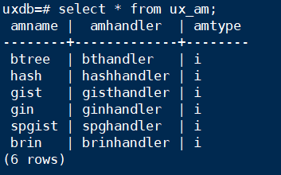

#### 4.1.4 索引的操作函数

TODO

### 4.2 B-Tree索引

#### 4.2.1 B-Tree索引的组织结构

TODO

#### 4.2.2 B-Tree索引的操作

TODO

### 4.3 Hash索引

#### 4..3.1 Hash索引的组织结构

TODO

### 4.4 GiST索引

#### 4.4.1 GiST的扩展性

TODO

#### 4.4.2 GiST索引的组织结构

TODO

#### 4.4.3 GiST索引的实现

TODO

#### 4.4.4 GiST索引实例

TODO

### 4.5 GIN索引

#### 4.5.1 GIN索引的扩展性

TODO

#### 4.5.2 GIN索引的组织结构

TODO

#### 4.5.3 GIN索引的操作

TODO

### 4.6 TSearch2全文搜索

#### 4.6.1 全文搜索的创建

TODO

#### 4.6.2 全文搜索的查询

TODO

#### 4.6.3 查询结果的处理

TODO

### 4.7 小结

索引是提高数据库性能的常用方法,
它可以令数据库服务器以更快的速度查找和检索特定的行.不过索引也增加了数据库系统的负荷,因此应该恰当的使用它们.索引的优劣不仅仅与索引的查询效率有关,同时与索引创建速度,更新速度,索引大小等因素有关.

以上分析的几种索引使用环境不同,相同环境下使用的优劣也各不相同.

**于是,为了方便用户对特殊数据类型数据的查询,PG中提供了索引模板可方便用户对索引的扩展以支持自定义数据类型上的索引创建和查询.**

通过使用索引,能够快速查找数据库中的数据.但在添加索引的同时,会增加数据库系统的负荷;在增删修改数据时,
维护索引的一致性也需要一定的时间和空间.由于索引给查找数据带来的巨大性能提升,因此也得到了广泛的应用.

在实际的使用中, 应该合理权衡使用索引带来的利弊, 恰当地使用索引.

PG的查询编译
------------

### 查询处理器的职责

查询处理器的职责是数据库管理系统中的一个部件集合,它允许用户使用SQL语言在较高层次上表达查询,
其主要职责是将用户的各种命令转化成数据库上的操作序列并执行.

### 查询编译的主要职责是什么

查询编译的主要任务是根据用户的查询语句生成数据库中最优的执行计划,在此过程中要考虑视图,规则以及表的连接路径等问题.

### 5.2 查询分析

#### 查询分析有几个模块

查询分析是查询编译的第一个模块,它包括3个部分:

1.  词法分析

2.  语法分析

3.  语义分析

#### 查询分析的输出结果是什么

它将用户输入的SQL命令转换为查询树(Query结构).

#### 查询分析借助的分析工具是什么

其中词法分析和语法分析分别借助词法分析工具Lex和语法分析工具Yacc来完成各自的工作.

#### 分析树和查询树的生成阶段

用户输入的SQL命令作为字符串传递给查询分析器,
对其进行词法分析和语法分析后生成分析树, 然后进行语义分析得到查询树.

#### 查询分析各个阶段对应的处理入口函数有哪些

对于用户的sQL命令, 统一由exec_simple_query函数处理;

该函数将调用pg_parse_query完成词法和语法分析并产生分析树;

接下来调用pg_analyze_and_rewrite函数逐个对分析树(原始分析树链表raw_parsetree_list
注意: 分析树可能有多个, 原因:用户输入的SQL字符串可能包含多条执行语句,
其对应多个分析树)进行语义分析和重写;

在该函数中又会调用函数parse_analyzer进行语义分析并创建查询树(Query结构),
函数pg_rewrite_query则负责对查询树进行重写.

#### 查询分析的处理过程是怎样的

1.  exec_simple_query调用函数pg_parse_query进入词法和语法分析的主体处理过程,
    然后函数pg_parse_query调用词法和语法分析的入口函数raw_parser生成分析树(原始分析树链表raw_parsetree_list).

2.  函数pg_parse_query返回分析树给外部函数 (即: exec_simpe_query)

3.  exec_simple_query接着调用函数pg_analyze_and_rewirte进行语义分析和查询重写.首先调用函数parse_analyze进行语义分析并生成查询树(用Query结构体表示),
    之后会将技术要求树传递给函数pg_rewrite_query进行查询重写.

#### 词法和语法分析在哪个函数中执行的, 通过哪个工具实现的?

在raw_parser中, 将通过Lex和Yacc生成的代码来进行词法和语法分析并生成分析树.

Lex和Yacc是词法和语法分析工具,
两者相配合可以生成助于词法和语法分析的C语言源代码.

在raw_parser中,
就是通过调用采用Lex和Yacc预生成的函数base_yyparse来实现词法和语法分析工作.

#### Lex工具的职责

Lex用来生成扫描器, 其工作是识别一个一个的模式,
比如数字,字符串,特殊符号等,然后将其传给Yacc.

#### Yacc工具的职责

Yacc则用于生成语法分析器, 它识别模式的组合,即语法.

#### PG中的词法分析和语法分析是由谁完成的

PG中的词法分析和语法分析是由Lex和Yacc配合完成的.

#### 词法和语法分析和各种文件生成和调用关系

#### 词法和语法分析的入口函数是谁, 返回结果是什么

词法和语法分析的入口函数是raw_parser, 该函数返回List结构用于存储生成的分析树.

#### 什么情况下raw_parsettree_list中会含有多个分析树

在某些情况下,
用户可能在一个命令字符串中执行多个SQL命令,也就是说客户端提交给服务进程的字符串包含多个SQL命令.
如: 用户可能输入:

“create table t(a int); insert into t values(1);select \* from t;”

这样一个字符串, 那么PG接收到该字符串之后进行词法和语法分析的结果就是三个分析树:
CreateStmt, InsertStmt和SelectStmt.

在返回的raw_parsettree_list中就有三个ListCell分别包含上述三个分析树.

#### 5.2.3 语义分析

##### 语义分析干什么的

语义分析阶段会检查命令中是否有不符合语义规定的成分.

如: 所使用的表,属性,过程函数等是否存在,聚集函数(如求和函数SUM,
平均函数AVG等)是否可以合法使用等.

其主要作用在于检查该命令是否可以正确执行.

##### 语义分析相比词法和语法分析阶段的更进之处

语义分析会根据分析树中的内容得到更有利于执行的数据, 例如: 根据表的名字得到OID,
根据属性名得到其属性号, 根据操作符的名字得到其对应的计算函数等.

##### 语义分析在exec_simple_query过程中扮演的角色是什么样的

exec_simple_query在从词法和语法分析模块获取了parsetree_list(分析树链表)之后,
会对其中每一棵分析树调用pg_analyze_and_rewrite进行语义分析和查询重写,而在其中负责语义分析的则是analyze.c文件中的parse_analyze函数.

parse_analyze会根据分析树生成一个对应的查询树,而查询重写模块则继续对这一查询树进行修改,
并且有可能会将这个查询树改写成一个包含多棵查询树的链表.

因此, pg_analyze_and_rewrite最终返回给exec_simple_query的将是一个查询树链表.

##### parse_analyze函数中的各个SQL语句命令(xxStmt)处理

在parse_analyze函数中, 将根据命令类型分七种情况处理(参考函数transformStmt).

经过语义分析之后, 会生成查询树(Query结构).

其中select/insert/delete/update这四种情况所生成的查询树会经由查询重写和查询优化作进一步处理.

##### 两个重要的结构体Query和ParseState

该过程涉及两个重要的结构体: Query和ParseState.

Query(用于存储查询树)是查询分析的最终输出结果,
其中许多字段可以在分析树的相关结构体中找到对应项.

ParseState结构体则用于记录语义分析的中间信息.

##### parse_analyze处理中遇到的命令类型都有哪些

概要分８种：

1.  设置分析状态

2.  Ｕｔｉｌｉｔｙ（建表，建索引等附件命令）

3.  Ｅｘｐｌａｉｎ　（显示查询的执行计划）

4.  Ｄｅｃｌａｒｅｃｕｒｓｏｒ　（定义游标）

5.  Ｓｅｌｅｃｔ

6.  Ｉｎｓｅｒｔ

7.  Delete

8.  Update

##### 各个命令对应的主义分析函数 (列表说明)

| **NodeTag值**       | **语义分析函数**                                         |
|---------------------|----------------------------------------------------------|
| T_InsertStmt        | transformInsertStmt                                      |
| T_DeleteStmt        | transformDeleteStmt                                      |
| T_UpdateStmt        | transformUpdateStmt                                      |
| T_SelectStmt        | transformSelectStmt或transformValuesClause               |
| T_DeclareCursorStmt | transformDeclareCursorStmt (游标定义语句)                |
| T_ExplainStmt       | transformExplainStmt (Explain语句)                       |
| 其他                | 作为Utility类型处理, 直接在分析树上封装一个Query节点返回 |

##### 简述transformSelectStmt函数的主要处理流程

transfromSelectStmt函数的作用是根据一个SelectStmt结构生成一个查询树(Query).

其主要流程如下:

1.  创建一个新的Query节点, 设置其commandType字段为CMD_SELECT;

2.  调用transformWithClause函数处理with子句;

3.  调用transformFromClause函数处理from子句;

4.  调用transfomrTargetList函数处理目标属性;

5.  调用transformWhereClause函数处理where子句和having子句;

6.  调用transformSortClause函数处理order by子句;

7.  调用transformGroupClause函数处理group by子句;

8.  调用transformDistinctClause函数或transformDistinctOnClause函数处理distinct.

9.  调用transformLimitClause函数处理limit和offset.

10. 处理INTO子句;

11. 设置Query节点的其他标志(如hasAggs,hasSubLinks等字段);

12. 返回Query节点.

由此可见,
对于SelectStmt的处理过程被分解成对其各个子句部分的处理,各子句的处理过程相对独立.

其他类型的分析树的语法分析过程与此大同小异.

#### 5.3.1 规则系统

##### 查询重写的核心是什么

查询重写的核心是规则系统.

##### 规则系统是什么

规则系统是由一系列的规则组成的, 系统表pg_rewrite存储重写规则.

PG的查询执行
------------

### 查询执行器的函数入口和查询编译一样吗

查询执行器也是被函数exec_simple_query调用, 只是调用的顺序上查询编译在前,
查询执行器在后.

### 查询执行器的执行过程

从总体上看, 查询执行器实际就是按照执行计划的安排,
有机的调用存储,索引,并发等模块,按照各种执行计划中各种计划节点的实现算法来完成数据的读取或者修改的过程.

### 查询执行器有几个子模块

查询执行器有４表主要的子模块：　

1.  Portal

2.  ProcessUtility

3.  Executor

4.  特定功能子模块

PG事务处理和并发控制
--------------------

### 7.1 事务系统简介

#### 什么是事务, 事务最大的特点是什么

事务是数据库操作的执行单位.

事务最大的特点是: 一个事务提交之后或者完整执行,或者完全不执行, 即没有中间态.

#### 数据库中有语句不在事务环境中吗

没有, 绝对没有.

数据库中, 任何语句的执行都存在于事务环境中, 任何语句开始执行之前事务就开始了.
当语句执行完成后, 事务结束.

#### 什么是事务环境

通常情况下, 我们提交的查询语句或者更新语句会被送入一个默认事务环境中执行.
PG中负责管理事务运行的模块称为事务管理器.

#### 事务系统的管理器

3个:

1.  事务管理器

2.  锁管理器

3.  日志管理器

事务管理器是事务系统的中枢.

锁管理器实现了系统并发控制所需要的各种锁.

日志管理器用来记录事务执行的状态和数据的变化过程.

#### MVCC应用在事务执行的哪个阶段

在PG中, 事务执行的读阶段采用了多版本并发控制(MVCC),
即对元组的读和写互不阻塞;而在事务执行的写阶段需要由各种锁来保证事务的隔离级别.

#### 上下层事务块的关系

在PG中, 上层的事务块以及底层的事务块共同构成了传统数据库中所提到的事务的概念.
任何语句的执行总是先进入事务处理接口事务块中,
然后调用事务底层函数处理具体的命令, 最后返回事务块中.

#### 事务的执行层次是怎样的

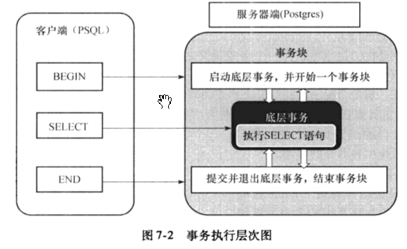

#### 7.2 事务系统的上层

##### 事务块和事务的关系

在PG中, 一个事务块中包含多个事务,
所以事务块的状态数量要比底层事务的状态数量多的多.

##### PG执行一条SQL对应的事务函数主要有哪些

在PG的事务处理层次中, 位于事务系统上层的是事务块.

PG执行一条SQL语句前会调用StartTransactionCommand函数,
执行结束时会调用CommitTransactionCommand函数.

如果命令执行失败, 则会调用AbortCurrentTransaction函数.

上述三个函数根据事务块的状态执行不同的操作, 并调用不同的底层事务执行函数.

需要注意的是, 上述三个函数只是进入事务系统上层的入口函数, 并不处理具体事务.

##### PG为什么要将事务系统为成2个层次

PG将事务系统分成上层(事务块)和底层(事务)两个层次, 通过分层的设计,
在处理上层业务的时候可以屏蔽具体细节.

##### 7.2.1 事务块状态

#### 7.3 事务系统的底层

##### 7.3.1 事务状态

##### 7.3.2 事务操作函数

###### 事务操作主要步骤

共4个:

1.  启动事务

2.  提交事务

3.  退出事务

4.  清理事务

##### 7.3.3 简单查询事务执行过程实例

###### 简单查询事务执行过程说明

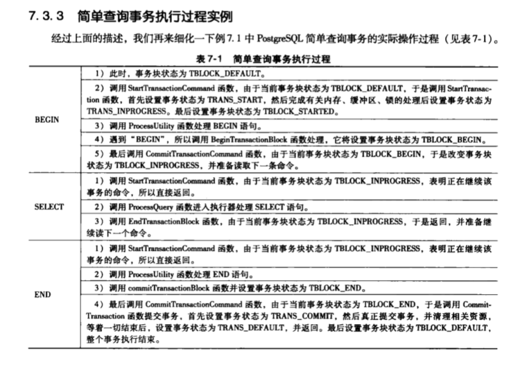

#### 7.4 事务保存点和子事务

##### 事务保存点和子事务提供了什么样的机制

事务保存点(SAVEPOINT)提供了一种机制, 用于回滚部分事务.

PG在实现上把SAVEPOINT认为是定义子事务的标记. 保存点的作用就是实现事务的回滚,
即从当前子事务回滚到事务链(即: 事务块)中的某个祖先事务.

在PG中, 子事务的主要作用是实现保存点, 从而增强事务操作的灵活性.

##### 7.4.1 保存点实现原理

##### 7.4.2 子事务

#### 7.5 两阶段提交

##### PG数据库使用什么机制来支持分布式数据库的事务处理的

PG使用两阶段提交(Two Phase Commit, 2PC)来支持分布式数据库的事务处理.

##### 什么是2pc (两阶段提交), 有什么作用

2pc分为a. 预提交阶段 和 b. 全局提交阶段.

**作用:** PG使用2pc来支持分布式数据库的事务处理.
而实现分布式事务处理的关键就是两阶段提交协议.

##### 分布式数据(如: RAC)中2pc有什么用

两阶段提交协议是分布式数据库系统中保证分布式事务ACID特性的经典解决方案.

PG为其提供了很好的操作接口, 应用程序开发者利用该操作接口可以很好的实现该协议.

#### 7.6 PG的并发控制

##### PG的并发控制是怎样的

目标: PG中存在多个会话试图同时访问同一数据库的情况,
并发控制的目标就是保证所有会话**高效地访问**, 同时**维护数据库的完整性.**

##### MVCC可以解决所有的并发控制情况吗

不能.

在PG中也有表和行级别的锁定机制, 因为MVCC并不能解决所有的并发控制情况,
所以还需要使用传统的数据库中的锁机制保证事务的并发.

另外, PG还提供了会话锁机制, 利用它可以扩大锁的使用范围,
即一次对某个对象加锁可以保证对于多个事务都有效.

##### SQL标准考虑的并行事务之间需要避免的现象是什么

共3个:

1.  脏读

2.  不可重复读

3.  幻读

脏读: 一个事务读取了另一个未提交的并行事务写的数据.

不可重复读: 一个事务重新读取前面读取过的数据,
发现该数据已经被另一个已提交的事务修改过.

幻读: 一个事务重新执行了一个查询, 返回一套符合查询条件的数据,
发现这些数据因为其他最近提交的事务而发生了改变.

**备注:** 实际上幻读可以算是”不可重复读”的一种子情况.
上面所述的”不可重复读”算是下面所述的”虚读”.

不可重复读（Non-repeatable
Reads）：一个事务对同一行数据重复读取两次，但是却得到了不同的结果。

包括以下情况：

（1）
虚读：事务T1读取某一数据后，事务T2对其做了修改，当事务T1再次读该数据时得到与前一次不同的值。

（2） [幻读](https://baike.baidu.com/item/%E5%B9%BB%E8%AF%BB)（Phantom
Reads）：事务在操作过程中进行两次查询，第二次查询的结果包含了第一次查询中未出现的数据或者缺少了第一次查询中出现的数据（这里并不要求两次查询的[SQL语句](https://baike.baidu.com/item/SQL%E8%AF%AD%E5%8F%A5)相同）。这是因为在两次查询过程中有另外一个事务插入数据造成的。

##### 如何理解SQL的可重复读和幻读之间的区别

<https://zhidao.baidu.com/question/1498699183609661299.html>

 

[不可重复读](https://www.baidu.com/s?wd=%E4%B8%8D%E5%8F%AF%E9%87%8D%E5%A4%8D%E8%AF%BB&tn=SE_PcZhidaonwhc_ngpagmjz&rsv_dl=gh_pc_zhidao)与幻读比较相似，都是在一个事务中多次读取到不同的数据。网络上的总结如下  
[不可重复读](https://www.baidu.com/s?wd=%E4%B8%8D%E5%8F%AF%E9%87%8D%E5%A4%8D%E8%AF%BB&tn=SE_PcZhidaonwhc_ngpagmjz&rsv_dl=gh_pc_zhidao)：所谓的虚读，也就是大家经常说的[不可重复读](https://www.baidu.com/s?wd=%E4%B8%8D%E5%8F%AF%E9%87%8D%E5%A4%8D%E8%AF%BB&tn=SE_PcZhidaonwhc_ngpagmjz&rsv_dl=gh_pc_zhidao)，是指在数据库访问中，一个事务范围内两个相同的查询却返回了不同数据。这是由于查询时系统中其他事务修改的提交而引起的。比如事务T1读取某一数据，事务T2读取并修改了该数据，T1为了对读取值进行检验而再次读取该数据，便得到了不同的结果。  
一种更易理解的说法是：在一个事务内，多次读同一个数据。在这个事务还没有结束时，另
一个事务也访问该同一数据。那么，在第一个事务的两次读数据之间。由于第二个事务的修改，那么第一个事务读到的数据可能不一样，这样就发生了在一个事务内
两次读到的数据是不一样的，因此称为不可重复读，即原始读取不可重复。  
所谓幻读，是指事务A读取与搜索条件相匹配的若干行。事务B以插入或删除行等方式来修改事务A的结果集，然后再提交。  
幻读是指当事务不是独立执行时发生的一种现象，例如第一个事务对一个表中的数据进行了修改，比如这种修改涉及到表中的“全部数据行”。同时，第二个事务也
修改这个表中的数据，这种修改是向表中插入“一行[新数据](https://www.baidu.com/s?wd=%E6%96%B0%E6%95%B0%E6%8D%AE&tn=SE_PcZhidaonwhc_ngpagmjz&rsv_dl=gh_pc_zhidao)”。那么，以后就会发生操作第一个事务的用户发现表中还有没有修改的数据行，就好象发生了幻觉一
样.一般解决幻读的方法是增加范围锁RangeS，锁定检锁范围为只读，这样就避免了幻读。简单来说，幻读是由插入或者删除引起的。  
大致的区别在于不可重复读是由于另一个事务对数据的更改所造成的，而幻读是由于另一个事务插入或删除引起的

##### 为什么数据库中要提供”事务隔离级别”这个概念

在数据库中, 为了有效保证并发读取数据库的正确性, 提出的”事务隔离级别”.

参考:

<https://baike.baidu.com/item/%E4%BA%8B%E5%8A%A1%E9%9A%94%E7%A6%BB%E7%BA%A7%E5%88%AB/2638091?fr=aladdin>

为了避免上面出现的几种情况，在标准[SQL](https://baike.baidu.com/item/SQL)规范中，定义了4个事务隔离级别，不同的隔离级别对事务的处理不同。

未授权读取

也称为读未提交（Read
Uncommitted）：允许脏读取，但不允许更新丢失。如果一个事务已经开始写数据，则另外一个事务则不允许同时进行写操作，但允许其他事务读此行数据。该隔离级别可以通过“排他写锁”实现。

授权读取

也称为读提交（Read
Committed）：允许[不可重复读取](https://baike.baidu.com/item/%E4%B8%8D%E5%8F%AF%E9%87%8D%E5%A4%8D%E8%AF%BB%E5%8F%96)，但不允许脏读取。这可以通过“瞬间共享读锁”和“排他写锁”实现。读取数据的事务允许其他事务继续访问该行数据，但是未提交的写事务将会禁止其他事务访问该行。

可重复读取（Repeatable Read）

可重复读取（Repeatable
Read）：禁止[不可重复读取](https://baike.baidu.com/item/%E4%B8%8D%E5%8F%AF%E9%87%8D%E5%A4%8D%E8%AF%BB%E5%8F%96)和脏读取，但是有时可能出现幻读数据。这可以通过“共享读锁”和“排他写锁”实现。读取数据的事务将会禁止写事务（但允许读事务），写事务则禁止任何其他事务。

序列化（Serializable）

序列化（Serializable）：提供严格的事务隔离。它要求事务[序列化](https://baike.baidu.com/item/%E5%BA%8F%E5%88%97%E5%8C%96)执行，事务只能一个接着一个地执行，不能并发执行。仅仅通过“行级锁”是无法实现事务序列化的，必须通过其他机制保证新插入的数据不会被刚执行查询操作的事务访问到。

隔离级别越高，越能保证数据的完整性和一致性，但是对并发性能的影响也越大。对于多数应用程序，可以优先考虑把[数据库系统](https://baike.baidu.com/item/%E6%95%B0%E6%8D%AE%E5%BA%93%E7%B3%BB%E7%BB%9F)的隔离级别设为**Read
Committed**。它能够避免脏读取，而且具有较好的并发性能。尽管它会导致[不可重复读](https://baike.baidu.com/item/%E4%B8%8D%E5%8F%AF%E9%87%8D%E5%A4%8D%E8%AF%BB)、幻读和第二类丢失更新这些并发问题，在可能出现这类问题的个别场合，可以由应用程序采用[悲观锁](https://baike.baidu.com/item/%E6%82%B2%E8%A7%82%E9%94%81)或[乐观锁](https://baike.baidu.com/item/%E4%B9%90%E8%A7%82%E9%94%81)来控制。

##### 简介一下乐观锁和悲观锁

乐观锁机制采取了更加宽松的加锁机制。悲观锁大多数情况下依靠数据库的锁机制实现，以保证操作最大程度的独占性。但随之而来的就是数据库
性能的大量开销，特别是对长[事务](https://baike.baidu.com/item/%E4%BA%8B%E5%8A%A1)而言，这样的开销往往无法承受。相对悲观锁而言，乐观锁更倾向于开发运用。

悲观锁，正如其名，具有强烈的独占和排他特性。它指的是对数据被外界（包括本系统当前的其他[事务](https://baike.baidu.com/item/%E4%BA%8B%E5%8A%A1)，以及来自外部系统的[事务处理](https://baike.baidu.com/item/%E4%BA%8B%E5%8A%A1%E5%A4%84%E7%90%86/217482)）修改持保守态度，因此，在整个数据处理过程中，将数据处于锁定状态。悲观锁的实现，往往依靠数据库提供的锁机制（也只有数据库层提供的锁机制才能真正保证数据访问的[排他性](https://baike.baidu.com/item/%E6%8E%92%E4%BB%96%E6%80%A7/2137580)，否则，即使在本系统中实现了加锁机制，也无法保证外部系统不会修改数据）

##### SQL标准定义的事务隔离级别有哪些

共4个:

1.  读未提交

2.  读已提交

3.  可重复读

4.  可串行化

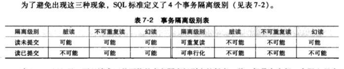

注意: SQL定义的这4种隔离级别, 只定义了哪种现象不能发生,
但没有定义哪种现象一定发生.

##### PG中事务隔离级别最小实体是什么

在PG系统中, 事务的隔离级别所涉及的最小实体是元组, 即: Tuple.

所以对元组的操作(例如读取, 插入, 更新, 删除)需要实施访问控制,
它们是通过锁操作以及MVCC相关的操作来实现的.

#### 7.7 PG中的三种锁

##### PG有几种锁, 简单介绍一下

共3种:

1.  SpinLock

2.  LWLock

3.  RegularLock

SpinLock的特点是: 封锁时间很短, 没有等待队列和死锁检测机制,
事务结束时不能自动释放SpinLock.

作为一种最底层的锁, 一般不直接使用SpinLock, 而是利用它来实现其他锁(LWLock).

LWLock(轻量级锁): 主要提供对共享存储器的数据结构的互斥访问.

LWLock有2种锁模式: 1) 排他模式 2) 共享模式.

LWLock不提供死锁检测, 但在elog恢复期间被自动释放,
所以持有轻量级锁的期间调用elog发出错误信息不会出现轻量级锁未释放的问题.

LWLock的特点是: 有等待队列, 无死锁检测, 能自动释放锁.

RegularLock就是一般数据库事务管理中所指的锁, 也简称为Lock.

RegularLock由LWLock实现, 其特点是: 有等待队列, 有死锁检测, 能自动释放锁.

#### 7.8 锁管理机制

##### PG都有哪些粒度的锁, 锁的对象分别是谁

5种:

1.  表粒度的锁

2.  页粒度的锁

3.  元组粒度的锁

4.  事务粒度的锁

5.  一般对象的锁

表粒度的锁操作表示在数据库系统中加锁对象为一个表.

页粒度的锁操作表示在数据库系统中加锁 对象为一个页面.

元组….对象为一个元组.

事务粒度..对象为一个事务.

一般对象…对象为一般对象.

##### 各个粒度的锁操作具体是怎样的

###### 表粒度的锁操作

###### 页粒度的锁操作

###### 元组粒度的锁操作

###### 事务粒度的锁操作

###### 一般对象的锁操作

### 7.9 死锁处理机制

#### 死锁处理机制

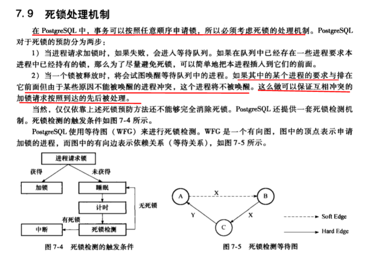

#### 死锁处理相关操作

在PG中, 当进程不能获得锁进入等待队列时, 就会触发死锁检测的操作.

如果发现了”死锁”, 进而尝试进行死锁的解除操作,
死锁解除采用枚举的方法尝试调整队列中进程的等待先后拓扑顺序,
试图找到一种打破进程之间循环等待的状态.

### 7.10 多版本并发控制

#### MVCC 多版本并发控制

PG为开发者提供了丰富的管理数据库并发访问的工具. 在内部,
PG利用MVCC来维护数据的一致性.

这就意味着当检索数据时, 每个事务看到的只是一段时间之前的数据快照,
而不是数据库的当前状态(即: 最新的状态).

这样, 如果对数据库会话进行事务隔离,
就可以避免一个事务看到其他并发事务的更新而导致不一致的数据.

优点: 使用MVCC的主要优点是对检索(读取)数据的锁请求与写数据的锁请求并不冲突,
所以读不会阻塞写, 而写也从不阻塞读. 这就极大地提升了并发处理能力.

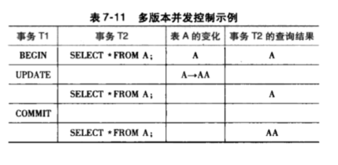

### 7.11 日志管理

#### PG的日志管理是怎样的

#### 日志的必要性

日志是数据库系统必不可少的一部分, 它以一种安全的方式记录数据库变更的历史.

当系统出现故障后, 数据库系统通过使用日志来重建对数据库所做更新的过程,
以恢复数据库到一致状态, 从而保证数据库的一致性和完整性.

#### PG的日志主要有哪些

4个:

1.  XLOG 事务日志

2.  CLOG 提交日志

3.  SUBTRANS (子事务日志)

4.  MULTIXACT(组合事务日志)

#### 已经有XLOG, 为什么还要CLOG呢

XLOG是一般的日志记录, 即通常意义上所认识的(数据库事务)日志记录,
它记录了事务对数据库更新的过程和事务的最终状态.

CLOG在一般的数据库教材上是没有提及的, 其实CLOG是XLOG的一种辅助形式,
记录了事务的最终状态. 因为每一条XLOG日志记录相对较大,
如果需要通过日志判断一个事务的状态, 那么使用CLOG比使用XLOG要高效的多.

同时CLOG占用的空间也非常有限.

此外, 为支持嵌套事务, PG还引入了SUBTRANS日志记录----即子事务日志,
记录每个事务的父事务的事务ID, 这样通过一个事务可以递归查找到其父事务,
但是并不能通过一个事务查找到其子事务.

同时, 为了支持多版本并发控制, PG引入了组合事务ID(MultiXactID),
记录事务的组合关系, 并维持从众多事务ID到MultiXactId的映射关系.

#### 为什么要设立日志缓冲区

在PG中, 日志通过日志文件来存放. 如果每个日志记录在创建时都被立即写到磁盘上,
那么将增加大量的I/O开销. 因为通常向磁盘的写入是以(数据)块为单位进行的,
而在大多数情况下, 一个日志记录比一个块小得多, 为了降低写入日志带来的I/O开销,
数据库系统在实现时往往设置了日志缓冲区, 即先将日志记录写到主存中的日志缓冲区中,
当日志缓冲区满了以后以块为单位向磁盘写出.

#### PG中数据库系统直接操作磁盘的日志文件吗

否.

在数据库系统中,
日志缓冲区通过日志管理器来管理.数据库系统并不直接操作磁盘日志文件,
一般是通过日志缓冲区来使用日志文件,
而缓冲区和磁盘之间的交互,同步则由日志管理器来完成.

PG有四种日志管理器, 即XLOG(事务日志), CLOG(事务提交日志),
SUBTRANS(子事务日志)以及MULTIXACT(组合事务日志).

#### PG是如何管理这些日志的

PG通过一种缓冲区来实现对CLOG日志, SUBTRANS日志以及MULTIXACT日志的管理,
即SLRU缓冲池----采用简单LRU(Last Recently Used)算法作为页面转换算法的缓冲池.

#### 若要获取一个事务状态,直接通过日志管理器操作日志缓冲池吗

不是.

如果要获取一个事务的状态, 并不是直接通过日志管理器操作日志缓冲池,
而是要通过事务日志接口例程(Routes)进行操作.

#### 简介日志的资源管理器作用

由于使用日志的资源有很多种, PG为对日志进行分类,
使用了资源管理器(不是第3章中介绍的资源跟踪器)的概念.
资源管理器主要用于在日志系统中把各种需要记录的数据分类,
通在日志中标识资源管理号, 使系统在恢复或者读取日志记录时,
能够很方便的知道该日志记录的元数据属于哪一类,
从而通过资源管理器的方法可以准确的选择对应的方法.

#### 7.11.1 SLRU缓冲池

##### SLRU缓冲区

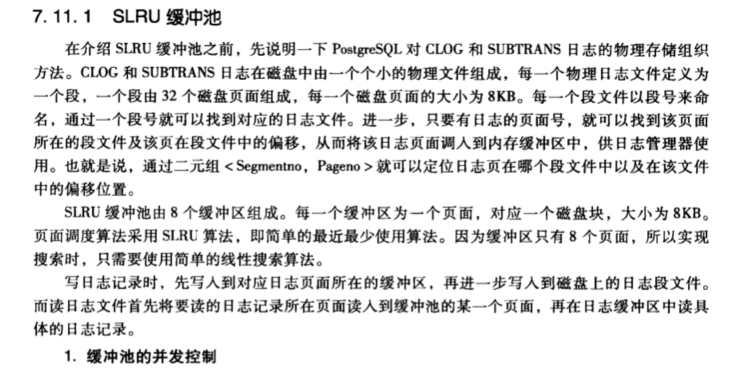

#### 7.11.2 CLOG日志管理器 \*\*

##### CLOG日志管理器概述

CLOG日志记录的是事务的最终状态. CLOG日志管理器管理着CLOG日志缓冲池,
该日志缓冲池是基于SLRU缓冲池实现的.

##### CLOG日志管理器模块有哪些主要内容

共2块:

1.  CLOG日志管理器相关数据结构

2.  CLOG日志管理器主要操作

#### 7.11.3 SUBTRANS日志管理器

#### 7.11.4 MULTIXACT日志管理器

#### 7.11.5 XLOG日志管理器

##### XLOG日志概述

XLOG是传统数据库理论中提到的事务日志, 它详细地记录了服务进程对数据库的操作过程.

##### XLOG在内存中是如何存放的

XLOG日志文件在内存中按页进行存放, 每个页面大小为8KB, 每个页都有一个头部,
头部信息之后才是XLOG日志记录.

##### XLOG文件在物理磁盘中是如何存放的

每个XLOG文件都有一个ID, 但事实上它被分为一个个大小为16MB的XLOG段文件来存放.

##### 如何在磁盘目录中唯一的确定XLOG单文件

XLOG文件号和段文件号可以用来唯一的确定这个段文件.

##### 如何确定XLOG日志文件内的一个日志记录的地址

确定日志文件内一个日志记录的地址时,
只需用一个XLOG文件号和日志记录在该文件内人偏移量即可.

##### XLOG日志管理器模块有哪些主要内容

共3个:

1.  XLOG日志管理器相关数据结构

2.  XLOG日志管理器主要操作

3.  XLOG日志恢复策略

##### 1 XLOG日志管理器相关数据结构

###### PG日志是REDO还是UNDO日志

PG只使用REDO方法来进行数据库的恢复,
它不使用UNDO是因为其数据的多版本使得UNDO没有必要.

但从本质上讲, PG日志并非REDO日志, 而应该是UNDO/REDO日志,
其创建检查点时大体上服务UNDO/REDO日志创建检查点时要服从的规则, 只是做了一点改动.

###### 参考: 浅析MySQL事务中的redo与undo

<https://www.jianshu.com/p/20e10ed721d0>

##### 2 XLOG日志管理器主要操作

###### XLOG日志管理器操作分几个组成

XLOG日志管理器的操作由以下几个部分组成:

1.  日志文件的建立

2.  初始化

3.  启动操作

4.  日志的插入

5.  日志的归档

6.  日志的删除

7.  日志文件的恢复

8.  日志备份块的读取

9.  日志的REDO操作

##### 3 XLOG日志恢复策略

###### XLOG日志恢复策略概述

在PG中, 系统在崩溃后重新启动时会调用StartupXlog入口函数,
该函数首先会扫描全局信息控制文件(global/pg_control)读取系统的控制信息,
然后扫描XLOG日志目录结构检测其是否完整,进而读取到最新的日志检查点记录,接下来根据日志记录序列的偏序关系检测到系统是否处理非正常状态下,
若系统处于非正常状态,
则触发恢复机制进行恢复.恢复完成后重新建立检查点并初始化XlogCtl控制信息,
然后启动事务提交日志以及相关辅助日志模块.

###### 日志中出现哪几种情况时需要进行恢复操作

日志中出现以下三种情况需要进行恢复操作:

1.  日志文件中扫描到back_label文件.

2.  根据ControlFile记录的最新检查点读取不到日志记录.

3.  根据ControlFile记录的检查点与通过该记录找到的检查点日志中的Redo位置不一致.

###### 日志恢复的具体步骤有哪些

在PG系统中, 日志建立的策略是采用改进的非静止检查点的Redo日志,
恢复则是找到最近的合法检查点然后做Redo操作. 恢复操作的具步骤如下:

1.  首先更新控制信息到ControFile中.

2.  初始化日志恢复时所用到的资源管理器.

3.  从检查点日志记录的REDO位置开始往后读取日志记录.

4.  根据日志记录的资源管理器号选择对应的RMGR,
    然后利用该RMGR做日志记录中所记录的操作过程(REDO操作).

5.  重复步骤3和4的过程, 直至读取不到日志记录.

###### 几种典型的日志的恢复操作介绍

在上述恢复流程中, 第4步的REDO操作会针对不同的日志类型做不同的恢复操作.
下面介绍几种典型日志的恢复操作.

1.  Database类型的日志操作.

2.  Heap类型的Redo操作.

3.  B-Tree类型的Redo操作.

4.  XLog类型的Redo操作.

###### 恢复完成后都做了些什么

当恢复过程完成后, 重新建立检查点并重新初始化XlogCtl结构信息.
然后继续调用;StartupCLOG函数,
StartupSUBTRANS函数和StartupMultiXact函数完成事务提交日志及其他辅助日志模块的启动.

如果根据系统日志检测到系统不需要恢复操作, 那么将跳过恢复操作,
然后完成事务提交日志等相关模块的初始化.

#### 7.11.6 日志管理器总结 \*\*

### 7.12 小结 \*\*

如果我们把整个数据库系统视为一个团队,
那么事务系统在这个团队中扮演了”指挥官”的角色,
它根据外部用户命令以及系统内部状态决定了当前数据库系统中操作的执行方向.

在7.1节到7.5节中, 详细阐述了PG事务管理器的操作,
其核心功能就是根据当前状态和接收到的外部状态(用户命令)决定当前需要执行的操作,
所以它承担了整个系统的决策功能, 是”指挥官”的大脑.

在7.6到7.10节中,
详细阐述了PG的并发控制机制,其核心功能是为了在保证数据一致性的前提下提高并发度,
所有它承担了整个系统的调度协调功能, 是”指挥官”的节拍器.

在7.11节中, 详细阐述国PG的日志管理机制,
其核心功能是通过磁盘日志文件夹来记录数据库操作状态序列以及数据库变化过程,
所以它承担了整个系统的保障恢复功能.

总之, 事务系统串联了整个数据库中各个不同的模块,
事务系统的调度决策驱动了整个数据库系统的执行进程.

第9章 数据库安全
----------------

附录
----

### oracle -- 数据块（data Block）

时间：2018-04-29 23:57:10      阅读：418      评论：0     
收藏：0      [点我收藏+]

标签：[inux](http://www.mamicode.com/so/1/inux)   [integer](http://www.mamicode.com/so/1/integer)   [排列](http://www.mamicode.com/so/1/%e6%8e%92%e5%88%97)   [unix](http://www.mamicode.com/so/1/unix)   [空间](http://www.mamicode.com/so/1/%e7%a9%ba%e9%97%b4)   [数据仓库](http://www.mamicode.com/so/1/%e6%95%b0%e6%8d%ae%e4%bb%93%e5%ba%93)   [int](http://www.mamicode.com/so/1/int)   [索引](http://www.mamicode.com/so/1/%e7%b4%a2%e5%bc%95)   [数据段](http://www.mamicode.com/so/1/%e6%95%b0%e6%8d%ae%e6%ae%b5)   

**基本关系：数据库---表空间---数据段---分区---数据块**  
  
  
数据块（data Block）  
一、数据块Block是Oracle存储数据信息的最小单位。这里说的是Oracle环境下的最小单位。Oracle也就是通过数据块来屏蔽不同操作系统存储结构的差异。无论是Windows环境，还是Unix/Linux环境，他们的操作系统存储结构和方式、甚至字符排列的方式都是不同的。Oracle利用数据块将这些差异加以屏蔽，全部数据操作采用对Oracle块的操作，相当于是一个层次的抽象。

二、Oracle所有对数据的操作和空间分配，实际上都是针对数据块Block的操作。我们从数据表中搜索出一行，实际中Oracle就会从内存缓冲区（或者硬盘）中读取到该行所在的数据块，再返回这数据块上的指定数据行。Oracle无论是在缓冲区，还是在硬盘，进行数据操作的虽小单位也就是数据块。

三、数据块是有大小的，在一个数据库建立的时候，通过参数进行设置。注意，在Oracle数据库参数中，只有数据块大小的参数是建库之后不能进行修改的。数据块的大小，在一个数据库中可以支持多个，但是一般没有太大的意义，会给管理和调试带来一定的负担。

四、数据块(data block)的大小是操作系统的data
block的整数倍，ORACLE默认是8K，还有4K，16K，32k几种。设置数据块的大小是依据不同类型的系统的。如果数据块设置比较大，那么一次读取的数据行较多，相应对SGA内存消耗比较大，特定查询引发的换入换出可能较多。如果设置的过小，频繁的IO逻辑物理读也会引起性能问题。  
**-----相关参数为db_block_size，查看block大小。**  
SQL\> **show parameter db_block_size;**  
NAME                                 TYPE        VALUE  
------------------------------------ ----------- ------------------------------  
db_block_size                        integer     8192  //1024×8  
注：  
1、DB_BLOCK_SIZE作为数据库的最小操作单位，是在创建数据库的时候指定的，在创建完数据库之后便不可修改。要修改DB_BLOCK_SIZE，需要重建数据库。一般可以将数据EXP出来，然后重建数据库，指定新的DB_BLOCK_SIZE，然后再将数据IMP进数据库。  
2、
DB_BLOCK_SIZE一般设置为操作系统块的倍数，即2K,4K,8K,16K或32K，但它的大小一般受数据库用途的影响。对于联机事务，其特点是事务量大，但每个事务处理的数据量小，所以DB_BLOCK_SIZE设置小点就足够了，一般为4K或者8K，设置太大话一次读出的数据有部分是没用的，会拖慢数据库的读写时间，同时增加无必要的IO操作。而对于数据仓库和ERP方面的应用，每个事务处理的数据量很大，所以DB_BLOCK_SIZE一般设置得比较大，一般为8K，16K或者32K，此时如果DB_BLOCK_SIZE小的话，那么I/O自然就多，消耗太大。  
3、
大一点的DB_BLOCK_SIZE对索引的性能有一定的提高。因为DB_BLOCK_SIZE比较大的话，一个DB_BLOCK一次能够索引的行数就比较多。  
4、
对于行比较大的话，比如一个DB_BLOCK放不下一行，数据库在读取数据的时候就需要进行行链接，从而影响读取性能。此时DB_BLOCK_SIZE大一点的话就可以避免这种情况的发生。

 

初始化参数db_file_multiblock_read_count是用来约束Oracle进行多数据块读取时的行为，所谓多数据块读取，就是Oracle在一次I/O时，可以读取多个数据块，从而用最小的I/O完成数据的读取。  
db_file_multiblock_read_count的设置要受OS最大IO能力影响，也就是说，如果你系统的硬件IO能力有限，即使设置再大的db_file_multiblock_read_count也是没用的。  
**------初始化参数db_file_multiblock_read_count，查看一次I/O完成数据的读取。**  
SQL\> **show parameter db_file_multiblock_read_count；**  
NAME                                 TYPE        VALUE  
-------------------------------------------------------  
db_file_multiblock_read_count        integer     32  
   
SQL\> **alter session set db_file_multiblock_read_count=256;**  
会话已更改。  
  
SQL\> **show parameter db_file；**  
NAME                                 TYPE        VALUE  
-----------------------------------------------------  
db_file_multiblock_read_count        integer      128

[oracle -- 数据块（data
Block）](http://www.mamicode.com/info-detail-2275881.html)

标签：[inux](http://www.mamicode.com/so/1/inux)   [integer](http://www.mamicode.com/so/1/integer)   [排列](http://www.mamicode.com/so/1/%e6%8e%92%e5%88%97)   [unix](http://www.mamicode.com/so/1/unix)   [空间](http://www.mamicode.com/so/1/%e7%a9%ba%e9%97%b4)   [数据仓库](http://www.mamicode.com/so/1/%e6%95%b0%e6%8d%ae%e4%bb%93%e5%ba%93)   [int](http://www.mamicode.com/so/1/int)   [索引](http://www.mamicode.com/so/1/%e7%b4%a2%e5%bc%95)   [数据段](http://www.mamicode.com/so/1/%e6%95%b0%e6%8d%ae%e6%ae%b5)   

原文地址：https://www.cnblogs.com/sunziying/p/8972237.html
