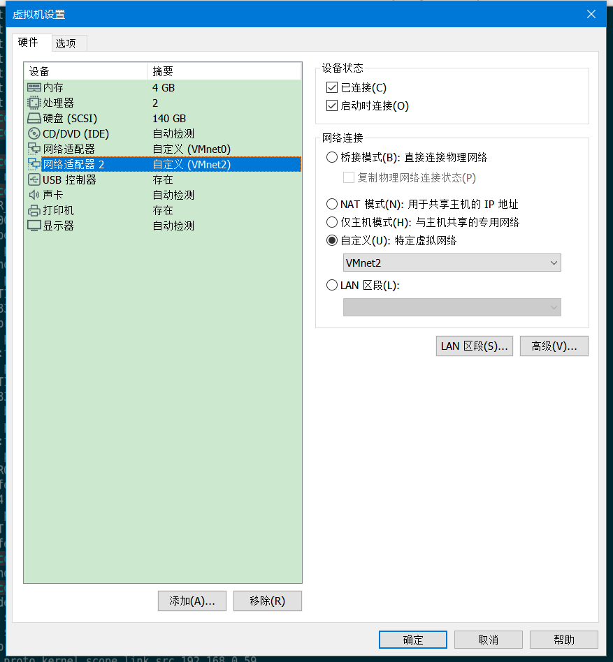
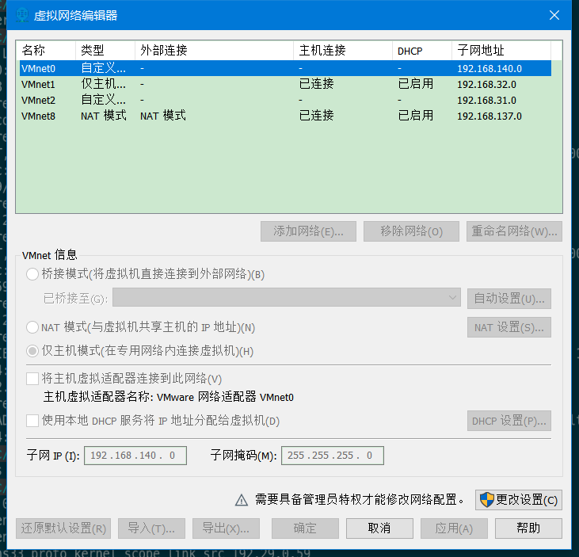
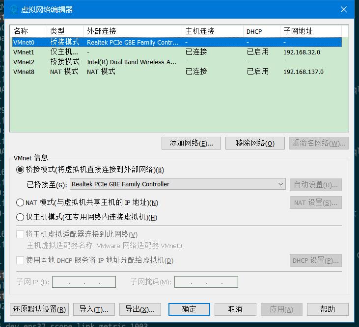
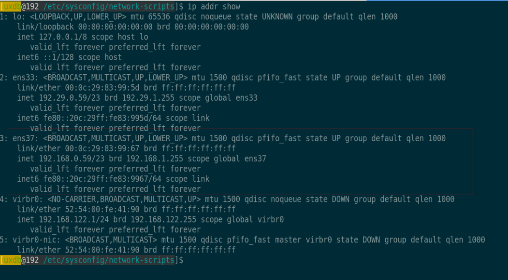
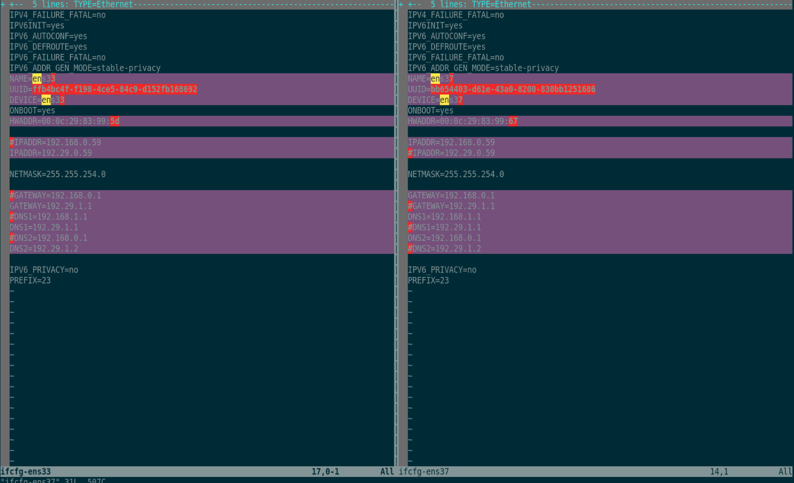

VMare Centos 7.4 双网卡设置教程
===============================

在VMare 设置中增加一块”物理”网卡
--------------------------------

在VMare 设置中增加一块”物理”网卡, 网络连接选择”VMnet2”



虚拟网络编辑器设置
------------------

如下图, 选择”更改设置”:



如下图, 虚拟机双网卡应该对应物理电脑的2块网卡,

比如我在公司用的是”有线网”, 而家里是”无线网”,

之前的做法就是, 环境一旦变化, 就手动更改
/etc/sysconfig/network-scripts/ifcfg-ens中的IP设置, 然后在 sudo systemctl
restart network

这样做, 尽管也可以, 但时间长了, 就感觉不爽, 所以想到给虚拟机配置2块网卡,
一块对应”有线网”, 一块对应”无线网”, 实现自动切换.

可以看出VMnet0 对应我的”有线网卡”, VMnet2对应我的”无线网卡”.



ip addr show
------------

之前只有一块网卡 ens33, 现在可以发现多出了一块ens37



ifcfg配置
---------

在/etc/sysconfig/network-scripts中, cp一份ifcfg-ens33,
让后根据上面ens37的信息进行修改.

需要修改的地方如下列表, 注意不要有遗漏, 否则 sudo systemctl restart network
就会失败, 我就因为遗漏了 ifcfg-ens37中的DEVICE=ens33, 而无故耗费了不少时间.

1.  NAME=

2.  UUID=

3.  DEVICE=

4.  HWADDR=

5.  IPADDR

6.  GATEWAY

7.  DNS1

8.  DNS2



错误处理
--------

### 错误提示

[root\@localhost /etc/sysconfig/network-scripts]\# systemctl start network

Job for network.service failed because the control process exited with error
code. See "systemctl status network.service" and "journalctl -xe" for details.

network.service 启动失败, 已经给你提示了:

1.  "systemctl status network.service" 查看 network.service 的状态信息

2.  执行 journalctl -xe

### 我因为遗漏修改ens37中的 DEVICE=ens33 而报出的错误

如下, 可以看出, journalctl -xe 错误信息已经说得很明确了 (参见下面黑体字部分), 只是自己一开始不够细心,
没有注意到, 所以在这问题上白白耗费了快一个小时.

#### systemctl status network

[root\@localhost /etc/sysconfig/network-scripts]\# systemctl status network

● network.service - LSB: Bring up/down networking

Loaded: loaded (/etc/rc.d/init.d/network; bad; vendor preset: disabled)

Active: failed (Result: exit-code) since Tue 2020-03-17 23:37:49 CST; 12s ago

Docs: man:systemd-sysv-generator(8)

Process: 3643 ExecStart=/etc/rc.d/init.d/network start (code=exited,
status=1/FAILURE)

Mar 17 23:37:49 localhost network[3643]: RTNETLINK answers: File exists

Mar 17 23:37:49 localhost network[3643]: RTNETLINK answers: File exists

Mar 17 23:37:49 localhost network[3643]: RTNETLINK answers: File exists

Mar 17 23:37:49 localhost network[3643]: RTNETLINK answers: File exists

Mar 17 23:37:49 localhost network[3643]: RTNETLINK answers: File exists

Mar 17 23:37:49 localhost network[3643]: RTNETLINK answers: File exists

Mar 17 23:37:49 localhost systemd[1]: network.service: control process exited,
code=exited status=1

Mar 17 23:37:49 localhost systemd[1]: Failed to start LSB: Bring up/down
networking.

Mar 17 23:37:49 localhost systemd[1]: Unit network.service entered failed state.

Mar 17 23:37:49 localhost systemd[1]: network.service failed.

#### journalctl -xe

[root\@localhost /etc/sysconfig/network-scripts]\# journalctl -xe

Mar 17 23:37:49 localhost /etc/sysconfig/network-scripts/ifup-eth[3821]: **Device
ens33 has different MAC address than expected, ignoring.**

Mar 17 23:37:49 localhost network[3643]: [FAILED]

Mar 17 23:37:49 localhost network[3643]: RTNETLINK answers: File exists

Mar 17 23:37:49 localhost network[3643]: RTNETLINK answers: File exists

Mar 17 23:37:49 localhost network[3643]: RTNETLINK answers: File exists

Mar 17 23:37:49 localhost network[3643]: RTNETLINK answers: File exists

Mar 17 23:37:49 localhost network[3643]: RTNETLINK answers: File exists

Mar 17 23:37:49 localhost network[3643]: RTNETLINK answers: File exists

Mar 17 23:37:49 localhost network[3643]: RTNETLINK answers: File exists

Mar 17 23:37:49 localhost network[3643]: RTNETLINK answers: File exists

Mar 17 23:37:49 localhost network[3643]: RTNETLINK answers: File exists

Mar 17 23:37:49 localhost systemd[1]: network.service: control process exited,
code=exited status=1

Mar 17 23:37:49 localhost systemd[1]: Failed to start LSB: Bring up/down
networking.

\-- Subject: Unit network.service has failed

\-- Defined-By: systemd

\-- Support: http://lists.freedesktop.org/mailman/listinfo/systemd-devel

\--

\-- Unit network.service has failed.

\--

\-- The result is failed.

Mar 17 23:37:49 localhost systemd[1]: Unit network.service entered failed state.

Mar 17 23:37:49 localhost systemd[1]: network.service failed.

Mar 17 23:37:49 localhost polkitd[916]: Unregistered Authentication Agent for
unix-process:3637:28656 (system bus name :1.148, object path
/org/freedesktop/PolicyKit1/Authen

Mar 17 23:40:01 localhost systemd[1]: Created slice User Slice of root.

\-- Subject: Unit user-0.slice has finished start-up

\-- Defined-By: systemd

\-- Support: http://lists.freedesktop.org/mailman/listinfo/systemd-devel

\--

\-- Unit user-0.slice has finished starting up.

\--

\-- The start-up result is done.

Mar 17 23:40:01 localhost systemd[1]: Started Session 2 of user root.

\-- Subject: Unit session-2.scope has finished start-up

\-- Defined-By: systemd

\-- Support: http://lists.freedesktop.org/mailman/listinfo/systemd-devel

\--

\-- Unit session-2.scope has finished starting up.

\--

\-- The start-up result is done.

Mar 17 23:40:01 localhost CROND[4002]: (root) CMD (/usr/lib64/sa/sa1 1 1)

Mar 17 23:40:01 localhost systemd[1]: Removed slice User Slice of root.

\-- Subject: Unit user-0.slice has finished shutting down

\-- Defined-By: systemd

\-- Support: http://lists.freedesktop.org/mailman/listinfo/systemd-devel

\--

\-- Unit user-0.slice has finished shutting down.

### 其他原因

一般来说, 如果启动失败, 肯定是你ifcfg-ensxx 文件中的配置哪里不对, 如:

1.  网卡的MAC地址不对

2.  UUID不对 (如何查询对应MAC的UUID这里不讲, 百度即可)

3.  network.service 和图形界面的 NetworkManager 冲突, 一般 sudo systemctl stop
    NetworkManager, 再启动network.service即可成功. 为了一劳永逸, 可以禁止
    NetworkManager开机启动.

参考
----

### [CentOS6如何为生成网卡UUID]( <https://blog.csdn.net/Linux_root_d/article/details/80656339>)

## ip route

上面配置了2块网卡后, 查看我的ip 路由表信息
```
[uxdb@192 ~]$ route -n
Kernel IP routing table
Destination     Gateway         Genmask         Flags Metric Ref    Use Iface
0.0.0.0         192.168.0.1     0.0.0.0         UG    0      0        0 ens37
169.254.0.0     0.0.0.0         255.255.0.0     U     1002   0        0 ens33
169.254.0.0     0.0.0.0         255.255.0.0     U     1003   0        0 ens37
192.29.0.0      0.0.0.0         255.255.254.0   U     0      0        0 ens33
192.168.0.0     0.0.0.0         255.255.254.0   U     0      0        0 ens37
192.168.122.0   0.0.0.0         255.255.255.0   U     0      0        0 virbr0
```

### 添加ip route

上面配置了2块网卡后, 发现有线网连接下, 一台 192.29.2.xx 的机器却无法访问了,
原因是配置2块网卡后, 192.29.2.xx 没有对应的网关, 根据 route -n 结果:

```
0.0.0.0         192.168.0.1     0.0.0.0         UG    0      0        0 ens37
```
192.29.2.xx被route到ens37网卡上去了, 即被route到192.168.0.1网关了, 而实际我们希望
其route到ens33 网卡对应的192.29.1.1网关. 这时就需要手动添加route. 具体配置如下:

```
[uxdb@192 ~]$ sudo route add -net 192.29.2.xx/32 gw 192.29.1.1
[sudo] password for uxdb: 
SIOCADDRT: Invalid argument
[uxdb@192 ~]$ sudo route add -host 192.29.2.xx/32 gw 192.29.1.1
[uxdb@192 ~]$ 
```

备注: 
1 sudo route add -net 好像不对, 试了sudo route add -host 可以成功.
2 修改后无需重启相关网络服务, 立即生效

### 删除添加的ip route

示例

```
route del -net 192.168.2.0/24 gw 192.168.1.1

route del -host 192.168.2.100/32 gw 192.168.1.1
```

### 添加默认路由

示例

```
route add default gw 192.168.1.1
```

### 修改路由

示例

```
ip route change 192.168.2.0/24 via 192.168.1.11


ip route replace 192.168.2.0/24 via 192.168.1.111
```

### 参考

我的 <centos IP 路由操作.md>
[linux - ip route 操作主机路由](https://baijiahao.baidu.com/s?id=1618978745521215381&wfr=spider&for=pc)
