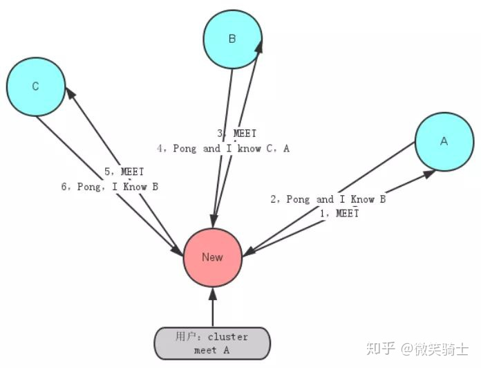
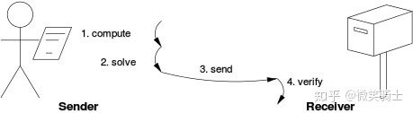
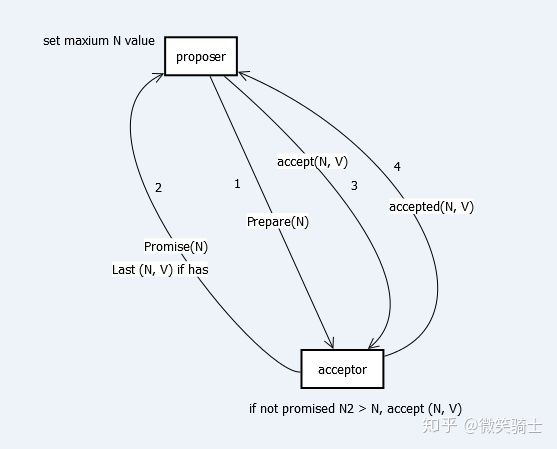
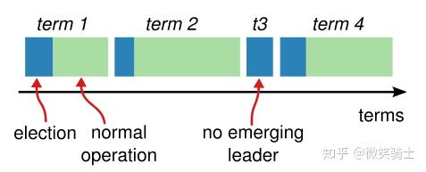
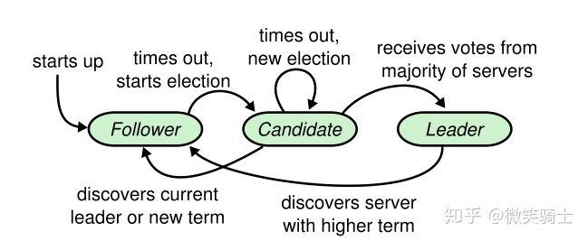

# 分布式一致性协议概述

## 楔子

最近在上MIT6.824这门课，这个课程的lab2实验要求根据论文完整地复现raft协议，开始我通读一遍论文，长舒一口气的同时吐槽工业界这么流行的raft协议怎么像个玩具一样，既不难理解，实现起来貌似也不复杂，微笑着满怀信心地就去做试验了。等做完实验发现自己头是真的铁，脸也是真的肿...遇到的各种坑数不胜数，锁的使用和各种细节纠错令人头皮发麻，等调试完整个系统并且达到bug free的状态，自己也已经身心俱疲了。经此深切地体会到一致性协议在分布式系统里的重要地位，所以出于拓展知识广度的目的写了这篇概述，分享给大家。当然，想要深入理解分布式一致性协议，体会其设计的精妙独到之处，最好的甚至可能是唯一有效的方式就是自己实现一遍。强烈推荐对该协议感兴趣的朋友啃paper撸代码搞一个协议架子出来，还是很有意思的哈哈。

## 为什么需要分布式一致性协议

顾名思义，一致性协议的应用是为了维护各节点数据的一致性，换句话说，就是使集群里的节点存储的数据是一模一样的。那么这样的技术，在现实生活中真的迫切需要嘛？其实这样的需求从古至今一直存在，这里我们举个趣味性的例子，可能很多人知道拜占庭将军问题，古时候东罗马帝国幅员辽阔，各个将军掌管各自的军队分散在帝国各处，他们之间靠信差交流。当东罗马帝国遭遇战争，将军们需要联合起来才能打倒敌方军队。这个时候将军们需要对最基本的进攻还是撤退达成一致。如果一齐进攻，他们能打倒敌人，如果一齐撤退，他们还有机会东山再起。此时将军们派出各自的信差去传达指令。那么帝国里有那么多将军，大家如何达成一致？最简单的，指派一个上将军，大家都听他的命令就好。那么上将军将怎么安排自己的信使？如果信使路上遇到了危险不幸逝去，那么长时间等不来回信的上将军该怎么处理？如果不幸逝世的是上将军怎么办？如果上将军是敌方间谍，专门传递虚假消息怎么办？比如间谍上将军对A将军传达撤退命令，对B将军传达进攻命令，那么最终只有B将军进攻，B就会全军覆没！这些情况其实都真实反映一致性协议需要考虑的种种问题。

让我们重新回到现代，实际上，现在“大红大紫”的区块链的核心技术就是一致性协议。以比特币为例，作为一个去中心化的且对安全性要求极高的平台，比特币要求所有参与者持有一本完全一致的"账本"，且这些"账本"不含有虚假信息。这样的应用，正是一致性协议大显身手的场景！除此之外,分布式存储中常常需要数据副本防止节点崩溃导致数据丢失，因而这里也需要一致性协议。以及传统的数据库一些并发实务的处理等等，应用真的是相当广泛了！

## 正文

接下来将介绍一些具有代表性的诸如Paxos, Raft, Gossip, Pow等广泛应用于区块链、物联网领域的协议。并对它们进行归纳、分类、比较和总结。

一致性协议可以有多种分类方法，关键要看我们选取的是哪个观察角度，这里我们从单主和多主的角度对协议进行分类。单主协议，即整个分布式集群中只存在一个主节点，采用这个思想的主要有2PC, Paxos, Raft等. 另一类是多主协议，即整个集群中不只存在一个主节点，Pow协议以及著名的Gossip协议。

单主协议由一个主节点发出数据，传输给其余从节点，能保证数据传输的有序性。而多主协议则是从多个主节点出发传输数据，传输顺序具有随机性，因而数据的有序性无法得到保证，只保证最终数据的一致性。这是单主协议和多主协议之间最大的区别。本篇综述选取单主协议中具有代表性的Paxos, Raft两大协议进行介绍，多主协议则选择经典且应用广泛的Gossip和Pow协议。

## 多主协议

### Gossip算法

Gossip又被称为流行病算法，它与流行病毒在人群中传播的性质类似，由初始的几个节点向周围互相传播，到后期的大规模互相传播，最终达到一致性。Gossip协议被广泛应用于P2P网络，同时一些分布式的数据库，如Redis集群的消息同步使用的也是Gossip协议，另一个重大应用是被用于比特币的交易信息和区块信息的传播。

Gossip传输示意图



Gossip协议的整体流程非常简单，传输示意图见上图.初始由几个节点发起消息，这几个节点会将消息的更新内容告诉自己周围的节点，收到消息的节点再将这些信息告诉周围的节点。依照这种方式，获得消息的节点会越来越多，总体消息的传输规模会越来越大，消息的传偶速度也越来越快。虽然不是每个节点都能在相同的时间达成一致，但是最终集群中所有节点的信息必然是一致的。Gossip协议确保的是分布式集群的最终一致性。

预先设定好消息更新的周期时间T，以及每个节点每个周期能够传播的周围节点数2，我们可以得到大致的消息更新流程如下：

1. 节点A收到新消息并更新
2. 节点A将收到的消息传递给与之直接相连的B,C
3. B,C各自将新更新的消息传给与之直接相连的两个节点，这些节点不包含A
4. 最终集群达成一致

在Gossip算法中，Gossip每次新感染的节点都会至少再感染一个节点，展开来看，这就是一个多叉树的结构，那么依据这个结构，最大的时间复杂度即使一个二叉树的形式，这时整体上达到一致性的速度是log(n).可见Gossip传播性能还是相当惊人的，著名的Redis数据库便是使用Gossip传播协议保持一致性，Redis最多可支持百万级别的节点，gossip协议在其中起到了重要作用。

## Proof-of-work（Pow）算法与比特币

Proof-of-work算法又被称为Pow算法，其实从这个算法的名称中我们能对它实现的功能窥见一二，工作量证明算法，那是否意味着工作量较大的某一个节点能够获得主动权呢？事实也是类似这个原理，大量的节点参与竞争，通过自身的工作量大小来证明自己的能力，最终能力最大的节点获得优胜，其他节点的信息需要与该节点统一。Pow最为人所熟知的应用是比特币。下面就以比特币为例具体讲解该算法。

我们知道，比特币塑造的是一个去中心化的交易平台，最重要的一点就是该平台的可信度。要达到高可信度，要求整个系统中没有固定的leader，且为了防止外界篡改，必然要设定一些特殊的机制，比如让图谋不轨的一方无法篡改或者必须付出与收获完全不等称的代价才有修改的可能，以这样的方式打消其修改的念头。这时候比特币引入了Pow算法，在Pow机制下，所有参与者共同求解数学问题，这些数学问题往往需要经过大量枚举才能求解，因此需要参与者消耗大量的硬件算力。成功求解数学问题的参与者将获得记账权，并获得比特币作为奖励。其余所有参与者需要保持和获得记账权节点的区块一致，由此达到最终的一致性。流程可见下图。

Pow算法



依靠Pow算法，比特币很大程度保证了交易平台的安全性。因为如果要对该平台的数据进行篡改或者毁坏，篡改者至少需要获得比特币全网一半以上的算力，这是非常难以达到的。但是同样Pow存在很多缺点，Pow达成一致性的速度很慢，应用在比特币中每秒钟只能做成7笔交易，这在大部分的商业应用中都是达不到要求的。其次Pow造成了很大的资源浪费。所有的竞争者夺取记账权需要付出巨大的硬件算力，这在背后是大量的硬件成本、电力损耗，而一旦记账权确定，其余没有获得记账权的节点的算力等于白白浪费。最后是现在出现了一些大规模的专业矿场，这些矿场的算力非常强大，它们的存在增大了平台被篡改的可能性。

## Gossip算法和Pow算法对比

同为去中心化的算法，Gossip算法和Pow算法都能实现超大集群的一致性，但是它们的特性可谓有天壤之别。Gossip算法往往应用于超大集群快速达成一致性的目的。它的特性是如流感一般超强的传播速度，以及自身能够管理的数量可观的节点数。但是对于流传的消息没有特别的管控，无法辨别其中的虚假信息，并且只关注与最终的一致性，不关心消息的顺序性。而Pow算法则完全专注于尽可能地解决"拜占庭将军"问题，防止消息的篡改。它可以不计代价地去要求各个节点参与竞选，以付出巨大算力为代价保证平台的安全性。

在比特币的应用中，使用**Pow算法确定竞争者的记账权**，尽可能地解决"拜占庭将军"问题，再将可信的结果由传播速度极强，**节点数目量大的Gossip协议去进行传输**，最终达成全网一致，可谓很好地利用这两大算法的特点，将二者优劣互补并巧妙地用于区块链领域，这一点令人非常赞叹！

## 单主协议

### Paxos协议

Paxos一致性算法由分布式领域专家Lamport提出，该算法主要是为了解决分布式一致性问题。作者论文中对于该算法的阐述paxos非常理论化，因而整体概念的理解较为抽象。下面我们以理论和示例相结合的方式解释这个算法。

Paxos消息传递图



需要知道的是，一致性算法的最终目的是让各个节点的数据内容达成一致，那么什么情况下可以认为各节点已经成功达成一致了呢？Paxos中的判定方法是如果存在大部分节点共同接收了该更新内容，可以认为本次更新已经达成一致。理清目标后，接下来我们看一下Paxos一致性理论的核心推导部分。

Paxos将节点进程分成"发起者""接收者""学习者"三类，论文称每个发起者发起的新的更新为"提议"，每个提议包含一个数字n和提议内容，算法的实现状态见图1。首先考虑一种特殊情况，如果在最开始的阶段，所有接收者没有收到任何"提议"，这时发起者发出的提议它们是会直接接受的。然而每次更新过程中，可能存在多个发起者发送提议，那么初始阶段可能各个接收者接受不同的提议，进而无法达成一致。这就要求一个接收者能够接受不止一个"提议"。这么一来就可能存在多个"提议"被"选择"(被大部分接收者接受)。既然会出现多个"提议"同时被选择的情况，最终如何达成一致呢？把条件设严格一点，如果后面被"选择"的"提议"内容都和第一个一致，那么无论有多少"提议"，最终不就相当于只有一个被选择了嘛！问题又来了，如何使得后面被选择的"提议"内容都和第一个一致呢？很简单，再把条件设严格一些，如果已经有"提议1"被选择，那么后续发起者发送的新"提议"的内容必须与"提议1"一致。Paxos的核心原理推导到这里就结束了，由此作者给出了一个算法：

```
发起者：
    发送数字为n，内容为v的"提议"的预请求给所有接收者：
        从回应中挑出数字小于n且数字最大的"提议"，并将提议内容赋给v
        如果回应中没有"提议"，内容v由发起者指定
    发送数字为n，内容为v的"提议"的接收请求给所有接收者

接收者：
    接收到预请求：
        如果预请求的数字n小于已经接收过的预请求的数字n，continue
        回应发起者，表明自己不会再接收数字小于n的请求以及收到的数字小于n且数字最大的"提议"
    接收到接收请求：
        如果没有收到数字比n大的预请求:
            接受请求
```

因为作者在描述Paxos时，列举了希腊城邦选举的例子，所以该算法又被称为希腊城邦算法。我们这里便列举希腊城邦选举的例子，帮助我们理解Paxos算法。城中的一些位高权重的人们("发起者")会提出新的"法案"，这些法案需要立法委员("接收者")达成一致即多数同意才能通过。于是权贵们会预先给立法委员一些金钱，让他们通过自己的法案，这对应的就是"预请求"，如果立法委员已经收到过更高贿赂的"预请求"，他们会拒绝，否则会同意。权贵们贿赂成功后，会告诉立法委员新的法案，在收到新法案之前，如果立法委员没有收到更高的贿赂，他们会选择接受这个法案，否则会拒绝。很关键的一点是，不要忘了我们是一致性协议，不是真正的立法，因此很关键的一点是如果立法委员在接收到更高的贿赂时已经接受了某个法案，那他会告诉贿赂的权贵这个法案的内容，权贵会将自己发起的法案改成该法案的内容，这样才能够迅速达成一致性。

Paxos是非常经典的一致性协议，但是因为过于理论化，难以直接工程化，因此工业界出现了诸多基于Paxos思想出发的变种。虽然这些变种最终很多都和原始的Paxos有比较大的差距，甚至完全演变成了新的协议，但是作为奠基者的Paxos在分布式一致性协议中依然持有不可撼动的地位。

## Raft协议

Raft协议是斯坦福的Diego Ongaro、John Ousterhout两人于2013年提出，作者表示流行的Paxos算法难以理解，且其过于理论化致使直接应用于工程实现时出现很多困难，因此作者希望提出一个能被大众比较容易地理解接受，且易于工程实现的协议。Raft由此应运而生。不得不说，Raft作为一种易于理解，且工程上能够快速实现一个较完整的原型的算法，受到业界的广泛追捧。大量基于Raft的一致性框架层出不穷。那么Raft究竟有哪些特点，它的整体运行逻辑是怎样的，下面讲具体介绍Raft算法。

Raft的算法逻辑主要可以分成两个部分，一个是选举部分，另一个是log传输部分。和Paxos部分不同的是，这里的log是连续并且按序传输的。Raft中定义了一个叫term概念，一个term实际上相当于一个时间片，如下图所示，这个时间片被分成两个部分，第一部分是选举部分，第二部分是传输部分。由此Raft的逻辑也可以分成选举和传输前后两个方面进行讲解。

Raft term示意图



首先我们介绍选举部分的算法逻辑。在Raft中可以存在多个server，其中每一个server都有机会成为leader，但是真实有效的leader只有一个。于是这个leader的产生需要所有的server去进行竞争。在每个term开始的阶段，众多server需要进行竞选，选出一个有效的leader。每个server被设置了一个300-400ms之间随机的timeout，在如果在timeout内没有收到某一个leader发来的心跳信息，那么这个server就会发起竞选，将自己的term值加一，成为candidate，并寻求其他server的投票。当且仅当某一个candidate收到超过一半的server的票数时，它就成功当选了leader，并开始向每个server发送心跳信息。仅仅这么做其实是存在问题的，如果有多个candidate同时参与竞选，很可能出现选票分散的情况，最终无法选出有效的leader。因而除此之外，Raft还要求如果candidate收到term比自己大的投票请求时将自己的状态修改成follower，这么一来就成了谁的term增加得快的问题，因为timeout是随机的，总会出现更快的server，因此算法最终是收敛的。选举过程的状态图可见下图.

Raft状态转换图



那么当选举成功后，整个集群进入log传输的状态。client会给leader发送需要传输的log，leader收到后在log上附加log的位置索引值和当前term值。这么一来每个log的索引与term值都是独一无二的。leader中会记录所有待传输给server的log索引值，针对于某个server，如果leader现存的索引数目大于待传输值，leader就会向该server传输新的logs。server收到logs后验证第一个log的term是否与自己同索引log的term一致，如果不一致告知leader匹配失败，leader会将传输的索引值减一，再重新传送。如果server验证后发现一致，则删除冲突索引后的所有log，并将新收到的log续借在该索引后面。

总的来看，Raft算法清晰明了，相比于Paxos抽象的理论阐述更易于理解。但是实际上因为Raft论文本身就实现了一个面向工业界的一致性协议原型，实现起来是相对较复杂的，根据论文复现过这个算法的人尤其能体会这一点。

## axos和Raft的对比

Paxos算法和Raft算法有显而易见的相同点和不同点。二者的共同点在于，它们本质上都是单主的一致性算法，且都以不存在拜占庭将军问题作为前提条件。二者的不同点在于，Paxos算法相对于Raft，更加理论化，原理上理解比较抽象，仅仅提供了一套理论原型，这导致很多人在工业上实现Paxos时，不得已需要做很多针对性的优化和改进，但是改进完却发现算法整体和Paxos相去甚远，无法从原理上保证新算法的正确性，这一点是Paxos难以工程化的一个很大原因。相比之下Raft描述清晰，作者将算法原型的实现步骤完整地列在论文里，极大地方便了业界的工程师实现该算法，因而能够受到更广泛的应用。同时Paxos日志的传输过程中允许有空洞，而Raft传输的日志却一定是需要有连续性的，这个区别致使它们确认日志传输的过程产生差异。

但其实从根本上来看，Raft的核心思想和Paxos是非常一致的，甚至可以说，Raft是基于Paxos的一种具体化实现和改进，它让一致性算法更容易为人所接受，更容易得到实现。由此亦可见，Paxos在一致性算法中的奠基地位是不可撼动的。

## 总结一下

这里主要介绍了分布式一致性算法，这类算法广泛应用于大数据时代的各个方面，如区块链、物联网等领域。本文将分布式一致性算法分成两类，分别是单主一致性算法和多主一致性算法。

第一部分的多主一致性算法介绍了Gossip和Pow算法，其中Gossip算法又被称为流行病算法，以其超快的传播速度和超大的传播广度闻名，而Pow算法则是希望尽可能解决"拜占庭将军"问题，防止信息的篡改。我们这里举了比特币的例子，比特币同时使用了这两种算法，将它们优劣互补，并和自身的需求完美锲合，相当巧妙。

第二部分的单主一致性算法主要介绍了Paxos和Raft两大算法。其中Paxos算法是一致性算法的奠基者算法，重要性可见一斑，但是由于其过于理论化，难以直接工程化实现。因而借鉴其思想的Raft横空出世，依靠其易理解、可实现的特性在工业界遍地开花，大量一致性框架都基于Raft协议，影响力相当可观。这两个算法在单主协议中都占有很高的地位，值得讲述。

分布式一致性算法问题在大数据的应用很广泛，极其重要却也非常有趣。我查看了该问题重要算法的论文，并复现了其中Raft协议的实现过程，本来浏览一遍论文，自己为掌握Raft原理的我，实现过程中却漏洞百出，花费大量时间和精力才得以调通，经此我才能深刻地感受到这类算法的精妙之处。这些算法往往具有很多看似不起眼的细节，然而真正遇到问题时，忽略算法中的任何一个细节都会导致问题无法正确解决。这是因为一致性算法大多每一步都经过严格的推导与证明，整体是一个相当严谨的结构。这一点在阅读Paxos论文时就可见一斑。往往看似简单的方法背后蕴含大量的工作量，其中每一个细节，每一个步骤都需经过仔细考量方能确定，忽略其中任何一个细节都可能导致系统最终崩溃。这样做出的算法才是稳定、高效、实用的。我想，不仅是这一个个精妙的算法需要我们学习，系统研究者们严谨细致的"匠心"更加值得我们去继承。

## 参考文献

1. Leslie Lamport. The part-time parliament. ACM Transactions on Computer Systems, 16(2):133–169, May 1998.
2. Ongaro, Diego, and John Ousterhout. "In search of an understandable consensus algorithm." 2014 {USENIX} Annual Technical Conference ({USENIX}{ATC} 14). 2014.
3. Demers, Alan, et al. "Epidemic algorithms for replicated database maintenance." Proceedings of the sixth annual ACM Symposium on Principles of distributed computing. 1987.
4. Vukolić, Marko. "The quest for scalable blockchain fabric: Proof-of-work vs. BFT replication." International workshop on open problems in network security. Springer, Cham, 2015.
5. LAMPORT , L. Fast paxos. Distributed Computing 19, 2(2006), 79–103.
6. LAMPORT , L. Paxos made simple. ACM SIGACT News 32, 4 (Dec. 2001), 18–25.

## 转自

[分布式一致性协议概述](https://zhuanlan.zhihu.com/p/130974371)